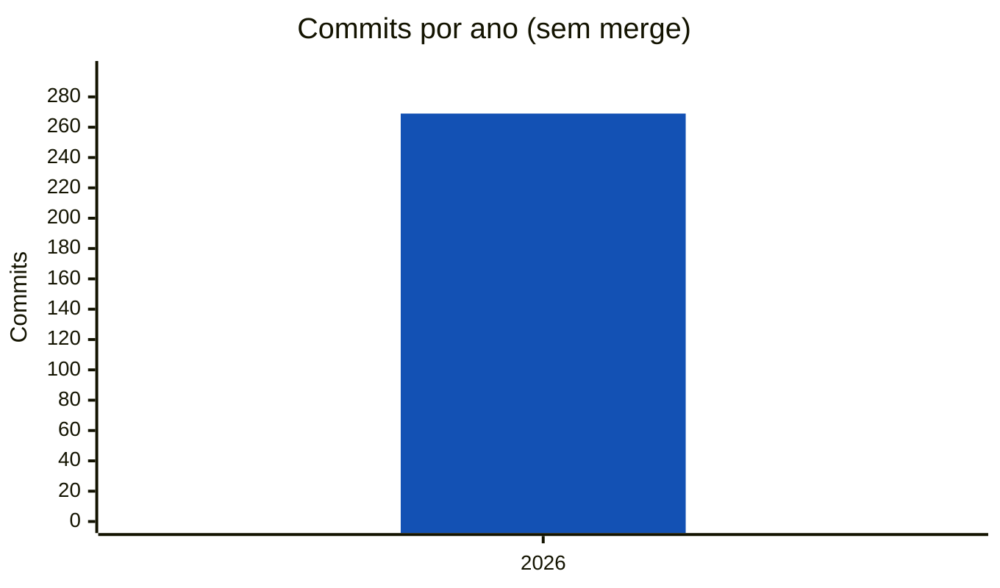
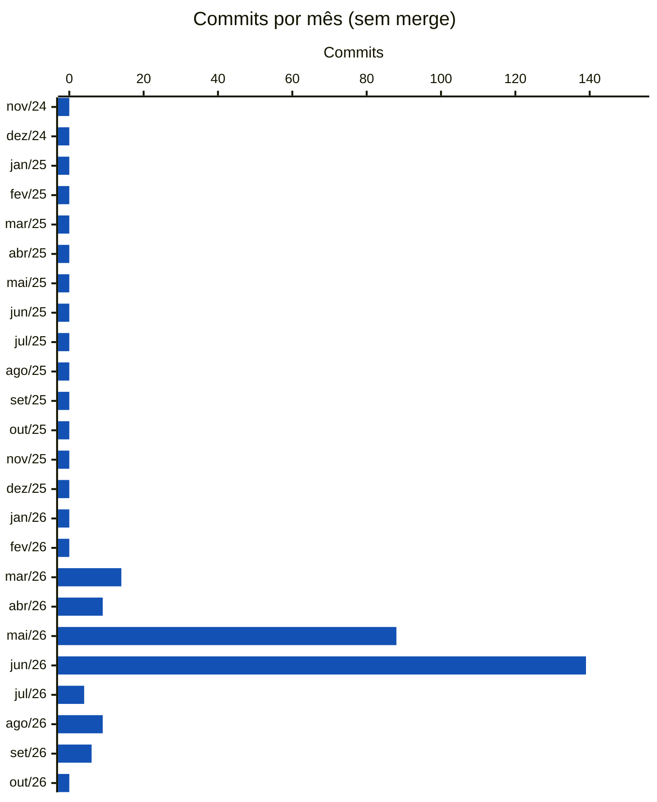
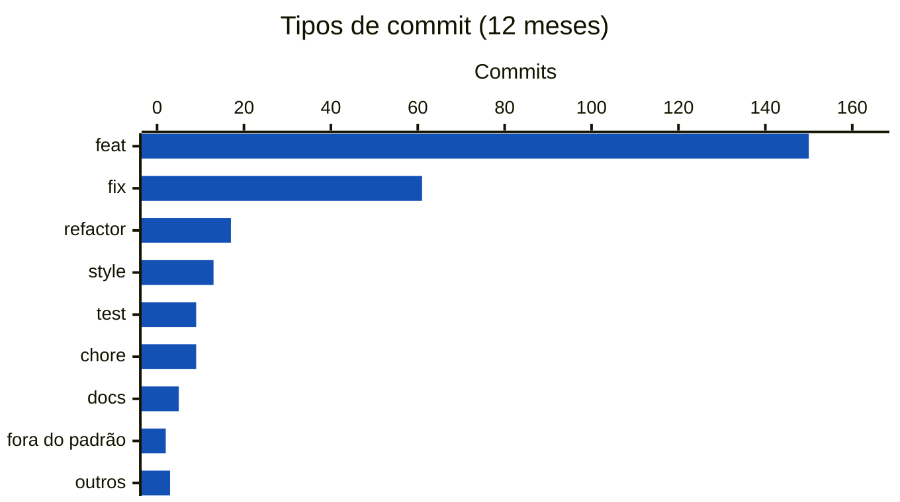

<!-- Gerado por scripts/estatisticas.py em 2026-10-10T19:18:25+00:00. Não edite à mão. -->

# Commits

!!! info "Coleta de 10/10/2026"
    Branch `main` do [multi-channel-participation](https://gitlab.com/lappis-unb/decidimbr/multi-channel-participation) e API pública do GitLab. Série a partir de 01/03/2026, mês do primeiro commit. "Últimos 12 meses" = 10/10/2025 a 10/10/2026. Para atualizar, rode `python3 scripts/estatisticas.py --projeto multicanal`.

Commits da branch `main`. Commits de merge são contados à parte.

| Desde mar/2026 | Sem merge | Merges | Últimos 12 meses | 12 meses anteriores |
| ---: | ---: | ---: | ---: | ---: |
| 276 | 269 | 7 | 269 | 0 |

## Por ano

## Últimos 24 meses

??? note "Dados mensais"

    | Mês | Commits |
    | --- | ---: |
    | nov/24 | 0 |
    | dez/24 | 0 |
    | jan/25 | 0 |
    | fev/25 | 0 |
    | mar/25 | 0 |
    | abr/25 | 0 |
    | mai/25 | 0 |
    | jun/25 | 0 |
    | jul/25 | 0 |
    | ago/25 | 0 |
    | set/25 | 0 |
    | out/25 | 0 |
    | nov/25 | 0 |
    | dez/25 | 0 |
    | jan/26 | 0 |
    | fev/26 | 0 |
    | mar/26 | 14 |
    | abr/26 | 9 |
    | mai/26 | 88 |
    | jun/26 | 139 |
    | jul/26 | 4 |
    | ago/26 | 9 |
    | set/26 | 6 |
    | out/26 | 0 |

## Padrão das mensagens

Percentual de commits cujo título segue o formato [Conventional Commits](https://www.conventionalcommits.org/pt-br/) (`tipo(escopo): descrição`), adotado pelo projeto.

| Ano | Conventional Commits | Reverts |
| --- | ---: | ---: |
| 2026 | 99% | 0 |

### Tipos de commit nos últimos 12 meses

## Arquivos mais alterados (12 meses)

Arquivos que mais aparecem em commits. Muitas alterações no mesmo arquivo indicam pontos de concentração de mudanças (*hotspots*), candidatos a refatoração ou a mais testes.

| Arquivo | Commits |
| --- | ---: |
| `api/tests/test_flow_engine.py` | 36 |
| `api/scripts/flow_engine.py` | 30 |
| `api/app/routes/admin.py` | 28 |
| `api/app/config.py` | 24 |
| `api/tests/test_conversation_orchestrator.py` | 20 |
| `api/app/services/conversation_orchestrator.py` | 19 |
| `api/app/services/admin_service.py` | 17 |
| `api/app/services/business_event_handler.py` | 16 |
| `api/tests/test_business_event_handler.py` | 15 |
| `api/uv.lock` | 15 |
| `api/scripts/flows/vila-carioca.yml` | 15 |
| `api/.env.example` | 14 |
| `api/app/services/admin_processes_service.py` | 14 |
| `api/app/models/participation_process.py` | 14 |
| `front/apps/admin/src/routes/ProcessDetail.tsx` | 14 |

