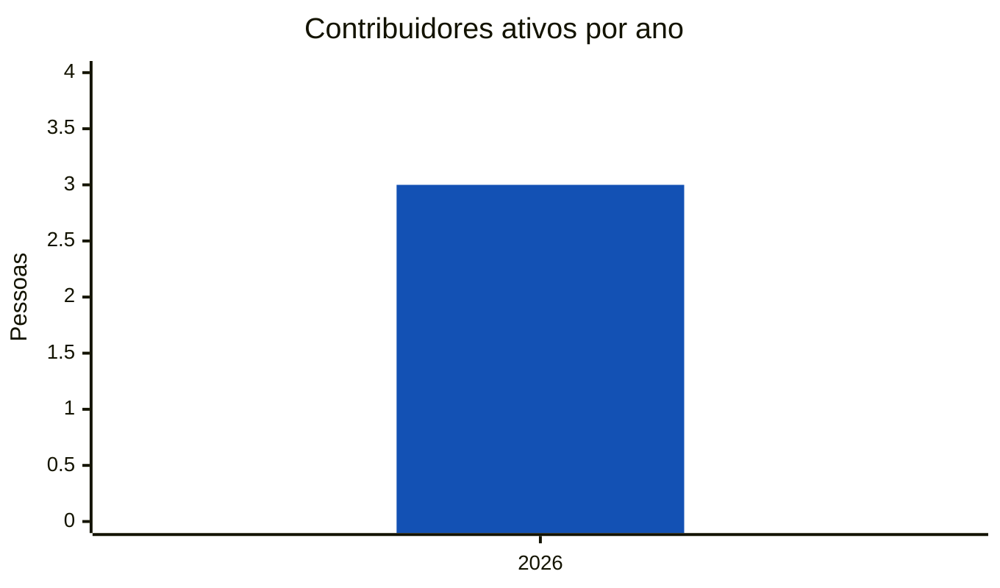
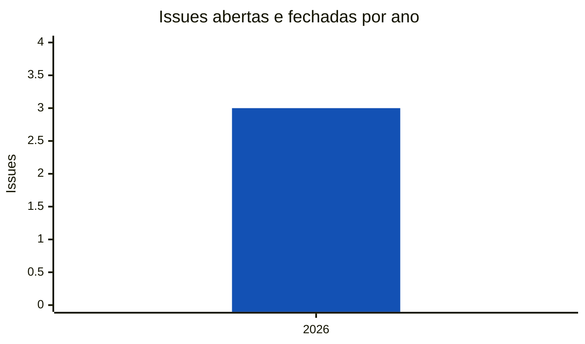
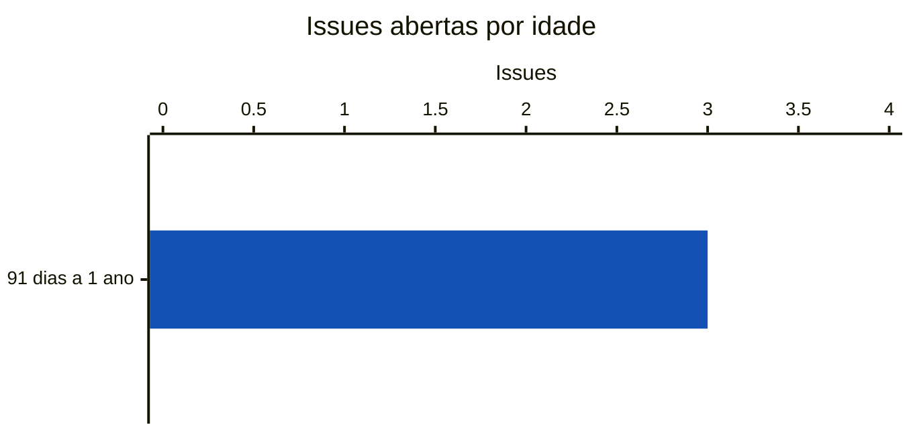

<!-- Gerado por scripts/estatisticas.py em 2026-10-10T19:18:25+00:00. Não edite à mão. -->

# Contribuições

!!! info "Coleta de 10/10/2026"
    Branch `main` do [multi-channel-participation](https://gitlab.com/lappis-unb/decidimbr/multi-channel-participation) e API pública do GitLab. Série a partir de 01/03/2026, mês do primeiro commit. "Últimos 12 meses" = 10/10/2025 a 10/10/2026. Para atualizar, rode `python3 scripts/estatisticas.py --projeto multicanal`.

!!! note "Identidades"
    Uma mesma pessoa pode ter feito commits com nomes ou e-mails diferentes. As variações são agrupadas automaticamente (mesmo e-mail ou mesmo nome normalizado). A contagem é uma aproximação.

## Pessoas contribuindo

Barras azuis: pessoas com ao menos um commit no ano. Linha laranja: pessoas que fizeram o primeiro commit no ano.

| Ano | Ativas | Novas | Retenção |
| --- | ---: | ---: | ---: |
| 2026 | 3 | 3 | — |

*Retenção*: parcela das pessoas ativas no ano anterior que continuaram contribuindo.

## Concentração das contribuições

O **fator de ausência** (*Contributor Absence Factor*, CHAOSS) é o menor número de pessoas que somam metade dos commits. Quanto menor, maior o risco de o projeto parar se essas pessoas saírem.

| Período | Fator de ausência | Contribuidores |
| --- | ---: | ---: |
| Desde março de 2026 | 1 | 3 |
| Últimos 12 meses | 1 | 3 |

=== "Últimos 12 meses"

    | # | Pessoa | Commits | Participação |
    | ---: | --- | ---: | ---: |
    | 1 | Eduardo Nunes | 264 | 98% |
    | 2 | David Carlos | 4 | 1% |
    | 3 | Thais Rebouças de Araujo | 1 | 0% |

=== "Desde março de 2026"

    | # | Pessoa | Commits | Participação |
    | ---: | --- | ---: | ---: |
    | 1 | Eduardo Nunes | 264 | 98% |
    | 2 | David Carlos | 4 | 1% |
    | 3 | Thais Rebouças de Araujo | 1 | 0% |

## Issues

Só issues públicas aparecem na API sem autenticação.

| Abertas | Fechadas | Abertas em 12 meses | Fechadas em 12 meses | Mediana para fechar (12 meses) | Autores (12 meses) |
| ---: | ---: | ---: | ---: | ---: | ---: |
| 3 | 0 | 3 | 0 | — | 1 |

### Por ano

Barras azuis: issues abertas no ano. Linha laranja: issues fechadas no ano.

| Ano | Abertas | Fechadas | Mediana para fechar |
| --- | ---: | ---: | ---: |
| 2026 | 3 | 0 | — |

### Idade das issues abertas

