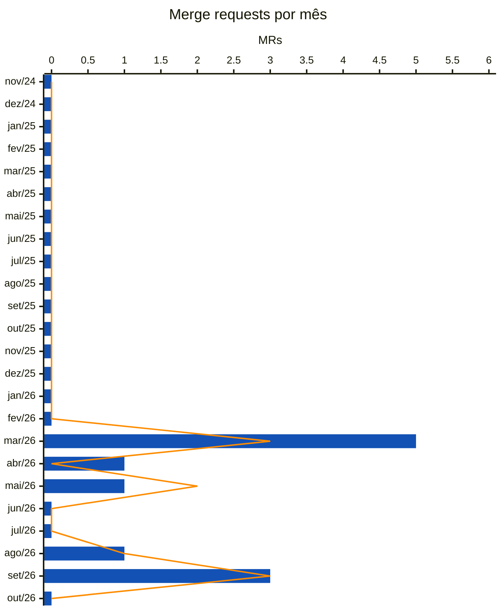

<!-- Gerado por scripts/estatisticas.py em 2026-10-08T14:14:52+00:00. Não edite à mão. -->

# Merge Requests

!!! info "Coleta de 08/10/2026"
    Branch `main` do [multi-channel-participation](https://gitlab.com/lappis-unb/decidimbr/multi-channel-participation) e API pública do GitLab. Série a partir de 01/03/2026, mês do primeiro commit. "Últimos 12 meses" = 08/10/2025 a 08/10/2026. Para atualizar, rode `python3 scripts/estatisticas.py --projeto multicanal`.

| Desde mar/2026 | Integrados | Fechados sem merge | Abertos |
| ---: | ---: | ---: | ---: |
| 11 | 9 | 2 | — |

## Últimos 12 meses

| Indicador | Valor | O que mede |
| --- | ---: | --- |
| MRs abertos | 11 | Volume de propostas de mudança |
| MRs integrados | 9 | Mudanças aceitas |
| Taxa de aceitação | 82% | Integrados ÷ (integrados + fechados sem merge) |
| Mediana até o merge | 0 h | Tempo típico entre abrir e integrar |
| 90º percentil até o merge | 2,0 dias | Tempo dos MRs mais demorados |
| MRs com comentário | 0% | Indício de revisão (comentários de qualquer pessoa) |
| Integrados pelo próprio autor | 56% | MRs sem uma segunda pessoa no merge |
| Autores distintos | 4 | Quantas pessoas propuseram mudanças |

## Por mês

Barras azuis: MRs abertos no mês. Linha laranja: MRs integrados no mês.

## Por ano

| Ano | Abertos | Integrados | Aceitação | Mediana até merge | P90 até merge | Com comentário | Auto-merge | Autores |
| --- | ---: | ---: | ---: | ---: | ---: | ---: | ---: | ---: |
| 2026 | 11 | 9 | 82% | 0 h | 2,0 dias | 0% | 56% | 4 |

## Branch de destino

Para quais branches os MRs foram abertos em cada ano.

| Ano | `main` |
| --- | ---: |
| 2026 | 11 |

## Abertos agora

Nenhum MR aberto.

