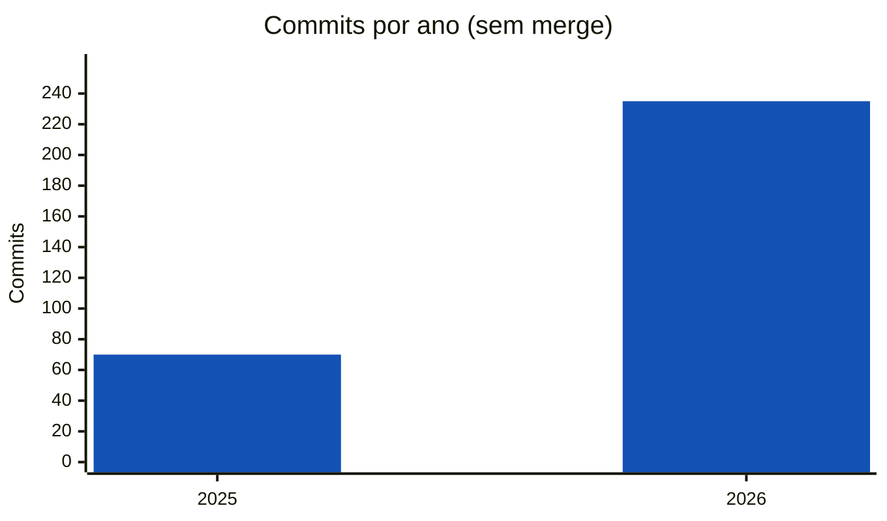
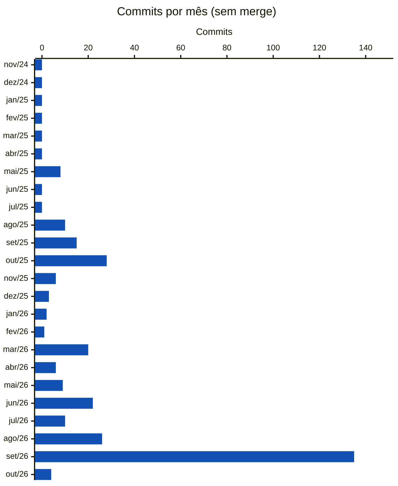
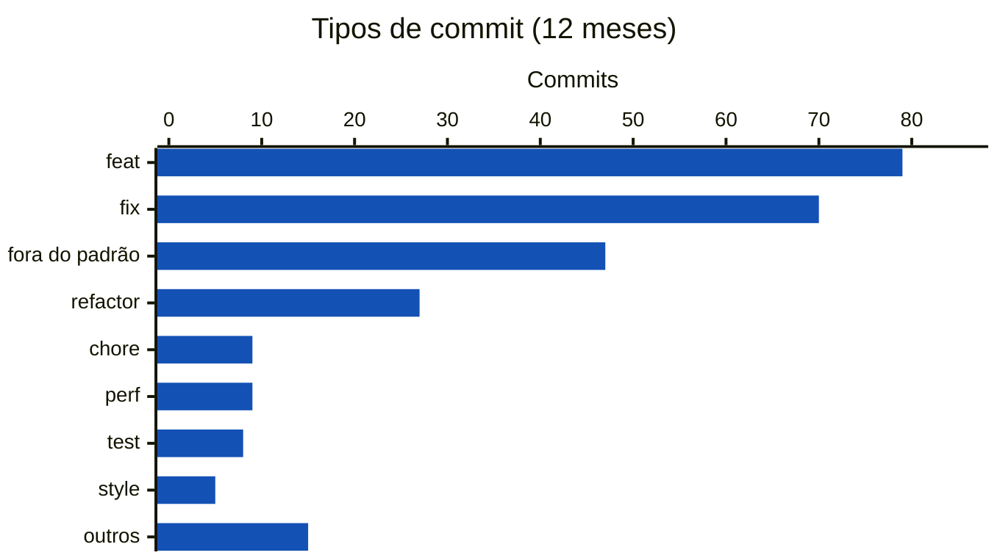

<!-- Gerado por scripts/estatisticas.py em 2026-10-10T19:16:35+00:00. Não edite à mão. -->

# Commits

!!! info "Coleta de 10/10/2026"
    Branches `main` e `develop` do [participa](https://gitlab.com/lappis-unb/decidimbr/participa) e API pública do GitLab. Série a partir de 01/05/2025, mês do primeiro commit. "Últimos 12 meses" = 10/10/2025 a 10/10/2026. Para atualizar, rode `python3 scripts/estatisticas.py --projeto participa`.

Commits das branches `main` e `develop`, sem duplicar os que estão nas duas. Commits de merge são contados à parte.

| Desde mai/2025 | Sem merge | Merges | Últimos 12 meses | 12 meses anteriores |
| ---: | ---: | ---: | ---: | ---: |
| 412 | 305 | 107 | 269 | 36 |

## Por ano

## Últimos 24 meses

??? note "Dados mensais"

    | Mês | Commits |
    | --- | ---: |
    | nov/24 | 0 |
    | dez/24 | 0 |
    | jan/25 | 0 |
    | fev/25 | 0 |
    | mar/25 | 0 |
    | abr/25 | 0 |
    | mai/25 | 8 |
    | jun/25 | 0 |
    | jul/25 | 0 |
    | ago/25 | 10 |
    | set/25 | 15 |
    | out/25 | 28 |
    | nov/25 | 6 |
    | dez/25 | 3 |
    | jan/26 | 2 |
    | fev/26 | 1 |
    | mar/26 | 20 |
    | abr/26 | 6 |
    | mai/26 | 9 |
    | jun/26 | 22 |
    | jul/26 | 10 |
    | ago/26 | 26 |
    | set/26 | 135 |
    | out/26 | 4 |

## Padrão das mensagens

Percentual de commits cujo título segue o formato [Conventional Commits](https://www.conventionalcommits.org/pt-br/) (`tipo(escopo): descrição`), adotado pelo projeto.

| Ano | Conventional Commits | Reverts |
| --- | ---: | ---: |
| 2025 | 80% | 0 |
| 2026 | 83% | 0 |

### Tipos de commit nos últimos 12 meses

## Arquivos mais alterados (12 meses)

Arquivos que mais aparecem em commits. Muitas alterações no mesmo arquivo indicam pontos de concentração de mudanças (*hotspots*), candidatos a refatoração ou a mais testes.

| Arquivo | Commits |
| --- | ---: |
| `decidim-chatbot/config/locales/en.yml` | 43 |
| `decidim-chatbot/config/locales/pt-BR.yml` | 43 |
| `Gemfile.lock` | 26 |
| `db/schema.rb` | 26 |
| `Gemfile` | 24 |
| `decidim-chatbot/spec/controllers/decidim/chatbot/admin/texts_controller_spec.rb` | 21 |
| `decidim-chatbot/lib/decidim/chatbot.rb` | 20 |
| `decidim-chatbot/config/flows/general_script.yml` | 18 |
| `decidim-chatbot/app/controllers/decidim/chatbot/admin/texts_controller.rb` | 17 |
| `decidim-govbr/config/locales/en.yml` | 16 |
| `decidim-govbr/config/locales/pt-BR.yml` | 16 |
| `decidim-chatbot/spec/lib/decidim/chatbot/flow_spec.rb` | 16 |
| `app/packs/stylesheets/decidim/decidim_application.scss` | 16 |
| `decidim-govbr/lib/decidim/govbr/engine.rb` | 15 |
| `decidim-chatbot/spec/controllers/decidim/chatbot/admin/dashboard_controller_spec.rb` | 15 |

