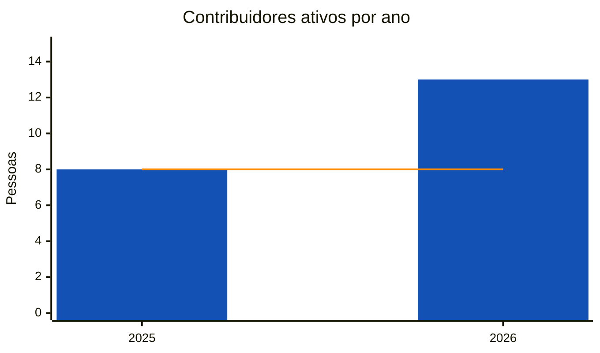
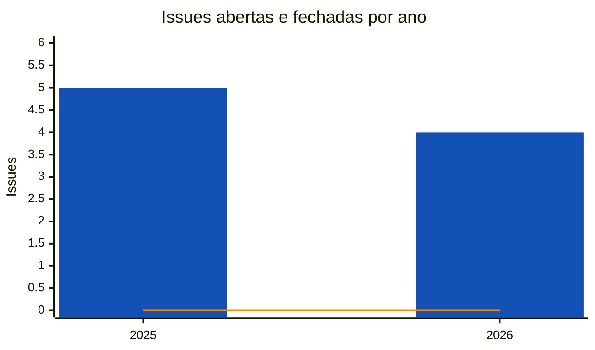
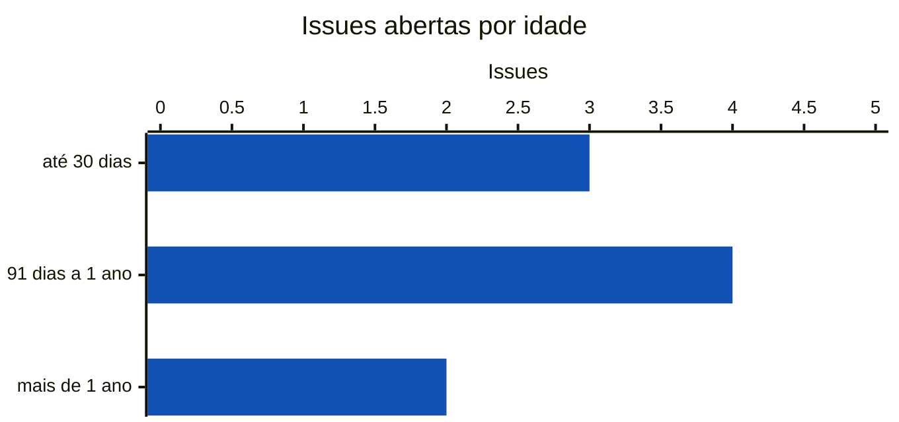

<!-- Gerado por scripts/estatisticas.py em 2026-10-08T14:14:52+00:00. Não edite à mão. -->

# Contribuições

!!! info "Coleta de 08/10/2026"
    Branches `main` e `develop` do [participa](https://gitlab.com/lappis-unb/decidimbr/participa) e API pública do GitLab. Série a partir de 01/05/2025, mês do primeiro commit. "Últimos 12 meses" = 08/10/2025 a 08/10/2026. Para atualizar, rode `python3 scripts/estatisticas.py --projeto participa`.

!!! note "Identidades"
    Uma mesma pessoa pode ter feito commits com nomes ou e-mails diferentes. As variações são agrupadas automaticamente (mesmo e-mail ou mesmo nome normalizado). A contagem é uma aproximação.

## Pessoas contribuindo

Barras azuis: pessoas com ao menos um commit no ano. Linha laranja: pessoas que fizeram o primeiro commit no ano.

| Ano | Ativas | Novas | Retenção |
| --- | ---: | ---: | ---: |
| 2025 | 8 | 8 | — |
| 2026 | 13 | 8 | 62% |

*Retenção*: parcela das pessoas ativas no ano anterior que continuaram contribuindo.

## Concentração das contribuições

O **fator de ausência** (*Contributor Absence Factor*, CHAOSS) é o menor número de pessoas que somam metade dos commits. Quanto menor, maior o risco de o projeto parar se essas pessoas saírem.

| Período | Fator de ausência | Contribuidores |
| --- | ---: | ---: |
| Desde maio de 2025 | 2 | 16 |
| Últimos 12 meses | 2 | 16 |

=== "Últimos 12 meses"

    | # | Pessoa | Commits | Participação |
    | ---: | --- | ---: | ---: |
    | 1 | Eduardo Nunes | 101 | 38% |
    | 2 | Leonardo M. Miranda | 40 | 15% |
    | 3 | Paulo Tada | 37 | 14% |
    | 4 | Lucca Medeiros | 28 | 10% |
    | 5 | VictorJorgeFGA | 25 | 9% |
    | 6 | Maria Eduarda Quaresma | 9 | 3% |
    | 7 | Lucas Pirola | 7 | 3% |
    | 8 | Gustavo Henrique | 5 | 2% |
    | 9 | Daniela s oliveira | 5 | 2% |
    | 10 | Leonardo Moreno | 4 | 1% |

=== "Desde maio de 2025"

    | # | Pessoa | Commits | Participação |
    | ---: | --- | ---: | ---: |
    | 1 | Eduardo Nunes | 101 | 33% |
    | 2 | Leonardo M. Miranda | 63 | 21% |
    | 3 | Paulo Tada | 44 | 14% |
    | 4 | Lucca Medeiros | 28 | 9% |
    | 5 | VictorJorgeFGA | 25 | 8% |
    | 6 | Maria Eduarda Quaresma | 10 | 3% |
    | 7 | Lucas Pirola | 7 | 2% |
    | 8 | Gustavo Henrique | 5 | 2% |
    | 9 | Daniela s oliveira | 5 | 2% |
    | 10 | Leonardo Moreno | 4 | 1% |

## Issues

Só issues públicas aparecem na API sem autenticação.

| Abertas | Fechadas | Abertas em 12 meses | Fechadas em 12 meses | Mediana para fechar (12 meses) | Autores (12 meses) |
| ---: | ---: | ---: | ---: | ---: | ---: |
| 9 | 0 | 7 | 0 | — | 4 |

### Por ano

Barras azuis: issues abertas no ano. Linha laranja: issues fechadas no ano.

| Ano | Abertas | Fechadas | Mediana para fechar |
| --- | ---: | ---: | ---: |
| 2025 | 5 | 0 | — |
| 2026 | 4 | 0 | — |

### Idade das issues abertas

### Rótulos mais comuns nas issues abertas

| Rótulo | Issues |
| --- | ---: |
| `decidim-0.32` | 1 |
| `tech-debt` | 1 |
| `WORKFLOW::Ready` | 1 |
| `Desenvolvimento` | 1 |
| `saas` | 1 |

