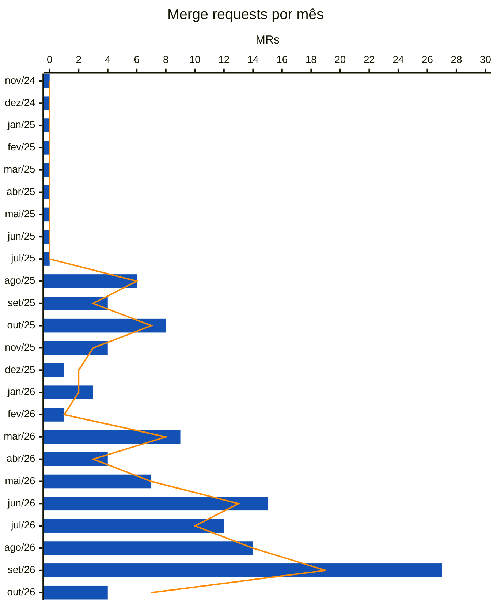

<!-- Gerado por scripts/estatisticas.py em 2026-10-10T19:16:35+00:00. Não edite à mão. -->

# Merge Requests

!!! info "Coleta de 10/10/2026"
    Branches `main` e `develop` do [participa](https://gitlab.com/lappis-unb/decidimbr/participa) e API pública do GitLab. Série a partir de 01/05/2025, mês do primeiro commit. "Últimos 12 meses" = 10/10/2025 a 10/10/2026. Para atualizar, rode `python3 scripts/estatisticas.py --projeto participa`.

| Desde mai/2025 | Integrados | Fechados sem merge | Abertos |
| ---: | ---: | ---: | ---: |
| 119 | 105 | 13 | 1 |

## Últimos 12 meses

| Indicador | Valor | O que mede |
| --- | ---: | --- |
| MRs abertos | 109 | Volume de propostas de mudança |
| MRs integrados | 95 | Mudanças aceitas |
| Taxa de aceitação | 88% | Integrados ÷ (integrados + fechados sem merge) |
| Mediana até o merge | 1,1 dias | Tempo típico entre abrir e integrar |
| 90º percentil até o merge | 14,0 dias | Tempo dos MRs mais demorados |
| MRs com comentário | 15% | Indício de revisão (comentários de qualquer pessoa) |
| Integrados pelo próprio autor | 44% | MRs sem uma segunda pessoa no merge |
| Autores distintos | 16 | Quantas pessoas propuseram mudanças |

## Por mês

Barras azuis: MRs abertos no mês. Linha laranja: MRs integrados no mês.

## Por ano

| Ano | Abertos | Integrados | Aceitação | Mediana até merge | P90 até merge | Com comentário | Auto-merge | Autores |
| --- | ---: | ---: | ---: | ---: | ---: | ---: | ---: | ---: |
| 2025 | 23 | 22 | 96% | 20 h | 14,9 dias | 17% | 64% | 6 |
| 2026 | 96 | 83 | 87% | 1,1 dias | 13,8 dias | 16% | 43% | 13 |

## Branch de destino

Para quais branches os MRs foram abertos em cada ano.

| Ano | `main` | `release/0.32.1-v1.0.0` | `core/bump-32` | `develop` |
| --- | ---: | ---: | ---: | ---: |
| 2025 | 23 | 0 | 0 | 0 |
| 2026 | 86 | 6 | 2 | 1 |

## Abertos agora

| MR | Título | Destino | Idade |
| --- | --- | --- | --- |
| [!100](https://gitlab.com/lappis-unb/decidimbr/participa/-/merge_requests/100) | Implementa otimização de exportação de contribuições | `main` | 25 dias |

