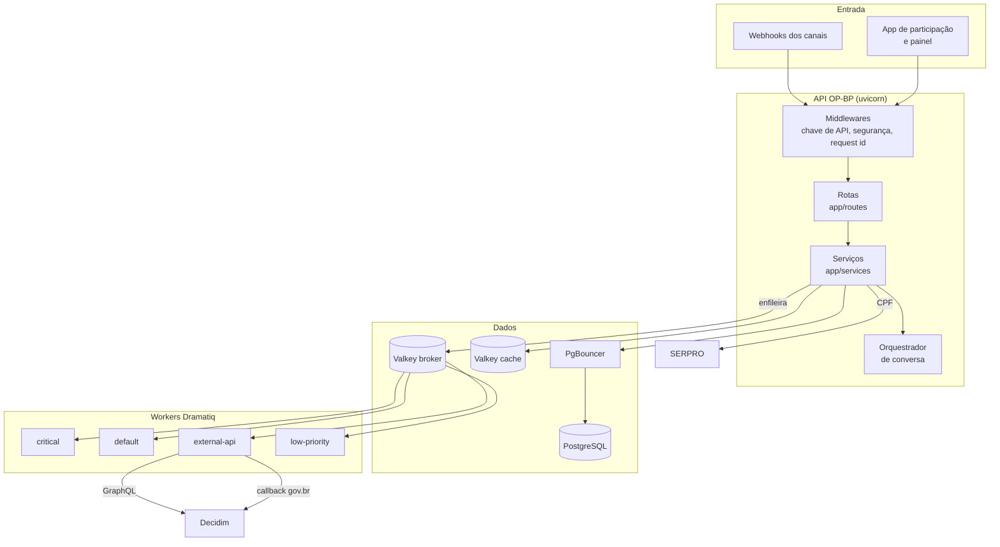
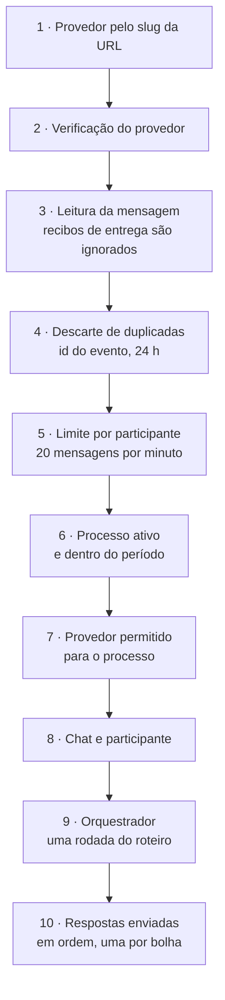

# Arquitetura da API OP-BP

A API OP-BP é uma aplicação **FastAPI** com workers **Dramatiq**, banco **PostgreSQL** atrás do **PgBouncer** e dois **Valkey** (um para cache, outro para filas). O pacote está em `api/app/`.

## Visão geral

## Pilha

| Camada | Tecnologia | Evidência |
|--------|-----------|-----------|
| Linguagem | Python 3.13 ou superior; imagem `python:3.14-slim` | `api/pyproject.toml`; `api/Dockerfile` |
| Web | FastAPI 0.137 servido por uvicorn (4 workers em produção) | `api/uv.lock`; `api/docker-compose.prod.yml` |
| ORM e migrações | SQLAlchemy 2 (assíncrono com asyncpg, síncrono com psycopg nos workers) e Alembic | `api/app/db.py`; `api/alembic/` |
| Banco | PostgreSQL 17 no Docker Compose; PgBouncer em modo transação | `api/docker-compose.yml` |
| Cache e filas | Valkey 8: `valkey-cache` (LRU, sem persistência) e `valkey-broker` (AOF) | `api/docker-compose.yml` |
| Tarefas | Dramatiq com 4 filas e até 3 novas tentativas | `api/app/workers/broker.py` |
| Observabilidade | Prometheus (`/metrics`), OpenTelemetry com Jaeger, logs em JSON com `request_id` | `api/app/core/metrics.py`; `api/app/core/tracing.py` |
| Gerenciador de pacotes | uv | `api/uv.lock` |

## Organização do código

| Pasta | Conteúdo |
|-------|----------|
| `app/config.py` | Configuração (pydantic-settings), com validação estrita quando `APP_ENV=production` |
| `app/core/` | Autenticação por chave de API e do painel, provedores de canal, circuit breakers, constantes de cache, logs, métricas, mascaramento de dados pessoais, rate limit, cifragem de segredos |
| `app/routes/` | Rotas REST: chats, participantes, propostas, CEP, votos, identidade, conversas, painel, anonimização, saúde |
| `app/services/` | Regras de negócio: orquestrador de conversa, votos, CPF, gov.br, painel, anonimização, catálogo de processos, provedores de canal |
| `app/integrations/` | Clientes do Brasil Participativo (GraphQL), SERPRO, WhatsApp do SERPRO, CEP e catálogo de processos |
| `app/models/` | Os [19 modelos](dados.md) |
| `app/workers/` | Broker e atores Dramatiq |
| `app/whatsapp_flows/` | Endpoint e telas do WhatsApp Flows |
| `scripts/flow_engine.py` | Motor dos [roteiros de conversa](roteiros.md), fora de `app/` |
| `scripts/flows/` | Roteiros versionados em YAML |

O código da API tem cerca de 17 mil linhas, e os testes, cerca de 23 mil.

## Caminho de uma mensagem

O webhook de conversa (`app/routes/conversations.py`) segue sempre a mesma ordem:

## Filas e workers

| Fila | Atores | Para quê |
|------|--------|----------|
| `critical` | `process_vote_submission`, `process_vote_identify` | Gravar votos e promover o nível de identificação |
| `default` | `persist_message` | Gravar mensagens |
| `external-api` | `bp_register_votes`, `process_govbr_auth`, `resend_post_auth_share` | Chamadas ao Decidim e mensagens após o login gov.br |
| `low-priority` | `reconcile_vote_flags`, `recover_orphan_tasks` | Correção de divergências entre cache e banco; reenvio de tarefas presas |

Cada tarefa enfileirada gera um registro em `task_logs` antes do envio. Se o envio à fila falhar, o registro fica pendente e o `recover_orphan_tasks` o reenvia depois de 10 minutos (`app/services/task_dispatch.py`; `app/workers/tasks/recovery.py`).

!!! warning "Sem agendador embutido"
    Não há agendador no código. O script `api/scripts/recover-orphan-tasks.sh` recomenda um cron externo a cada 5 minutos, e a reconciliação de votos é disparada pelo painel (`POST /api/v1/admin/reconcile-votes`). O ator de limpeza de backups de anonimização existe, mas não é registrado pelo worker (`app/workers/tasks/__init__.py`).

## Cache e consistência

O `valkey-cache` guarda sessões e dados de leitura frequente; o `valkey-broker`, as filas. Usos principais (`app/core/constants.py`):

| Uso | Duração |
|-----|---------|
| Marca de voto por participante e processo, para impedir voto duplo | 90 dias |
| Sessão do roteiro de conversa | 24 h |
| Sessão do WhatsApp Flows | 1 h |
| Resposta da Consulta CPF do SERPRO | 24 h |
| CEP | 6 h |
| Propostas e catálogo de processos | 5 min |
| Ranking preliminar | 15 s |
| Descarte de eventos de webhook repetidos | 24 h |

Se o Valkey cair, a marca de voto **falha fechada**: a API recusa o voto em vez de arriscar duplicidade (`app/services/vote_submit_service.py`). Chamadas ao SERPRO, ao WhatsApp do SERPRO e ao catálogo de processos passam por circuit breakers.

## Capacidade

O repositório traz testes de carga com k6 (`api/tests/load_tests/`). O relatório (`results/REPORT.md`) registra, num servidor de 4 CPUs e 32 GB:

- 150 participantes por segundo durante 6 horas com boa experiência;
- perda considerável e sobrecarga do banco a 300 e 350 participantes por segundo;
- conclusão do relatório: até cerca de 1 milhão de participantes por dia; acima disso, banco e cache viram gargalo.

São medições do próprio relatório, não reproduzidas nesta documentação.
