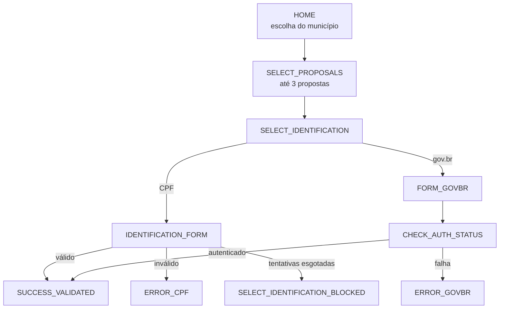

# Canais

A API OP-BP recebe participantes por quatro portas de entrada. Cada uma tem um formato de mensagem e uma forma de verificação próprios.

| Canal | Provedor | Entrada | Saída |
|-------|----------|---------|-------|
| **WhatsApp do SERPRO** | `whatsapp-serpro` | Webhook `POST /api/v1/conversations/whatsapp-serpro/webhook?process_id=N` | API de mensagens do SERPRO: texto, botões, lista e botão com link |
| **WhatsApp Flows** (Meta) | `whatsapp-meta` | `POST /api/v1/whatsapp-flows`, com o payload cifrado do protocolo Flows | Resposta cifrada na mesma requisição |
| **Telegram** | `telegram` | Webhook `POST /api/v1/conversations/telegram/webhook?process_id=N` | Resposta no corpo do webhook |
| **App de participação** | — | Chamadas REST do [app](painel.md#app-de-participacao) (Telegram Mini App ou web) | Respostas REST |

Fontes: `api/app/services/channel_providers/`, `api/app/whatsapp_flows/`, `api/app/routes/conversations.py`.

Não há integração com Instagram, Twilio ou a API de nuvem da Meta para mensagens comuns. Embora `docs/api-scenarios.md` cite o Instagram, ele não existe no código.

## WhatsApp do SERPRO

O canal principal de conversa. A API autentica no SERPRO com OAuth2 (*client credentials*) e envia mensagens pelo número configurado para o processo (`api/app/integrations/whatsapp_serpro_client.py`).

- **Credenciais por processo**: cada processo pode ter seu próprio `client_id`, segredo e número de origem, cadastrados na aba WhatsApp do painel. O segredo é cifrado no banco e nunca devolvido pela API. Campos vazios usam os valores globais `WHATSAPP_SERPRO_*`.
- **Registro do webhook**: o painel registra e ativa no SERPRO a URL do webhook do processo (`POST /api/v1/admin/processes/{id}/webhook/register`). A operação é idempotente.
- **Limites da interface**: títulos de lista com até 24 caracteres e descrições com até 72 são aplicados pela API.

## WhatsApp Flows

Formulários de várias telas dentro do WhatsApp, usados na votação do Orçamento do Povo. A definição do Flow está em `api/data/v1_flows.json`; as telas são tratadas em `api/app/whatsapp_flows/screens/`:

O Flow usa o provedor `whatsapp-meta`. Quem gera o `flow_token` e dispara a mensagem inicial do Flow não está no repositório (**a confirmar**).

## Telegram

O bot de texto recebe *updates* da Bot API (mensagens e cliques em botões) e verifica o cabeçalho `X-Telegram-Bot-Api-Secret-Token` com o segredo `TELEGRAM_WEBHOOK_SECRET` (`api/app/services/channel_providers/telegram.py`).

!!! warning "Entrega das respostas a confirmar"
    O provedor do Telegram monta a resposta e a devolve no corpo do webhook, sem chamar a Bot API nem guardar token de bot. Como as respostas chegam ao participante no ambiente real precisa ser confirmado com a equipe atual.

## Provedor por processo

Cada processo declara qual provedor atende cada canal, no campo `channel_providers` (por exemplo, `{"whatsapp": "whatsapp-serpro"}`). Há no máximo um provedor por canal em cada processo, o que impede o WhatsApp Flows e o WhatsApp do SERPRO de atenderem o mesmo processo (`api/app/models/participation_process.py`; `api/app/services/provider_gate.py`).

- Processos criados pelo painel recebem `{"whatsapp": "whatsapp-serpro"}`.
- O campo só é editável pela API do painel, não pela interface.
- Canal não declarado no processo é aceito (o portão é permissivo nesse caso).

## Retorno ao canal e compartilhamento

Cada processo pode configurar:

- `channel_return_urls`: endereços de volta ao WhatsApp ou ao Telegram, usados no botão "Voltar" depois do login gov.br no Brasil Participativo;
- `share_url`: endereço divulgado na mensagem de compartilhamento;
- `webhook_url`: endereço registrado no provedor.

Depois do login gov.br, a API envia pelo WhatsApp uma mensagem de sucesso com o ranking preliminar e botões para compartilhar ou encerrar. O envio é idempotente e tem intervalo mínimo de 10 minutos entre reenvios (`api/app/services/post_auth_notification.py`).
