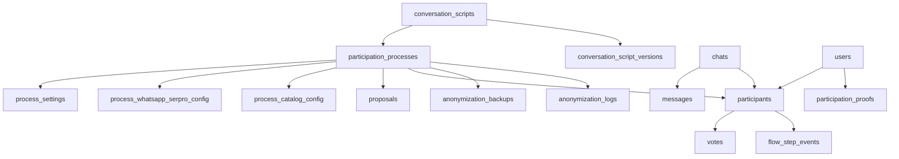

# Modelo de dados

A API OP-BP usa **PostgreSQL** (imagem `postgres:17-alpine` no Docker Compose) com acesso pelo **PgBouncer** em modo transação. Os modelos SQLAlchemy estão em `api/app/models/`, e as 30 migrações Alembic, em `api/alembic/versions/`.

## Relacionamentos

## Tabelas

### Processos e configuração

| Tabela | Conteúdo |
|--------|----------|
| `participation_processes` | Processo: `slug` único, nome, situação (rascunho, ativo, pausado, encerrado, arquivado), período, fonte das propostas (banco ou JSON), endereços de webhook, compartilhamento e retorno, provedores por canal, roteiro |
| `process_settings` | [Regras de voto](votacao.md#regras-de-voto), uma linha por processo |
| `process_whatsapp_serpro_config` | Credenciais do WhatsApp do SERPRO do processo; segredo cifrado |
| `process_catalog_config` | Instância Decidim do catálogo de processos; chave cifrada e destaques |
| `proposals` | Propostas do processo, com id da proposta no Decidim, situação, endereço público e etiquetas (índice GIN) |
| `conversation_scripts` | Roteiros de conversa (YAML) em edição |
| `conversation_script_versions` | Versões publicadas e imutáveis dos roteiros |

### Participação

| Tabela | Conteúdo |
|--------|----------|
| `chats` | Conversa por canal e identificador (telefone ou id do Telegram); única por par canal e identificador |
| `messages` | Mensagens recebidas e enviadas (até 4.096 caracteres) |
| `users` | Pessoa: nível de identificação, CPF **cifrado**, hash do CPF (único), id externo (gov.br ou Decidim), e-mail, nome, nascimento |
| `participants` | Participação de uma pessoa num processo: estado atual do roteiro, bloqueio de CPF, município, id no Brasil Participativo, conclusão |
| `votes` | Votos: participante, proposta no Decidim, título e tipo (anônimo, identificado, autenticado); único por participante e proposta |
| `flow_step_events` | Transições de estado do roteiro, para medir o tempo por passo |

### Auditoria e LGPD

| Tabela | Conteúdo |
|--------|----------|
| `cpf_validation_attempts` | Tentativas de validação de CPF (hash e máscara do CPF, resultado, origem) |
| `serpro_api_calls` | Chamadas à Consulta CPF (máscara do CPF, endpoint, resultado, tempo de resposta) |
| `task_logs` | Registro persistente das tarefas assíncronas e seus parâmetros |
| `participation_proofs` | Prova de participação sem vínculo com o voto, criada na anonimização |
| `anonymization_backups` | Mapeamento cifrado para reverter uma anonimização (7 dias) |
| `anonymization_logs` | Histórico de anonimizações e reversões |

## Migrações

| Período | Mudanças principais |
|---------|---------------------|
| fev. a mar. 2026 | Esquema inicial; CPF passa a ser guardado como hash e máscara nas tentativas e **cifrado** em `users`; anonimização |
| mai. 2026 | Propostas por processo (tabela `proposals`); roteiros de conversa; endereços de webhook, compartilhamento e retorno |
| jun. 2026 | Credenciais do WhatsApp por processo; `register_votes_on_bp`; provedores por canal; versões de roteiro; `flow_step_events`; alteração de voto |
| jul. a ago. 2026 | Comando de reinício em produção; configuração do catálogo de processos e destaques |

As migrações rodam no `entrypoint.sh` da imagem, a não ser que `SKIP_MIGRATIONS=true` (usado nos workers). O mesmo script cria três processos padrão: `default`, `orcamento-participativo-homolog` e `orcamento-participativo` (`api/scripts/entrypoint.sh`).
