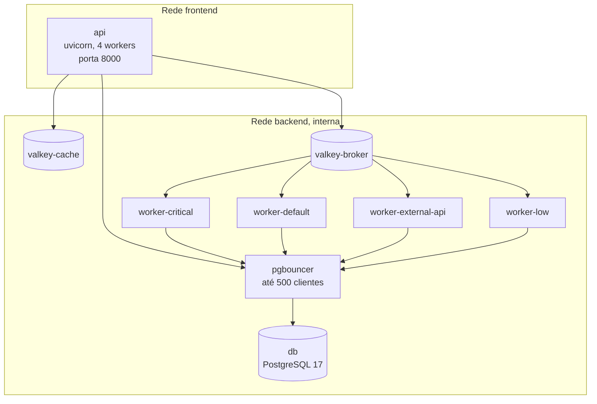

# Implantação e desenvolvimento

## Ambiente local

Pré-requisitos: Docker com Compose e `make`. Na pasta `api/`:

```bash
cp .env.example .env
make up          # banco, PgBouncer, Valkey, API e workers
make seed        # dados de demonstração
make test        # testes pytest
```

| Alvo do `Makefile` | Faz |
|--------------------|-----|
| `up`, `up-d`, `down`, `down-v`, `logs`, `shell`, `db-shell` | Ciclo de vida dos contêineres |
| `tools` | Sobe o Dramatiq Dashboard (porta 8080) e o Adminer (8081) |
| `lint`, `format`, `format-check`, `fix`, `typecheck` | Ruff e mypy |
| `security`, `audit`, `trivy`, `gitleaks`, `semgrep`, `quality` | Análises de segurança e qualidade |
| `test`, `test-verbose`, `test-file`, `test-e2e-auth` | Testes |
| `migrate`, `migrate-status`, `migrate-history`, `migrate-sql` | Migrações Alembic |
| `seed`, `seed-clean`, `seed-vila`, `reset` | Dados de demonstração |
| `deploy`, `prod-build`, `prod-up`, `prod-down`, `prod-logs` | Docker Compose de produção |

O `api/docker-compose.override.yml` deixa o ambiente local mais leve: limites de CPU e memória e **um só worker** consumindo as quatro filas. O perfil `observability` sobe o Jaeger (porta 16686).

No front-end, na pasta `front/`: `pnpm install`, depois `pnpm dev:admin` ou `pnpm dev:participation`.

O script `scripts/ci-check.sh` reproduz o pipeline localmente por estágio (`quality`, `security`, `test`, `build` ou `all`), inclusive verificações do front-end que não estão no CI.

## Imagens

| Imagem | Arquivo | Conteúdo |
|--------|---------|----------|
| API e workers | `api/Dockerfile` | Multiestágio sobre `python:3.14-slim`, uv, usuário sem privilégios (UID 1001), `HEALTHCHECK` em `/health`. O `entrypoint.sh` roda as migrações e cria os processos padrão |
| Dramatiq Dashboard | `api/Dockerfile.dashboard` | Painel das filas, ligado ao `valkey-broker` |

O job `api:build` do CI publica `registry.gitlab.com/.../api:<sha>` e `:latest` no registro do GitLab, só na branch padrão.

## Docker Compose de produção

O arquivo `api/docker-compose.prod.yml`, usado por `make deploy`, sobe:



Todos os serviços têm `restart: always`, `no-new-privileges` e limites de CPU e memória. O PostgreSQL usa `api/config/postgresql.conf`.

## Onde roda em produção

Mensagens de commit e o relatório de carga citam *pods*, *Secrets* do Kubernetes e a infraestrutura da Dataprev. Os manifestos (Kubernetes ou Helm) **não estão no repositório**. Cluster, ingress, TLS e domínio de produção estão **a confirmar** com a equipe atual.

Domínios citados no código:

| Domínio | Papel |
|---------|-------|
| `api-opbp.lablivre.rocks` | Callback gov.br padrão do script de diagnóstico |
| `api.bp.lappis.rocks` | API padrão do app de participação |
| `acre.dev.participa.lappis.rocks` | Catálogo de processos (Participa do Acre, desenvolvimento) |
| `api.whatsapp.serpro.gov.br` | WhatsApp do SERPRO |
| `gateway.apiserpro.serpro.gov.br` | Consulta CPF |

## Rotinas de operação

| Rotina | Como |
|--------|------|
| Reenviar tarefas presas | Cron externo a cada 5 minutos com `api/scripts/recover-orphan-tasks.sh` |
| Reconciliar votos entre cache e banco | Painel › Operação › Reconciliação |
| Repetir tarefas com falha | Painel › Operação › Task logs |
| Recarregar propostas | `POST /api/v1/admin/proposals/reload` |
| Acompanhar filas | Dramatiq Dashboard (perfil `tools`) |
| Saúde | `GET /health` (banco, Valkey, versão e commit) e `/metrics` (Prometheus) |

## Integração contínua

O `.gitlab-ci.yml` da raiz roda em merge requests e na branch padrão, apenas quando há mudanças em `api/`:

| Estágio | Jobs |
|---------|------|
| `quality` | `api:ruff-lint`, `api:ruff-format`, `api:mypy` |
| `security` | `api:bandit`, `api:pip-audit` (não bloqueia), `api:trivy`, `gitleaks`, `api:semgrep` (não bloqueia) |
| `test` | `api:pytest`, com PostgreSQL 16 e Valkey 8 como serviços, relatório JUnit e cobertura |
| `build` | `api:build` |

Não há jobs para o front-end. O arquivo `api/.gitlab-ci.yml` é legado: o GitLab só lê o da raiz, que não o inclui.
