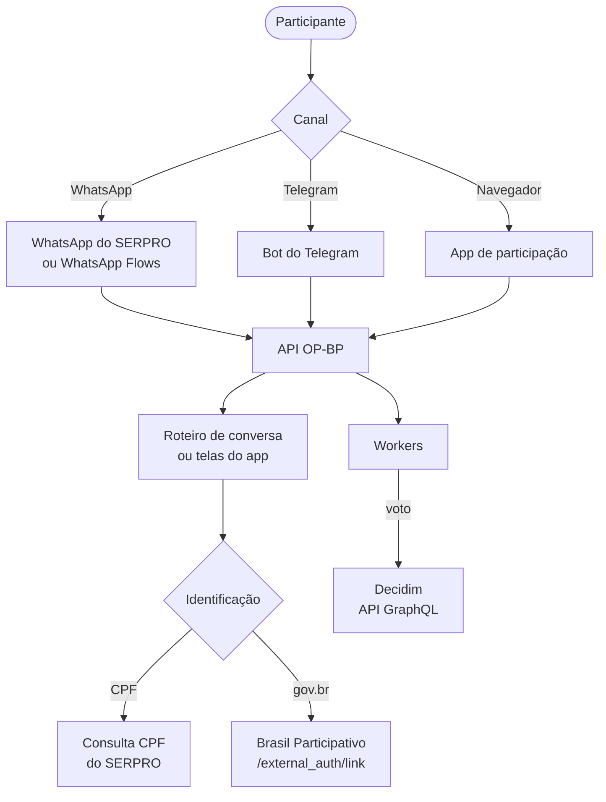

# Participação multicanal

A **participação multicanal** leva a participação do Brasil Participativo para fora do navegador: o participante vota, se identifica e acompanha processos pelo **WhatsApp**, pelo **Telegram** ou por um **app web**. O código está no repositório [`multi-channel-participation`](https://gitlab.com/lappis-unb/decidimbr/multi-channel-participation).

O backend é a **API OP-BP**, o mesmo sistema que a documentação do Brasil Participativo cita como integração externa. O nome vem do **Orçamento do Povo**, primeiro processo atendido (`api/README.md`; `api/app/main.py`).

## Componentes

| Componente | O que faz | Onde está |
|------------|-----------|-----------|
| **API OP-BP** | Recebe as mensagens dos canais, conduz a conversa, valida a identidade e registra os votos no Decidim | `api/` (Python, FastAPI) |
| **Workers** | Executam em segundo plano o registro de votos, a identificação e as chamadas a sistemas externos | `api/app/workers/` (Dramatiq) |
| **Painel administrativo** | Cadastro de processos, roteiros de conversa, propostas, participantes, votos e operação | `front/apps/admin/` (Vite + React) |
| **App de participação** | Votação do Orçamento do Povo como Telegram Mini App ou página web | `front/apps/participation/` (Next.js) |

## Como funciona

1. O participante escreve no canal. O provedor do canal entrega a mensagem à API por **webhook**.
2. A API identifica o processo, aplica o **roteiro de conversa** configurado para ele e responde no mesmo canal.
3. Para votar, o participante pode seguir anônimo, informar o **CPF** (validado no SERPRO) ou entrar com o **gov.br** pelo Brasil Participativo.
4. Os workers registram o voto no Decidim em nome do participante.

## Identificação progressiva

O mesmo participante passa por até três níveis, e o voto acompanha o nível alcançado (`api/app/core/enums.py`; `api/app/workers/tasks/vote_identify.py`):

| Nível | Como chega | Voto |
|-------|-----------|------|
| **Anônimo** | Só o identificador do canal (telefone ou id do Telegram) | Fica na API OP-BP |
| **Identificado** | CPF, nome e data de nascimento conferidos na Consulta CPF do SERPRO | Registrado no Decidim por um usuário efêmero criado a partir do CPF |
| **Autenticado** | Login gov.br pelo Brasil Participativo | Registrado no Decidim em nome da conta do participante |

Detalhes em [Votação e identificação](votacao.md).

## Processos atendidos

| Processo | Canal | Como funciona |
|----------|-------|---------------|
| **Orçamento do Povo** | WhatsApp Flows, app de participação | Escolha do município (por nome ou CEP) e voto em até 3 propostas. O catálogo embarcado tem 420 municípios e 4.173 propostas (`api/app/data/decidim_proposals_components.json`) |
| **Concierge do Brasil Participativo** | WhatsApp, Telegram | Saudação, dúvidas frequentes e busca de processos abertos. Não registra voto (`api/scripts/flows/bp-concierge.yml`) |
| **Consultas locais** | WhatsApp, Telegram | Roteiros próprios, como a consulta da Vila Carioca, com escolha de tema, login gov.br e ranking (`api/scripts/flows/vila-carioca.yml`) |

## Situação do projeto

- Primeiro commit em março de 2026; desenvolvimento concentrado em maio e junho de 2026. Veja [Estatísticas › Participação multicanal](../estatisticas/multicanal/index.md).
- Sem versões publicadas (tags) e sem arquivo de licença no repositório.
- A documentação interna (`docs/api-scenarios.md`, `api/CLAUDE.md`, READMEs) está parcialmente desatualizada. Esta documentação segue o código da branch `main`.

## Nesta seção

-   :material-sitemap:{ .lg .middle } **[Arquitetura](arquitetura.md)**

    API, workers, filas, cache e o caminho de uma mensagem.

-   :material-cellphone-message:{ .lg .middle } **[Canais](canais.md)**

    WhatsApp do SERPRO, WhatsApp Flows, Telegram e app web.

-   :material-state-machine:{ .lg .middle } **[Roteiros de conversa](roteiros.md)**

    Máquinas de estado em YAML, editáveis pelo painel.

-   :material-vote:{ .lg .middle } **[Votação e identificação](votacao.md)**

    Níveis de identificação, regras de voto e anonimização.

-   :material-link-variant:{ .lg .middle } **[Integração com o Decidim](integracao.md)**

    GraphQL, login gov.br e catálogo de processos.

-   :material-view-dashboard:{ .lg .middle } **[Painel e app](painel.md)**

    Painel administrativo e app de participação.

-   :material-database:{ .lg .middle } **[Modelo de dados](dados.md)**

    As 19 tabelas e as migrações Alembic.

-   :material-cog:{ .lg .middle } **[Configuração](configuracao.md)**

    Variáveis de ambiente e validações de produção.

-   :material-rocket-launch:{ .lg .middle } **[Implantação e desenvolvimento](implantacao.md)**

    Docker Compose, imagens, CI e ambiente local.

