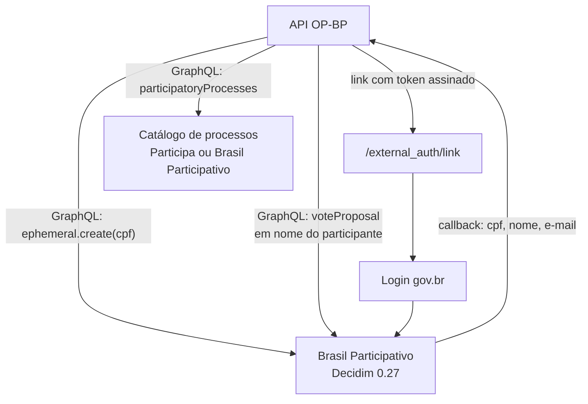

# Integração com o Decidim

A API OP-BP conversa com o Decidim de três formas: registra votos pela API GraphQL, usa o login gov.br do Brasil Participativo e consulta o catálogo de processos abertos.

## Registro de votos

Endpoint: `{BP_API_URL}/api/` (GraphQL). Não há uso de REST nem de `/api/sign_in` (`api/app/integrations/bp_client.py`).

| Operação | Mutation | Autenticação |
|----------|----------|--------------|
| Criar usuário efêmero a partir do CPF | `ephemeral(authKey) { create(cpf) }` | `authKey` = `BP_API_KEY` |
| Votar numa proposta | `proposal(id) { voteProposal { id } }` | Cabeçalhos de **impersonação** `X-API-KEY` e `X-USER-ID` |

Para participantes autenticados, `X-USER-ID` recebe o id numérico da conta Decidim, extraído do token devolvido no login gov.br e guardado em `users.external_key`.

O host do Brasil Participativo (Decidim 0.27) só aceita troca de chave RSA no TLS. Por isso o cliente HTTP readmite essas suítes no fim da lista de preferência (`api/app/core/http_client.py`).

## Login gov.br

O fluxo usa o **login externo** do Brasil Participativo (`/external_auth/link`), descrito na documentação do decidim-govbr (`api/app/services/govbr_identity_service.py`):

1. A API verifica se o processo está ativo e permite o gov.br.
2. Gera um `source_id`, token assinado que identifica o participante, o processo e o canal, válido por 10 horas.
3. Gera o token do link com o `source_id`, o endereço de retorno (`GOVBR_CALLBACK_URL`) e, se configurado, o endereço de volta ao canal.
4. O participante abre `{GOVBR_AUTH_BASE_URL}?token=...`. O host precisa estar na lista permitida: `sso.acesso.gov.br`, `acesso.gov.br`, `contas.acesso.gov.br`, `brasilparticipativo.presidencia.gov.br`, `staging.brasilparticipativo.presidencia.gov.br` e `lab-decide.dataprev.gov.br`.
5. Depois do login, o Decidim chama `POST /api/v1/identity/govbr/callback` com `source_id`, `external_id`, CPF, nome, e-mail e situação, autenticado por chave compartilhada.
6. O worker `process_govbr_auth` promove o participante a **autenticado** (exige CPF e e-mail), reaproveita a pessoa pelo hash do CPF e dispara o registro dos votos e a mensagem de compartilhamento.

Callbacks repetidos para quem já está autenticado só reenviam a mensagem de compartilhamento, respeitando o intervalo mínimo.

### Segredos compartilhados com o Decidim

Os valores precisam coincidir dos dois lados. Os nomes do lado Decidim são os do `decidim-govbr` (`api/app/config.py`; `api/.env.example`):

| API OP-BP | Decidim | Uso |
|-----------|---------|-----|
| `GOVBR_JWT_SECRET` | `EXTERNAL_AUTH_SECRET` | Assina os tokens do link de login externo |
| `BP_API_KEY` | `N8N_SECRET_KEY` | Chave da API do Decidim usada pela API OP-BP |
| `GOVBR_CALLBACK_API_KEY` | `N8N_SECRET_KEY` | Chave do callback; precisa ser igual a `BP_API_KEY` |

O nome `N8N_SECRET_KEY` indica que a API OP-BP substituiu uma integração anterior feita com n8n (**inferido**; o repositório não contém n8n).

## Catálogo de processos

O concierge lista processos com participação aberta pela consulta GraphQL `participatoryProcesses` de uma instância Decidim (`api/app/integrations/processes_catalog_client.py`):

- **Instância padrão**: `PROCESSES_API_URL`, que hoje aponta para o ambiente de desenvolvimento do Participa do Acre. O código traz um TODO para trocar pela produção do Acre quando ela existir.
- **Por processo**: cada processo pode apontar para outra instância (`process_catalog_config`, com chave cifrada e até 20 destaques).
- **Compatibilidade**: a consulta remove campos desconhecidos e serve Decidim 0.27 (Brasil Participativo), 0.29 a 0.31 e 0.32 (Participa).
- **Filtro**: "aberto agora" no fuso `PROCESSES_TIMEZONE` (padrão `America/Rio_Branco`), com busca por texto livre e cache de 5 minutos.

## Relação com o Participa

| Ponto | Situação no código |
|-------|-------------------|
| Destino dos votos | Brasil Participativo (`BP_API_URL`) |
| Catálogo do concierge | Participa do Acre (ambiente de desenvolvimento) |
| Chatbot do Participa | O Participa tem um módulo próprio de chatbot por WhatsApp (`decidim-chatbot`), independente da API OP-BP. Veja [Participa › Chatbot](../participa/chatbot.md) |
