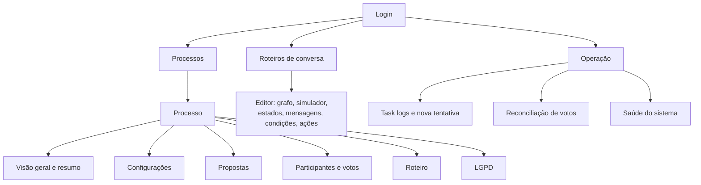
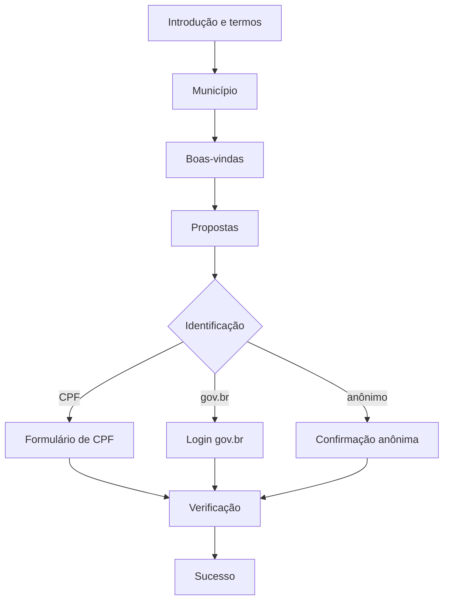

# Painel administrativo e app de participação

O front-end é um monorepo **pnpm + Turborepo** em `front/`, com dois apps e pacotes de configuração compartilhados (`eslint-config`, `tailwind-config`, `tsconfig`).

| App | Tecnologia | Público |
|-----|-----------|---------|
| `apps/admin` | Vite 6, React 19, React Router 7, TanStack Query 5, CodeMirror 6 | Gestores de processo e equipe de operação |
| `apps/participation` | Next.js 16, React 19, SDK de Telegram Mini Apps, next-intl, Tailwind 4 | Participantes |

## Painel administrativo

O painel (chamado **BPAPI** na barra lateral) consome as rotas `/api/v1/admin/*` da API OP-BP, no endereço `VITE_API_URL`.

### Acesso

O administrador entra com a chave `ADMIN_API_KEY`. A partir dela, o painel pode obter um token JWT de curta duração (padrão de 1 hora) em `POST /api/v1/admin/auth/token` e revogá-lo ao sair (`/auth/revoke`). Ao contrário do que dizem o README do painel e `docs/api-scenarios.md`, a emissão do token exige a chave de administrador (`api/app/routes/admin.py`).

### Telas

| Tela | O que permite |
|------|---------------|
| **Processos** | Criar e editar processos: dados gerais, período e fonte das propostas, regras de votação, credenciais do WhatsApp e catálogo de processos |
| **Processo › Configurações** | Webhook (salvar e registrar no SERPRO), alteração de voto, anonimização, comando de reinício em produção |
| **Processo › Propostas** | Cadastro e importação em lote de propostas |
| **Processo › Participantes e votos** | Consulta filtrada por processo; CPF sempre mascarado |
| **Processo › Roteiro** | Escolha do roteiro de conversa do processo |
| **Processo › LGPD** | Anonimização em duas etapas (preparar e confirmar) |
| **Roteiros de conversa** | Editor visual com grafo, simulador e edição de estados; versões e publicação |
| **Operação** | Tarefas com falha e nova tentativa, reconciliação entre cache e banco, saúde do sistema, tempo por passo do roteiro |

Fontes: `front/apps/admin/src/main.tsx`, `routes/ProcessDetail.tsx`, `components/ProcessModal.tsx`, `routes/flow/`, `routes/Operations.tsx`.

## App de participação

App de votação do **Orçamento do Povo** que roda como **Telegram Mini App** ou como página **web**, conforme `NEXT_PUBLIC_PLATFORM` (`web` ou `telegram`).

- No Telegram, o participante é identificado pelo id do usuário do Telegram; na web, por um identificador de sessão gerado no navegador (`src/platform/`).
- O navegador chama `/api/v1/*`, que o Next reescreve para `NEXT_PUBLIC_API_URL` (`next.config.ts`).
- O processo é fixado por `NEXT_PUBLIC_PROCESS_ID` (padrão 1); a descoberta de processos ainda é um TODO no código.
- Municípios, estados e o catálogo de componentes do Decidim vêm de arquivos estáticos em `public/data/`.

### Etapas

O app tem painel de acessibilidade (`src/components/accessibility/`) e um botão de reinício para demonstração.

## Implantação do front-end

Não há Dockerfile nem job de CI para os apps. O README do front é o do modelo de Telegram Mini Apps e sugere Vercel. Onde e como os apps são publicados está **a confirmar**.
