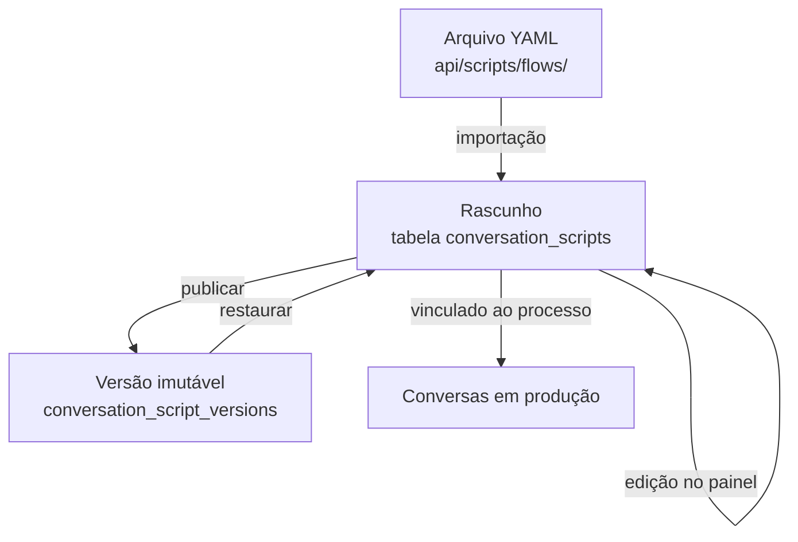

# Roteiros de conversa

Nos canais de texto (WhatsApp do SERPRO e Telegram), a conversa segue um **roteiro**: uma máquina de estados escrita em YAML. O gestor de processo edita o roteiro pelo painel, e a troca vale na mensagem seguinte, sem reiniciar a API.

O motor está em `api/scripts/flow_engine.py`, e os roteiros versionados, em `api/scripts/flows/`.

## Estrutura

```yaml
fluxo: consulta-votacao
versao: "1.0"
descricao: >
  Consulta participativa que carrega as propostas reais do processo e
  contabiliza o voto do participante na proposta escolhida.

estado_inicial: Inicio

global:
  default:
    mensagem:
      tipo: texto
      corpo: "Não entendi. Envie 'oi' para recomeçar."
    proximo_estado: Inicio

estados:
  Inicio:
    transicoes:
      - acoes:
          - carregar_propostas:
              salvar_como: lista_propostas
        mensagem:
          tipo: botoes
          corpo: |
            Olá! Bem-vindo(a) à consulta participativa.
          botoes:
            - id: quero_participar
              titulo: Quero participar
        proximo_estado: MostrarPropostas
```

Trecho de `api/scripts/flows/consulta-votacao.yml`.

| Elemento | Para quê |
|----------|----------|
| `estado_inicial` | Onde a conversa começa |
| `estados` | Cada estado tem `transicoes`; cada transição pode ter condição (`quando`, `se`), `acoes`, `mensagem` e `proximo_estado` |
| `default` | Resposta quando nenhuma transição se aplica, no estado ou em `global` |
| `colecoes` | Listas fixas declaradas no próprio YAML, como menus |
| `variaveis` | Valores reutilizáveis; `${VAR}` só lê variáveis de ambiente com prefixo `FLOW_` ou `VILA_` |

### Condições

`quando` aceita `id` (botão ou item de lista), `id_em` (um de vários ids), `id_em_sessao`, `texto_contem`, `texto_livre` e `sempre`. O predicado `se` acrescenta uma expressão booleana sobre a sessão.

### Mensagens

Tipos `texto`, `botoes`, `lista` e `url_botao`. O corpo aceita modelos Jinja2, avaliados num ambiente isolado (*sandbox*).

### Ações

| Ação | Efeito |
|------|--------|
| `salvar`, `limpar` | Grava ou apaga valores na sessão |
| `carregar_propostas`, `carregar_processos`, `buscar_processos`, `carregar_ranking` | Busca dados antes de montar a resposta |
| `votar`, `alterar_voto_acao` | Registra ou altera o voto |
| `criar_proposta` | Grava uma proposta enviada pelo participante |
| `gerar_link_govbr` | Gera o link de login gov.br |

As ações que acessam banco ou sistemas externos viram **eventos de negócio**, resolvidos pelo orquestrador fora do motor (`api/app/services/conversation_orchestrator.py`; `api/app/services/business_event_handler.py`). Por isso, dados carregados num passo só aparecem na mensagem seguinte.

## Ciclo de vida



- Em produção, vale o conteúdo da tabela `conversation_scripts`, não o arquivo.
- O painel valida o YAML com o próprio motor antes de salvar; roteiro inválido é recusado (HTTP 422).
- Publicar cria uma cópia imutável; restaurar devolve uma cópia ao rascunho.
- O orquestrador guarda os roteiros compilados em memória pela data de atualização, por isso a troca vale sem reinício.
- Cada mudança de estado é registrada em `flow_step_events`, base do painel de tempo por passo.

## Roteiros existentes

| Roteiro | Linhas | O que faz |
|---------|-------:|-----------|
| `bp-concierge.yml` | 646 | Concierge do Brasil Participativo: menu, dúvidas frequentes, lista e busca de processos abertos. Não registra voto |
| `vila-carioca.yml` | 433 | Consulta da Vila Carioca: tema prioritário do bairro, login gov.br, ranking e compartilhamento |
| `consulta-votacao.yml` | 112 | Consulta genérica: carrega as propostas do processo e registra o voto |

O concierge é provisionado em produção pela API do painel com `api/scripts/provision_bp_concierge.py` (simulação por padrão; `--apply` aplica). A opção `--register-webhook` registra o webhook no SERPRO e tem efeito externo.

## Comando de reinício para testes

Há um comando de depuração que reinicia a sessão do participante e apaga o voto e o vínculo dele. Fora de produção, ele sempre funciona. Em produção, só funciona se o processo tiver a opção **Permitir comando de reset em produção** ligada (`allow_reset_command`, desligada por padrão; `api/app/models/process_settings.py`).

!!! danger "Desligue antes de abrir o processo"
    Com a opção ligada, qualquer participante que conheça o comando pode apagar o próprio voto e votar de novo. Use só em homologação ou em testes com o processo fechado ao público.
