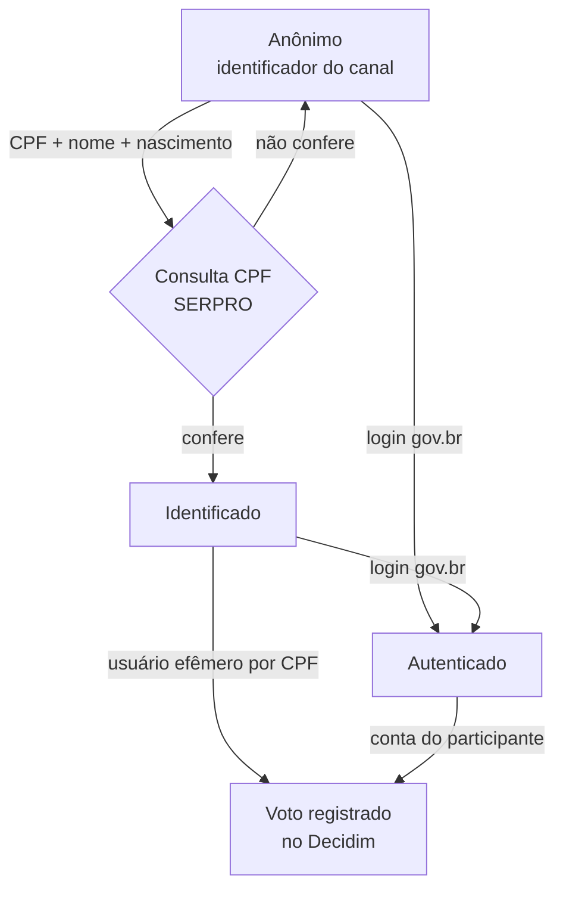

# Votação e identificação

## Regras de voto

As regras ficam em `process_settings`, uma linha por processo (`api/app/models/process_settings.py`):

| Opção | Padrão | Efeito |
|-------|--------|--------|
| `max_votes_per_participant` | 3 | Máximo de propostas por participante no processo |
| `cpf_validation_enabled` | sim | Permite a identificação por CPF |
| `cpf_validation_max_attempts` | 5 | Tentativas de CPF antes do bloqueio do participante |
| `allow_govbr_authentication` | sim | Permite o login gov.br |
| `minimum_age` | 15 | Idade mínima, conferida na Consulta CPF |
| `register_votes_on_bp` | sim | Registra os votos no Decidim; desligado, o voto fica só na API |
| `allow_vote_change` | não | Permite trocar o voto. A troca vale **só na API**; o registro no Brasil Participativo não muda |
| `allow_reset_command` | não | Permite o [comando de reinício](roteiros.md#comando-de-reinicio-para-testes) em produção |
| `anonymization_enabled` | não | Permite a [anonimização](#anonimizacao) do processo |

O voto é registrado de uma vez (*one-shot*). Uma marca no Valkey, válida por 90 dias, impede o voto duplo do mesmo participante no mesmo processo.

## Níveis de identificação

| Nível | Requisito | Registro no Decidim |
|-------|-----------|---------------------|
| **Anônimo** | Identificador do canal | Não |
| **Identificado** | CPF validado no SERPRO | Sim, por um usuário efêmero criado com o CPF |
| **Autenticado** | Login gov.br com CPF e e-mail | Sim, em nome da conta gov.br do participante |

### Identificação por CPF

O serviço `api/app/services/cpf_validate_service.py` consulta a **Consulta CPF** do SERPRO e confere:

- situação cadastral regular;
- data de nascimento igual à informada;
- nome compatível (sem acentos; igual, contido ou com ao menos duas palavras em comum);
- idade mínima do processo.

Proteções: limite de tentativas por participante (bloqueio após 5 em 24 h) e por CPF (10 em 24 h), resposta do SERPRO em cache por 24 h, tempo mínimo de resposta para não revelar resultados pelo tempo, e um token de validação de uso único (30 min). Fora de produção, a consulta pode usar um simulador (`SERPRO_USE_REAL_API=false`).

### Login gov.br

O login usa o fluxo de **login externo** do Brasil Participativo (`/external_auth/link`). Veja [Integração com o Decidim](integracao.md#login-govbr).

## Registro no Decidim

O worker `bp_register_votes` (fila `external-api`) registra os votos pela API GraphQL do Decidim (`api/app/integrations/bp_client.py`):

1. Participante identificado: cria um **usuário efêmero** a partir do CPF (`ephemeral.create`).
2. Participante autenticado: usa o id da conta Decidim recebido no retorno do login gov.br.
3. Para cada proposta com id do Decidim, chama `voteProposal` agindo em nome do usuário (**impersonação**).

Respostas como "votação encerrada" ou "não autorizado" são tratadas como voto já registrado. Erros de chave são permanentes e não geram nova tentativa. O registro de votos em lote usa até 5 chamadas simultâneas.

## Anonimização

Por processo, e só com `anonymization_enabled` ligado, o gestor de processo pode anonimizar os participantes (`api/app/services/anonymization_service.py`):

1. **Preparar**: o painel pede a ação e recebe um token de confirmação válido por 5 minutos.
2. **Executar**: o vínculo entre participante e pessoa é desfeito, e uma **prova de participação** (pessoa, processo, canal e método de identificação, sem o voto) é criada em `participation_proofs`.
3. O mapeamento anterior fica cifrado por 7 dias em `anonymization_backups`, para permitir reverter.

!!! note "O que a anonimização não apaga"
    Os dados da pessoa em `users` (CPF cifrado, nome, e-mail e data de nascimento) permanecem. Não há rotina de retenção ou expurgo de dados pessoais no código. A política de retenção precisa ser definida com a SNPS antes da transferência ([Segurança e LGPD](../transferencia/seguranca.md)).
