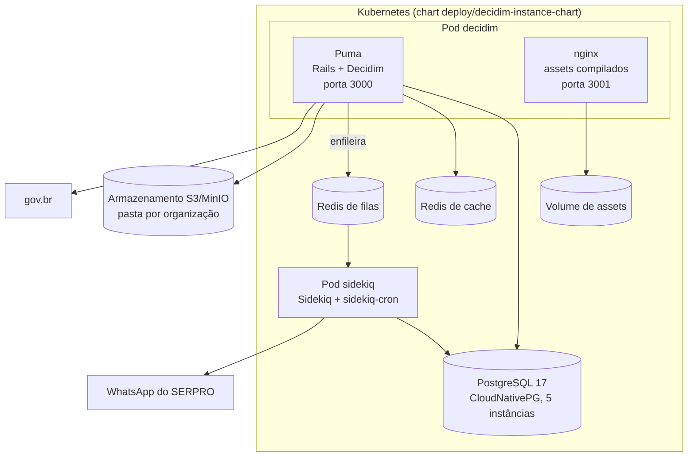

# Arquitetura do Participa

O Participa é um **monolito Rails** (aplicação hospedeira do Decidim) com processos separados para web e tarefas em segundo plano, um PostgreSQL com um schema por organização e dois Redis.

## Processos em execução

| Processo | Como roda | Evidência |
|----------|-----------|-----------|
| Web | Puma (`bundle exec puma`), 1 worker e 6 threads por padrão, porta 3000 | `config/puma.rb`; ConfigMap `puma-configmap.yaml` |
| Tarefas | Sidekiq 7 com filas ponderadas (`mailers` peso 4; `default`, `reminders`, `newsletter`, `events` e outras peso 2; `metrics`, `exports` peso 1) | `config/sidekiq.yml` |
| Agendamento | `sidekiq-cron`, carregado no início do Sidekiq a partir de `config/sidekiq_cron_schedule.yml`. Único job: troca automática de etapa, de hora em hora | `config/initializers/sidekiq_cron.rb` |
| Assets | Compilados por um job do Helm num volume e servidos por um nginx ao lado do Puma, em `/decidim-packs` | `assets-job.yaml`; `assets-nginx-configmap.yaml` |
| WebSockets | Action Cable carregado, sem canais em uso | `config/cable.yml` |
| Profiling | Pyroscope em produção, inclusive nos jobs | `config/initializers/pyroscope.rb` |

!!! warning "Tarefas periódicas do Decidim sem agendamento"
    A documentação do Decidim 0.32 recomenda agendar tarefas como resumos de notificação, lembretes, exportação de dados abertos, limpeza de arquivos de "baixar meus dados", troca de etapa e exclusão de participantes inativos. Nenhuma delas está agendada no repositório (nem no `sidekiq-cron`, nem como CronJob no Helm). Se existem, estão em outro repositório (**a confirmar**).

## Camadas do monolito

| Camada | Onde está | O que faz |
|--------|-----------|-----------|
| Front-end | Views ERB e cells do Decidim, sobrescritas pontuais em `app/` e na engine `decidim-govbr`; JavaScript e SCSS em `app/packs/`, compilados com Shakapacker 9.7 | Interface pública e painéis |
| Back-end | Rails 8.1 com o padrão do Decidim: commands, forms, permissions, cells, jobs | Regras de negócio |
| Extensões | Gems `decidim-*` do Brasil Participativo e de terceiros; engines `decidim-govbr` e `decidim-chatbot` | Funcionalidades além do Decidim |
| Multi-organização | `decidim-apartment` + `ros-apartment` | Troca de schema por host, jobs, cache e arquivos por organização |
| Dados | PostgreSQL (schemas por organização, extensões em `shared_extensions`), Redis, S3/MinIO | Persistência |
| API | GraphQL do Decidim em `/api` | Leitura e escrita por clientes externos |

O Participa usa Deface para alterar trechos de views do Decidim sem copiá-las. Em produção, as views alteradas são pré-compiladas na imagem (`rails deface:precompile`) e o Deface fica desligado em execução (`config/environments/production.rb`).

## Pilha

| Item | Versão |
|------|--------|
| Ruby | 3.4.7 |
| Rails | 8.1.4 |
| Decidim | 0.32.1 |
| Node.js | 22.14.0 |
| PostgreSQL | 17.5 |
| Redis | 7.4 (desenvolvimento), 7.2 (chart Bitnami) |
| Sidekiq | 7.3 com sidekiq-cron 2.4 |
| Puma | 6.6 |
| Shakapacker | 9.7 |
| Multi-organização | ros-apartment 3.4.4 e decidim-apartment |

Fontes: `.ruby-version`, `.node-version`, `Gemfile.lock`, `docker-compose.yml`, `deploy/decidim-instance-chart/`.

## Integrações

| Serviço | Para quê | Configuração |
|---------|----------|--------------|
| gov.br (Login Único) | Login com OAuth2/OpenID Connect e PKCE; o CPF vem do `sub` | Por organização, no `/system`; variáveis `OMNIAUTH_GOVBR_*` como padrão |
| WhatsApp do SERPRO | [Chatbot](chatbot.md) | Por organização, no painel do chatbot |
| SMTP | E-mails | Por organização, no `/system`; `SMTP_*` como padrão global |
| S3/MinIO | Arquivos enviados, separados por organização | `STORAGE_PROVIDER`, `AWS_*` |
| Mapas | OpenStreetMap (blocos), HERE (geocodificação e mapa estático com chave) ou Photon | `OSM_URL`, `MAPS_HERE_API_KEY`, `MAPS_GEOCODING_HOST` |
| Análise de uso | Matomo (Tag Manager) e PostHog | `MATOMO_*`, `POSTHOG_*` |
| Modelos de processo | Repositório Git do catálogo | `TEMPLATE_GIT_*` |
| Etherpad | Opcional | Credenciais Rails |

## APIs expostas

- **GraphQL** do Decidim em `/api`, com GraphiQL em `/api/graphiql` e login de API em `/api/sign_in`. Limites: 50 itens por página, complexidade 5.000 e profundidade 15. CORS em `/api*` só para as origens de `ALLOWED_ORIGINS`.
- **Webhooks do chatbot** em `/chatbot/webhooks/:token` e páginas de identificação em `/chatbot/identify/:token`.
- **Dados abertos** do Decidim, exportados por organização.

O Participa não tem a API REST própria nem a impersonação de usuários do `decidim-govbr`, usadas pela API OP-BP.
