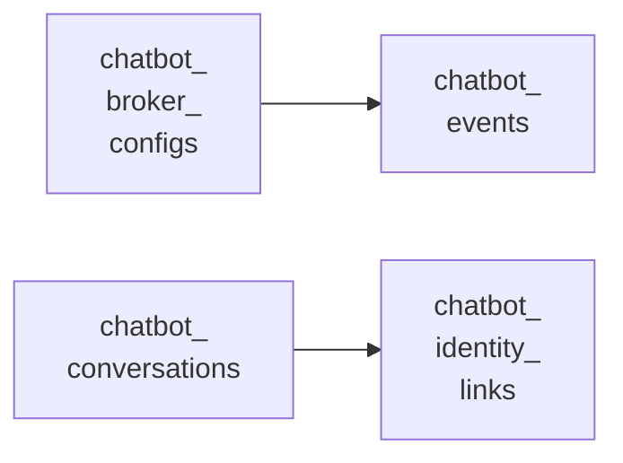

<!-- Gerado por scripts/banco_de_dados.py em 2026-10-09T16:34:04+00:00. Não edite à mão. -->

# Chatbot

Tabelas do módulo decidim-chatbot: provedores de mensageria, conversas, eventos, roteiro e links de identificação.

**5 tabelas.** Schema versão `20260924162404`. Legenda da coluna **Referência**: *FK* = chave estrangeira declarada no banco; *→* = referência por convenção de nome (sem restrição no banco).

## Relacionamentos

Cada seta vai da tabela referenciada para a tabela que guarda a referência. Referências para outros domínios aparecem na coluna **Referência** das tabelas abaixo.

## Tabelas

| Tabela | Descrição | Colunas | Origem |
|---|---|---:|---|
| [`decidim_chatbot_broker_configs`](#decidim-chatbot-broker-configs) | Provedor de mensageria da organização (hoje só o WhatsApp do SERPRO), com segredos cifrados e dados do webhook. | 11 | :flag_br: Participa |
| [`decidim_chatbot_conversations`](#decidim-chatbot-conversations) | Conversa de uma pessoa (telefone) com o chatbot: estado do roteiro, participante vinculado e voto confirmado. | 11 | :flag_br: Participa |
| [`decidim_chatbot_events`](#decidim-chatbot-events) | Mensagens recebidas e enviadas, com situação (pendente, processada, ignorada, falha, enviada). | 12 | :flag_br: Participa |
| [`decidim_chatbot_flow_settings`](#decidim-chatbot-flow-settings) | Roteiro da organização: textos editáveis, componente de propostas, modo de identificação, rascunho e versão publicada. | 10 | :flag_br: Participa |
| [`decidim_chatbot_identity_links`](#decidim-chatbot-identity-links) | Links de identificação enviados na conversa: só o resumo do token, validade de 1 hora, uso único. | 8 | :flag_br: Participa |

### `decidim_chatbot_broker_configs` { #decidim-chatbot-broker-configs }

Provedor de mensageria da organização (hoje só o WhatsApp do SERPRO), com segredos cifrados e dados do webhook.

Origem: :flag_br: Participa.

| Coluna | Tipo | Nulo | Padrão | Referência / observação | Origem |
|---|---|:---:|---|---|---|
| `id` | `bigint` | não |  | chave primária | [:flag_br: Participa](https://gitlab.com/lappis-unb/decidimbr/participa/-/blob/main/db/migrate/20260918211817_create_decidim_chatbot_broker_configs.decidim_chatbot.rb "20260918211817_create_decidim_chatbot_broker_configs.decidim_chatbot.rb") |
| `active` | `boolean` | não | `false` |  | [:flag_br: Participa](https://gitlab.com/lappis-unb/decidimbr/participa/-/blob/main/db/migrate/20260918211817_create_decidim_chatbot_broker_configs.decidim_chatbot.rb "20260918211817_create_decidim_chatbot_broker_configs.decidim_chatbot.rb") |
| `created_at` | `datetime` | não |  |  | [:flag_br: Participa](https://gitlab.com/lappis-unb/decidimbr/participa/-/blob/main/db/migrate/20260918211817_create_decidim_chatbot_broker_configs.decidim_chatbot.rb "20260918211817_create_decidim_chatbot_broker_configs.decidim_chatbot.rb") |
| `decidim_organization_id` | `bigint` | não |  | FK → [`decidim_organizations`](organizacao-usuarios.md#decidim-organizations) | [:flag_br: Participa](https://gitlab.com/lappis-unb/decidimbr/participa/-/blob/main/db/migrate/20260918211817_create_decidim_chatbot_broker_configs.decidim_chatbot.rb "20260918211817_create_decidim_chatbot_broker_configs.decidim_chatbot.rb") |
| `key` | `string` | não |  |  | [:flag_br: Participa](https://gitlab.com/lappis-unb/decidimbr/participa/-/blob/main/db/migrate/20260918211817_create_decidim_chatbot_broker_configs.decidim_chatbot.rb "20260918211817_create_decidim_chatbot_broker_configs.decidim_chatbot.rb") |
| `settings` | `jsonb` | não | `{}` |  | [:flag_br: Participa](https://gitlab.com/lappis-unb/decidimbr/participa/-/blob/main/db/migrate/20260918211817_create_decidim_chatbot_broker_configs.decidim_chatbot.rb "20260918211817_create_decidim_chatbot_broker_configs.decidim_chatbot.rb") |
| `updated_at` | `datetime` | não |  |  | [:flag_br: Participa](https://gitlab.com/lappis-unb/decidimbr/participa/-/blob/main/db/migrate/20260918211817_create_decidim_chatbot_broker_configs.decidim_chatbot.rb "20260918211817_create_decidim_chatbot_broker_configs.decidim_chatbot.rb") |
| `webhook_id` | `string` | sim |  |  | [:flag_br: Participa](https://gitlab.com/lappis-unb/decidimbr/participa/-/blob/main/db/migrate/20260918211817_create_decidim_chatbot_broker_configs.decidim_chatbot.rb "20260918211817_create_decidim_chatbot_broker_configs.decidim_chatbot.rb") |
| `webhook_registered_at` | `datetime` | sim |  |  | [:flag_br: Participa](https://gitlab.com/lappis-unb/decidimbr/participa/-/blob/main/db/migrate/20260918211817_create_decidim_chatbot_broker_configs.decidim_chatbot.rb "20260918211817_create_decidim_chatbot_broker_configs.decidim_chatbot.rb") |
| `webhook_secret` | `text` | sim |  |  | [:flag_br: Participa](https://gitlab.com/lappis-unb/decidimbr/participa/-/blob/main/db/migrate/20260918211817_create_decidim_chatbot_broker_configs.decidim_chatbot.rb "20260918211817_create_decidim_chatbot_broker_configs.decidim_chatbot.rb") |
| `webhook_token` | `string` | sim |  |  | [:flag_br: Participa](https://gitlab.com/lappis-unb/decidimbr/participa/-/blob/main/db/migrate/20260918211817_create_decidim_chatbot_broker_configs.decidim_chatbot.rb "20260918211817_create_decidim_chatbot_broker_configs.decidim_chatbot.rb") |

??? note "Índices (2)"

    | Nome | Colunas | Único | Tipo |
    |---|---|:---:|---|
    | `index_decidim_chatbot_broker_configs_on_key` | `decidim_organization_id`, `key` | sim | btree |
    | `index_decidim_chatbot_broker_configs_on_webhook_token` | `webhook_token` | sim | btree |

### `decidim_chatbot_conversations` { #decidim-chatbot-conversations }

Conversa de uma pessoa (telefone) com o chatbot: estado do roteiro, participante vinculado e voto confirmado.

Origem: :flag_br: Participa.

| Coluna | Tipo | Nulo | Padrão | Referência / observação | Origem |
|---|---|:---:|---|---|---|
| `id` | `bigint` | não |  | chave primária | [:flag_br: Participa](https://gitlab.com/lappis-unb/decidimbr/participa/-/blob/main/db/migrate/20260918203843_create_decidim_chatbot_conversations.decidim_chatbot.rb "20260918203843_create_decidim_chatbot_conversations.decidim_chatbot.rb") |
| `broker` | `string` | não |  |  | [:flag_br: Participa](https://gitlab.com/lappis-unb/decidimbr/participa/-/blob/main/db/migrate/20260918203843_create_decidim_chatbot_conversations.decidim_chatbot.rb "20260918203843_create_decidim_chatbot_conversations.decidim_chatbot.rb") |
| `confirmed_at` | `datetime` | sim |  |  | [:flag_br: Participa](https://gitlab.com/lappis-unb/decidimbr/participa/-/blob/main/db/migrate/20260918203843_create_decidim_chatbot_conversations.decidim_chatbot.rb "20260918203843_create_decidim_chatbot_conversations.decidim_chatbot.rb") |
| `confirmed_option` | `string` | sim |  |  | [:flag_br: Participa](https://gitlab.com/lappis-unb/decidimbr/participa/-/blob/main/db/migrate/20260918203843_create_decidim_chatbot_conversations.decidim_chatbot.rb "20260918203843_create_decidim_chatbot_conversations.decidim_chatbot.rb") |
| `created_at` | `datetime` | não |  |  | [:flag_br: Participa](https://gitlab.com/lappis-unb/decidimbr/participa/-/blob/main/db/migrate/20260918203843_create_decidim_chatbot_conversations.decidim_chatbot.rb "20260918203843_create_decidim_chatbot_conversations.decidim_chatbot.rb") |
| `current_state` | `string` | sim |  |  | [:flag_br: Participa](https://gitlab.com/lappis-unb/decidimbr/participa/-/blob/main/db/migrate/20260918203843_create_decidim_chatbot_conversations.decidim_chatbot.rb "20260918203843_create_decidim_chatbot_conversations.decidim_chatbot.rb") |
| `data` | `jsonb` | não | `{}` |  | [:flag_br: Participa](https://gitlab.com/lappis-unb/decidimbr/participa/-/blob/main/db/migrate/20260918203843_create_decidim_chatbot_conversations.decidim_chatbot.rb "20260918203843_create_decidim_chatbot_conversations.decidim_chatbot.rb") |
| `decidim_organization_id` | `bigint` | não |  | FK → [`decidim_organizations`](organizacao-usuarios.md#decidim-organizations) | [:flag_br: Participa](https://gitlab.com/lappis-unb/decidimbr/participa/-/blob/main/db/migrate/20260918203843_create_decidim_chatbot_conversations.decidim_chatbot.rb "20260918203843_create_decidim_chatbot_conversations.decidim_chatbot.rb") |
| `decidim_user_id` | `bigint` | sim |  | FK → [`decidim_users`](organizacao-usuarios.md#decidim-users) | [:flag_br: Participa](https://gitlab.com/lappis-unb/decidimbr/participa/-/blob/main/db/migrate/20260918203843_create_decidim_chatbot_conversations.decidim_chatbot.rb "20260918203843_create_decidim_chatbot_conversations.decidim_chatbot.rb") |
| `updated_at` | `datetime` | não |  |  | [:flag_br: Participa](https://gitlab.com/lappis-unb/decidimbr/participa/-/blob/main/db/migrate/20260918203843_create_decidim_chatbot_conversations.decidim_chatbot.rb "20260918203843_create_decidim_chatbot_conversations.decidim_chatbot.rb") |
| `user_identifier` | `string` | não |  |  | [:flag_br: Participa](https://gitlab.com/lappis-unb/decidimbr/participa/-/blob/main/db/migrate/20260918203843_create_decidim_chatbot_conversations.decidim_chatbot.rb "20260918203843_create_decidim_chatbot_conversations.decidim_chatbot.rb") |

??? note "Índices (2)"

    | Nome | Colunas | Único | Tipo |
    |---|---|:---:|---|
    | `index_decidim_chatbot_conversations_on_user` | `decidim_organization_id`, `broker`, `user_identifier` | sim | btree |
    | `index_decidim_chatbot_conversations_on_decidim_user_id` | `decidim_user_id` |  | btree |

### `decidim_chatbot_events` { #decidim-chatbot-events }

Mensagens recebidas e enviadas, com situação (pendente, processada, ignorada, falha, enviada).

Origem: :flag_br: Participa.

| Coluna | Tipo | Nulo | Padrão | Referência / observação | Origem |
|---|---|:---:|---|---|---|
| `id` | `bigint` | não |  | chave primária | [:flag_br: Participa](https://gitlab.com/lappis-unb/decidimbr/participa/-/blob/main/db/migrate/20260918224245_create_decidim_chatbot_events.decidim_chatbot.rb "20260918224245_create_decidim_chatbot_events.decidim_chatbot.rb") |
| `created_at` | `datetime` | não |  |  | [:flag_br: Participa](https://gitlab.com/lappis-unb/decidimbr/participa/-/blob/main/db/migrate/20260918224245_create_decidim_chatbot_events.decidim_chatbot.rb "20260918224245_create_decidim_chatbot_events.decidim_chatbot.rb") |
| `decidim_chatbot_broker_config_id` | `bigint` | não |  | FK → [`decidim_chatbot_broker_configs`](chatbot.md#decidim-chatbot-broker-configs) | [:flag_br: Participa](https://gitlab.com/lappis-unb/decidimbr/participa/-/blob/main/db/migrate/20260918224245_create_decidim_chatbot_events.decidim_chatbot.rb "20260918224245_create_decidim_chatbot_events.decidim_chatbot.rb") |
| `direction` | `string` | não |  |  | [:flag_br: Participa](https://gitlab.com/lappis-unb/decidimbr/participa/-/blob/main/db/migrate/20260918224245_create_decidim_chatbot_events.decidim_chatbot.rb "20260918224245_create_decidim_chatbot_events.decidim_chatbot.rb") |
| `error` | `string` | sim |  |  | [:flag_br: Participa](https://gitlab.com/lappis-unb/decidimbr/participa/-/blob/main/db/migrate/20260918224245_create_decidim_chatbot_events.decidim_chatbot.rb "20260918224245_create_decidim_chatbot_events.decidim_chatbot.rb") |
| `external_id` | `string` | sim |  |  | [:flag_br: Participa](https://gitlab.com/lappis-unb/decidimbr/participa/-/blob/main/db/migrate/20260918224245_create_decidim_chatbot_events.decidim_chatbot.rb "20260918224245_create_decidim_chatbot_events.decidim_chatbot.rb") |
| `kind` | `string` | não |  |  | [:flag_br: Participa](https://gitlab.com/lappis-unb/decidimbr/participa/-/blob/main/db/migrate/20260918224245_create_decidim_chatbot_events.decidim_chatbot.rb "20260918224245_create_decidim_chatbot_events.decidim_chatbot.rb") |
| `occurred_at` | `datetime` | não |  |  | [:flag_br: Participa](https://gitlab.com/lappis-unb/decidimbr/participa/-/blob/main/db/migrate/20260918224245_create_decidim_chatbot_events.decidim_chatbot.rb "20260918224245_create_decidim_chatbot_events.decidim_chatbot.rb") |
| `status` | `string` | não |  |  | [:flag_br: Participa](https://gitlab.com/lappis-unb/decidimbr/participa/-/blob/main/db/migrate/20260918224245_create_decidim_chatbot_events.decidim_chatbot.rb "20260918224245_create_decidim_chatbot_events.decidim_chatbot.rb") |
| `updated_at` | `datetime` | não |  |  | [:flag_br: Participa](https://gitlab.com/lappis-unb/decidimbr/participa/-/blob/main/db/migrate/20260918224245_create_decidim_chatbot_events.decidim_chatbot.rb "20260918224245_create_decidim_chatbot_events.decidim_chatbot.rb") |
| `user_identifier` | `string` | não |  |  | [:flag_br: Participa](https://gitlab.com/lappis-unb/decidimbr/participa/-/blob/main/db/migrate/20260918224245_create_decidim_chatbot_events.decidim_chatbot.rb "20260918224245_create_decidim_chatbot_events.decidim_chatbot.rb") |
| `value` | `text` | sim |  |  | [:flag_br: Participa](https://gitlab.com/lappis-unb/decidimbr/participa/-/blob/main/db/migrate/20260918224245_create_decidim_chatbot_events.decidim_chatbot.rb "20260918224245_create_decidim_chatbot_events.decidim_chatbot.rb") |

??? note "Índices (4)"

    | Nome | Colunas | Único | Tipo |
    |---|---|:---:|---|
    | `index_decidim_chatbot_events_on_time` | `decidim_chatbot_broker_config_id`, `created_at` |  | btree |
    | `index_decidim_chatbot_events_on_external_id` | `decidim_chatbot_broker_config_id`, `external_id` | sim | btree (parcial: `(external_id IS NOT NULL)`) |
    | `index_decidim_chatbot_events_on_phone_window` | `decidim_chatbot_broker_config_id`, `user_identifier`, `direction`, `created_at` |  | btree |
    | `index_decidim_chatbot_events_on_inbox` | `decidim_chatbot_broker_config_id`, `user_identifier`, `status` |  | btree |

### `decidim_chatbot_flow_settings` { #decidim-chatbot-flow-settings }

Roteiro da organização: textos editáveis, componente de propostas, modo de identificação, rascunho e versão publicada.

Origem: :flag_br: Participa.

| Coluna | Tipo | Nulo | Padrão | Referência / observação | Origem |
|---|---|:---:|---|---|---|
| `id` | `bigint` | não |  | chave primária | [:flag_br: Participa](https://gitlab.com/lappis-unb/decidimbr/participa/-/blob/main/db/migrate/20260918201143_create_decidim_chatbot_flow_settings.decidim_chatbot.rb "20260918201143_create_decidim_chatbot_flow_settings.decidim_chatbot.rb") |
| `created_at` | `datetime` | não |  |  | [:flag_br: Participa](https://gitlab.com/lappis-unb/decidimbr/participa/-/blob/main/db/migrate/20260918201143_create_decidim_chatbot_flow_settings.decidim_chatbot.rb "20260918201143_create_decidim_chatbot_flow_settings.decidim_chatbot.rb") |
| `decidim_component_id` | `bigint` | sim |  | FK → [`decidim_components`](componentes-conteudo.md#decidim-components) | [:flag_br: Participa](https://gitlab.com/lappis-unb/decidimbr/participa/-/blob/main/db/migrate/20260918201143_create_decidim_chatbot_flow_settings.decidim_chatbot.rb "20260918201143_create_decidim_chatbot_flow_settings.decidim_chatbot.rb") |
| `decidim_organization_id` | `bigint` | não |  | FK → [`decidim_organizations`](organizacao-usuarios.md#decidim-organizations) | [:flag_br: Participa](https://gitlab.com/lappis-unb/decidimbr/participa/-/blob/main/db/migrate/20260918201143_create_decidim_chatbot_flow_settings.decidim_chatbot.rb "20260918201143_create_decidim_chatbot_flow_settings.decidim_chatbot.rb") |
| `identity_mode` | `string` | não | `"ephemeral"` |  | [:flag_br: Participa](https://gitlab.com/lappis-unb/decidimbr/participa/-/blob/main/db/migrate/20260918201143_create_decidim_chatbot_flow_settings.decidim_chatbot.rb "20260918201143_create_decidim_chatbot_flow_settings.decidim_chatbot.rb") |
| `published` | `jsonb` | sim |  |  | [:flag_br: Participa](https://gitlab.com/lappis-unb/decidimbr/participa/-/blob/main/db/migrate/20260918201143_create_decidim_chatbot_flow_settings.decidim_chatbot.rb "20260918201143_create_decidim_chatbot_flow_settings.decidim_chatbot.rb") |
| `published_at` | `datetime` | sim |  |  | [:flag_br: Participa](https://gitlab.com/lappis-unb/decidimbr/participa/-/blob/main/db/migrate/20260918201143_create_decidim_chatbot_flow_settings.decidim_chatbot.rb "20260918201143_create_decidim_chatbot_flow_settings.decidim_chatbot.rb") |
| `published_by_id` | `bigint` | sim |  | FK → [`decidim_users`](organizacao-usuarios.md#decidim-users) | [:flag_br: Participa](https://gitlab.com/lappis-unb/decidimbr/participa/-/blob/main/db/migrate/20260918201143_create_decidim_chatbot_flow_settings.decidim_chatbot.rb "20260918201143_create_decidim_chatbot_flow_settings.decidim_chatbot.rb") |
| `updated_at` | `datetime` | não |  |  | [:flag_br: Participa](https://gitlab.com/lappis-unb/decidimbr/participa/-/blob/main/db/migrate/20260918201143_create_decidim_chatbot_flow_settings.decidim_chatbot.rb "20260918201143_create_decidim_chatbot_flow_settings.decidim_chatbot.rb") |
| `values` | `jsonb` | não | `{}` |  | [:flag_br: Participa](https://gitlab.com/lappis-unb/decidimbr/participa/-/blob/main/db/migrate/20260918201143_create_decidim_chatbot_flow_settings.decidim_chatbot.rb "20260918201143_create_decidim_chatbot_flow_settings.decidim_chatbot.rb") |

??? note "Índices (2)"

    | Nome | Colunas | Único | Tipo |
    |---|---|:---:|---|
    | `index_decidim_chatbot_flow_settings_on_decidim_component_id` | `decidim_component_id` |  | btree |
    | `index_decidim_chatbot_flow_settings_on_decidim_organization_id` | `decidim_organization_id` | sim | btree |

### `decidim_chatbot_identity_links` { #decidim-chatbot-identity-links }

Links de identificação enviados na conversa: só o resumo do token, validade de 1 hora, uso único.

Origem: :flag_br: Participa.

| Coluna | Tipo | Nulo | Padrão | Referência / observação | Origem |
|---|---|:---:|---|---|---|
| `id` | `bigint` | não |  | chave primária | [:flag_br: Participa](https://gitlab.com/lappis-unb/decidimbr/participa/-/blob/main/db/migrate/20260919164737_create_decidim_chatbot_identity_links.decidim_chatbot.rb "20260919164737_create_decidim_chatbot_identity_links.decidim_chatbot.rb") |
| `attempts` | `integer` | não | `0` |  | [:flag_br: Participa](https://gitlab.com/lappis-unb/decidimbr/participa/-/blob/main/db/migrate/20260919164737_create_decidim_chatbot_identity_links.decidim_chatbot.rb "20260919164737_create_decidim_chatbot_identity_links.decidim_chatbot.rb") |
| `created_at` | `datetime` | não |  |  | [:flag_br: Participa](https://gitlab.com/lappis-unb/decidimbr/participa/-/blob/main/db/migrate/20260919164737_create_decidim_chatbot_identity_links.decidim_chatbot.rb "20260919164737_create_decidim_chatbot_identity_links.decidim_chatbot.rb") |
| `decidim_chatbot_conversation_id` | `bigint` | não |  | FK → [`decidim_chatbot_conversations`](chatbot.md#decidim-chatbot-conversations) | [:flag_br: Participa](https://gitlab.com/lappis-unb/decidimbr/participa/-/blob/main/db/migrate/20260919164737_create_decidim_chatbot_identity_links.decidim_chatbot.rb "20260919164737_create_decidim_chatbot_identity_links.decidim_chatbot.rb") |
| `expires_at` | `datetime` | não |  |  | [:flag_br: Participa](https://gitlab.com/lappis-unb/decidimbr/participa/-/blob/main/db/migrate/20260919164737_create_decidim_chatbot_identity_links.decidim_chatbot.rb "20260919164737_create_decidim_chatbot_identity_links.decidim_chatbot.rb") |
| `token_digest` | `string` | não |  |  | [:flag_br: Participa](https://gitlab.com/lappis-unb/decidimbr/participa/-/blob/main/db/migrate/20260919164737_create_decidim_chatbot_identity_links.decidim_chatbot.rb "20260919164737_create_decidim_chatbot_identity_links.decidim_chatbot.rb") |
| `updated_at` | `datetime` | não |  |  | [:flag_br: Participa](https://gitlab.com/lappis-unb/decidimbr/participa/-/blob/main/db/migrate/20260919164737_create_decidim_chatbot_identity_links.decidim_chatbot.rb "20260919164737_create_decidim_chatbot_identity_links.decidim_chatbot.rb") |
| `used_at` | `datetime` | sim |  |  | [:flag_br: Participa](https://gitlab.com/lappis-unb/decidimbr/participa/-/blob/main/db/migrate/20260919164737_create_decidim_chatbot_identity_links.decidim_chatbot.rb "20260919164737_create_decidim_chatbot_identity_links.decidim_chatbot.rb") |

??? note "Índices (2)"

    | Nome | Colunas | Único | Tipo |
    |---|---|:---:|---|
    | `index_chatbot_identity_links_on_conversation_id` | `decidim_chatbot_conversation_id` |  | btree |
    | `index_decidim_chatbot_identity_links_on_token_digest` | `token_digest` | sim | btree |

