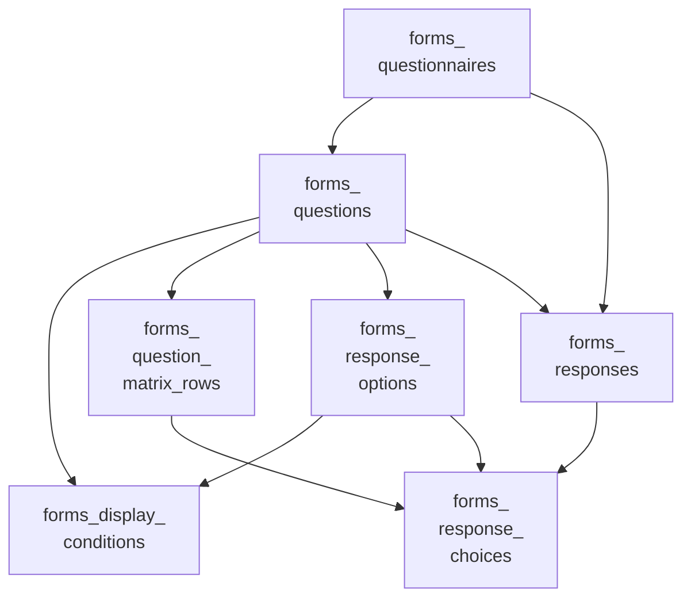

<!-- Gerado por scripts/banco_de_dados.py em 2026-10-09T16:34:04+00:00. Não edite à mão. -->

# Formulários

Questionários, perguntas, condições de exibição e respostas dos componentes de formulário.

**8 tabelas.** Schema versão `20260924162404`. Legenda da coluna **Referência**: *FK* = chave estrangeira declarada no banco; *→* = referência por convenção de nome (sem restrição no banco).

## Relacionamentos

Cada seta vai da tabela referenciada para a tabela que guarda a referência. Referências para outros domínios aparecem na coluna **Referência** das tabelas abaixo.

## Tabelas

| Tabela | Descrição | Colunas | Origem |
|---|---|---:|---|
| [`decidim_forms_display_conditions`](#decidim-forms-display-conditions) | Condições de exibição entre perguntas. | 9 | Decidim |
| [`decidim_forms_question_matrix_rows`](#decidim-forms-question-matrix-rows) | — | 4 | Decidim |
| [`decidim_forms_questionnaires`](#decidim-forms-questionnaires) | Questionários. Polimórfico em `questionnaire_for` (formulário, reunião…). | 10 | Decidim |
| [`decidim_forms_questions`](#decidim-forms-questions) | Perguntas de um questionário. | 17 | Decidim |
| [`decidim_forms_response_choices`](#decidim-forms-response-choices) | Opções escolhidas em uma resposta. | 7 | Decidim |
| [`decidim_forms_response_options`](#decidim-forms-response-options) | Opções de resposta. | 4 | Decidim |
| [`decidim_forms_responses`](#decidim-forms-responses) | Respostas a perguntas (chamadas de `answers` antes do Decidim 0.32). | 9 | Decidim |
| [`decidim_surveys_surveys`](#decidim-surveys-surveys) | Componente de formulário (enquete). | 13 | Decidim |

### `decidim_forms_display_conditions` { #decidim-forms-display-conditions }

Condições de exibição entre perguntas.

Origem: Decidim.

| Coluna | Tipo | Nulo | Padrão | Referência / observação | Origem |
|---|---|:---:|---|---|---|
| `id` | `bigint` | não |  | chave primária |  |
| `condition_type` | `integer` | não | `0` |  |  |
| `condition_value` | `jsonb` | sim |  |  |  |
| `created_at` | `datetime` | não |  |  |  |
| `decidim_condition_question_id` | `bigint` | não |  |  |  |
| `decidim_question_id` | `bigint` | não |  | → [`decidim_forms_questions`](formularios.md#decidim-forms-questions) |  |
| `decidim_response_option_id` | `bigint` | sim |  | → [`decidim_forms_response_options`](formularios.md#decidim-forms-response-options) |  |
| `mandatory` | `boolean` | sim | `false` |  |  |
| `updated_at` | `datetime` | não |  |  |  |

??? note "Índices (3)"

    | Nome | Colunas | Único | Tipo |
    |---|---|:---:|---|
    | `decidim_forms_display_condition_condition_question` | `decidim_condition_question_id` |  | btree |
    | `decidim_forms_display_condition_question` | `decidim_question_id` |  | btree |
    | `decidim_forms_display_condition_response_option` | `decidim_response_option_id` |  | btree |

### `decidim_forms_question_matrix_rows` { #decidim-forms-question-matrix-rows }

Origem: Decidim.

| Coluna | Tipo | Nulo | Padrão | Referência / observação | Origem |
|---|---|:---:|---|---|---|
| `id` | `bigint` | não |  | chave primária |  |
| `body` | `jsonb` | sim |  | traduzível (`{"pt-BR": …}`) |  |
| `decidim_question_id` | `bigint` | sim |  | → [`decidim_forms_questions`](formularios.md#decidim-forms-questions) |  |
| `position` | `integer` | sim |  |  |  |

??? note "Índices (2)"

    | Nome | Colunas | Único | Tipo |
    |---|---|:---:|---|
    | `index_decidim_forms_question_matrix_questionnaire_id` | `decidim_question_id` |  | btree |
    | `index_decidim_forms_question_matrix_rows_on_position` | `position` |  | btree |

### `decidim_forms_questionnaires` { #decidim-forms-questionnaires }

Questionários. Polimórfico em `questionnaire_for` (formulário, reunião…).

Origem: Decidim.

| Coluna | Tipo | Nulo | Padrão | Referência / observação | Origem |
|---|---|:---:|---|---|---|
| `id` | `serial` | não |  | chave primária |  |
| `created_at` | `datetime` | não |  |  |  |
| `description` | `jsonb` | sim |  | traduzível (`{"pt-BR": …}`) |  |
| `published_at` | `datetime` | sim |  |  |  |
| `questionnaire_for_id` | `integer` | sim |  | polimórfico (tipo em `questionnaire_for_type`) |  |
| `questionnaire_for_type` | `string` | sim |  |  |  |
| `salt` | `string` | sim |  |  |  |
| `title` | `jsonb` | sim |  | traduzível (`{"pt-BR": …}`) |  |
| `tos` | `jsonb` | sim |  |  |  |
| `updated_at` | `datetime` | não |  |  |  |

??? note "Índices (1)"

    | Nome | Colunas | Único | Tipo |
    |---|---|:---:|---|
    | `index_decidim_forms_questionnaires_questionnaire_for` | `questionnaire_for_type`, `questionnaire_for_id` |  | btree |

### `decidim_forms_questions` { #decidim-forms-questions }

Perguntas de um questionário.

Origem: Decidim.

| Coluna | Tipo | Nulo | Padrão | Referência / observação | Origem |
|---|---|:---:|---|---|---|
| `id` | `serial` | não |  | chave primária |  |
| `body` | `jsonb` | sim |  | traduzível (`{"pt-BR": …}`) |  |
| `created_at` | `datetime` | não |  |  |  |
| `decidim_questionnaire_id` | `integer` | sim |  | → [`decidim_forms_questionnaires`](formularios.md#decidim-forms-questionnaires) |  |
| `description` | `jsonb` | sim |  | traduzível (`{"pt-BR": …}`) |  |
| `display_conditions_count` | `integer` | não | `0` | contador em cache |  |
| `display_conditions_for_other_questions_count` | `integer` | não | `0` | contador em cache |  |
| `mandatory` | `boolean` | sim |  |  |  |
| `matrix_rows_count` | `integer` | não | `0` | contador em cache |  |
| `max_characters` | `integer` | sim | `0` |  |  |
| `max_choices` | `integer` | sim |  |  |  |
| `max_files` | `integer` | sim |  |  | `decidim-questionnaires` (LabLivre) |
| `position` | `integer` | sim |  |  |  |
| `question_type` | `string` | sim |  |  |  |
| `response_options_count` | `integer` | não | `0` | contador em cache |  |
| `survey_responses_published_at` | `datetime` | sim |  |  |  |
| `updated_at` | `datetime` | não |  |  |  |

??? note "Índices (2)"

    | Nome | Colunas | Único | Tipo |
    |---|---|:---:|---|
    | `index_decidim_forms_questions_on_decidim_questionnaire_id` | `decidim_questionnaire_id` |  | btree |
    | `index_decidim_forms_questions_on_position` | `position` |  | btree |

### `decidim_forms_response_choices` { #decidim-forms-response-choices }

Opções escolhidas em uma resposta.

Origem: Decidim.

| Coluna | Tipo | Nulo | Padrão | Referência / observação | Origem |
|---|---|:---:|---|---|---|
| `id` | `bigint` | não |  | chave primária |  |
| `body` | `jsonb` | sim |  | traduzível (`{"pt-BR": …}`) |  |
| `custom_body` | `text` | sim |  |  |  |
| `decidim_question_matrix_row_id` | `integer` | sim |  | → [`decidim_forms_question_matrix_rows`](formularios.md#decidim-forms-question-matrix-rows) |  |
| `decidim_response_id` | `bigint` | sim |  | → [`decidim_forms_responses`](formularios.md#decidim-forms-responses) |  |
| `decidim_response_option_id` | `bigint` | sim |  | → [`decidim_forms_response_options`](formularios.md#decidim-forms-response-options) |  |
| `position` | `integer` | sim |  |  |  |

??? note "Índices (2)"

    | Nome | Colunas | Único | Tipo |
    |---|---|:---:|---|
    | `index_decidim_forms_response_choices_response_id` | `decidim_response_id` |  | btree |
    | `index_decidim_forms_response_choices_response_option_id` | `decidim_response_option_id` |  | btree |

### `decidim_forms_response_options` { #decidim-forms-response-options }

Opções de resposta.

Origem: Decidim.

| Coluna | Tipo | Nulo | Padrão | Referência / observação | Origem |
|---|---|:---:|---|---|---|
| `id` | `bigint` | não |  | chave primária |  |
| `body` | `jsonb` | sim |  | traduzível (`{"pt-BR": …}`) |  |
| `decidim_question_id` | `bigint` | sim |  | → [`decidim_forms_questions`](formularios.md#decidim-forms-questions) |  |
| `free_text` | `boolean` | sim |  |  |  |

??? note "Índices (1)"

    | Nome | Colunas | Único | Tipo |
    |---|---|:---:|---|
    | `index_decidim_forms_response_options_question_id` | `decidim_question_id` |  | btree |

### `decidim_forms_responses` { #decidim-forms-responses }

Respostas a perguntas (chamadas de `answers` antes do Decidim 0.32).

Origem: Decidim.

| Coluna | Tipo | Nulo | Padrão | Referência / observação | Origem |
|---|---|:---:|---|---|---|
| `id` | `serial` | não |  | chave primária |  |
| `body` | `text` | sim |  |  |  |
| `created_at` | `datetime` | não |  |  |  |
| `decidim_question_id` | `integer` | sim |  | → [`decidim_forms_questions`](formularios.md#decidim-forms-questions) |  |
| `decidim_questionnaire_id` | `integer` | sim |  | → [`decidim_forms_questionnaires`](formularios.md#decidim-forms-questionnaires) |  |
| `decidim_user_id` | `integer` | sim |  | → [`decidim_users`](organizacao-usuarios.md#decidim-users) |  |
| `ip_hash` | `string` | sim |  |  |  |
| `session_token` | `string` | não | `""` |  |  |
| `updated_at` | `datetime` | não |  |  |  |

??? note "Índices (5)"

    | Nome | Colunas | Único | Tipo |
    |---|---|:---:|---|
    | `index_decidim_forms_responses_question_id` | `decidim_question_id` |  | btree |
    | `index_decidim_forms_responses_on_decidim_questionnaire_id` | `decidim_questionnaire_id` |  | btree |
    | `index_decidim_forms_responses_on_decidim_user_id` | `decidim_user_id` |  | btree |
    | `index_decidim_forms_responses_on_ip_hash` | `ip_hash` |  | btree |
    | `index_decidim_forms_responses_on_session_token` | `session_token` |  | btree |

### `decidim_surveys_surveys` { #decidim-surveys-surveys }

Componente de formulário (enquete).

Origem: Decidim.

| Coluna | Tipo | Nulo | Padrão | Referência / observação | Origem |
|---|---|:---:|---|---|---|
| `id` | `serial` | não |  | chave primária |  |
| `allow_editing_responses` | `boolean` | sim |  |  |  |
| `allow_responses` | `boolean` | sim |  |  |  |
| `allow_unregistered` | `boolean` | sim |  |  |  |
| `announcement` | `jsonb` | sim |  | traduzível (`{"pt-BR": …}`) |  |
| `clean_after_publish` | `boolean` | sim |  |  |  |
| `created_at` | `datetime` | não |  |  |  |
| `decidim_component_id` | `integer` | sim |  | → [`decidim_components`](componentes-conteudo.md#decidim-components) |  |
| `deleted_at` | `datetime` | sim |  |  |  |
| `ends_at` | `datetime` | sim |  |  |  |
| `published_at` | `datetime` | sim |  |  |  |
| `starts_at` | `datetime` | sim |  |  |  |
| `updated_at` | `datetime` | não |  |  |  |

??? note "Índices (3)"

    | Nome | Colunas | Único | Tipo |
    |---|---|:---:|---|
    | `index_decidim_surveys_surveys_on_decidim_component_id` | `decidim_component_id` |  | btree |
    | `index_decidim_surveys_surveys_on_deleted_at` | `deleted_at` |  | btree |
    | `index_decidim_surveys_surveys_on_published_at` | `published_at` |  | btree |

