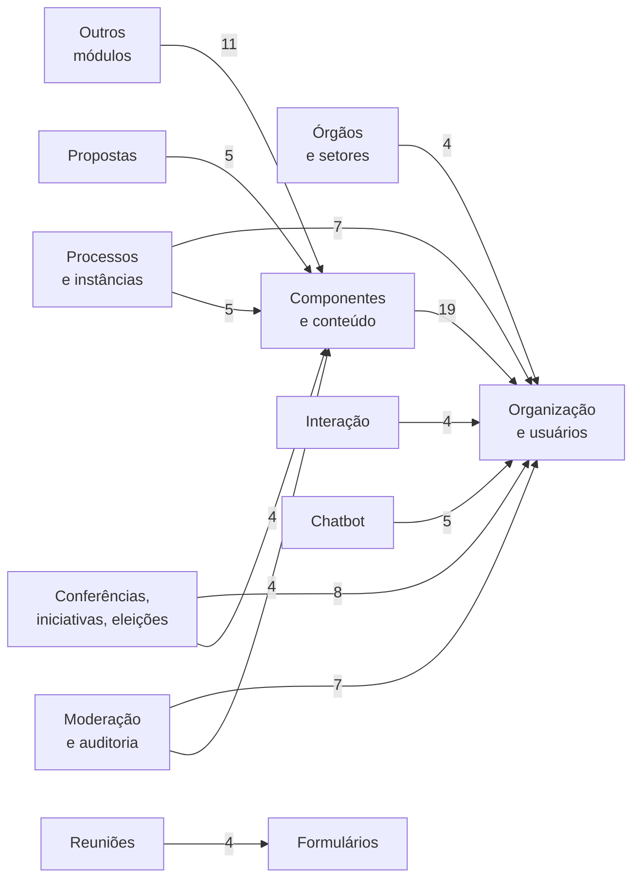

<!-- Gerado por scripts/banco_de_dados.py em 2026-10-09T16:34:04+00:00. Não edite à mão. -->

# Banco de Dados

Dicionário de dados do PostgreSQL do Participa, gerado a partir do `db/schema.rb` e das migrações da branch `main` do [participa](https://gitlab.com/lappis-unb/decidimbr/participa).

!!! note "Um schema por organização"
    O `schema.rb` descreve o schema `public`, que serve de modelo. Cada organização ganha um schema PostgreSQL próprio, com nome UUID, contendo todas estas tabelas. Só `apartment_distribution_keys` fica no `public`, e as extensões ficam no schema `shared_extensions`. Veja [Multi-organização](../multi-organizacao.md).

!!! info "Versão do schema: `20260924162404`"
    Gerado em 09/10/2026. Para atualizar, rode `python3 scripts/banco_de_dados.py`.

## Em números

| Item | Quantidade |
|---|---:|
| Tabelas | 153 |
| Colunas | 1525 |
| Índices | 408 |
| Chaves estrangeiras declaradas | 70 |
| Referências por convenção (sem FK) | 141 |
| Associações polimórficas | 57 |
| Migrações em `db/migrate` | 776 (9 das engines do repositório, 13 de gems do LabLivre, 2 de outras gems) |
| Extensões do PostgreSQL | `pg_catalog.plpgsql`, `shared_extensions.hstore`, `shared_extensions.ltree`, `shared_extensions.pg_trgm` |

## Domínios

-   :material-account-key:{ .lg .middle } **[Organização, usuários e autenticação](organizacao-usuarios.md)**

    ---

    Organizações, usuários, administradores de sistema, identidades de login (gov.br), autorizações, tokens de API e o mapa de schemas do multi-organização.

    18 tabelas

-   :material-sitemap:{ .lg .middle } **[Processos participativos e instâncias](processos-instancias.md)**

    ---

    Processos participativos, etapas, grupos e assembleias, chamadas de instâncias na interface.

    9 tabelas

-   :material-domain:{ .lg .middle } **[Órgãos e setores](orgaos-setores.md)**

    ---

    Hierarquia de governo Órgão → Setor da gem decidim-government_spaces: tipos de órgão, membros, convites e atribuição de processos a setores.

    5 tabelas

-   :material-account-group:{ .lg .middle } **[Conferências, iniciativas e eleições](outros-espacos.md)**

    ---

    Espaços e módulos do Decidim instalados explicitamente no Participa: conferências, iniciativas e eleições.

    21 tabelas

-   :material-puzzle:{ .lg .middle } **[Componentes, taxonomia, conteúdo e arquivos](componentes-conteudo.md)**

    ---

    Componentes de cada espaço, taxonomias, categorias, escopos, áreas, anexos, blocos de conteúdo, páginas estáticas, modelos de processo, newsletters e arquivos do ActiveStorage.

    32 tabelas

-   :material-lightbulb-on:{ .lg .middle } **[Propostas e texto participativo](propostas.md)**

    ---

    Propostas, votos, emendas, coautorias, rascunhos colaborativos, avaliação e o componente de texto participativo (parágrafos e devolutivas).

    10 tabelas

-   :material-calendar:{ .lg .middle } **[Reuniões e eventos](reunioes.md)**

    ---

    Reuniões, inscrições, convites, pautas e enquetes ao vivo.

    13 tabelas

-   :material-form-select:{ .lg .middle } **[Formulários](formularios.md)**

    ---

    Questionários, perguntas, condições de exibição e respostas dos componentes de formulário.

    8 tabelas

-   :material-comment-multiple:{ .lg .middle } **[Comentários e interação](interacao.md)**

    ---

    Comentários, curtidas, seguidores, notificações, mensagens privadas, lembretes e conquistas.

    13 tabelas

-   :material-shield-search:{ .lg .middle } **[Moderação, auditoria e métricas](moderacao-auditoria.md)**

    ---

    Denúncias, moderações, bloqueios de usuários, log de ações administrativas, versões (PaperTrail) e métricas agregadas.

    8 tabelas

-   :material-view-grid-plus:{ .lg .middle } **[Orçamentos, debates, blog e outros módulos](outros-modulos.md)**

    ---

    Demais módulos nativos do Decidim: orçamentos, prestação de contas, debates, blog e páginas, mais a tabela legada de sorteios.

    11 tabelas

-   :material-whatsapp:{ .lg .middle } **[Chatbot](chatbot.md)**

    ---

    Tabelas do módulo decidim-chatbot: provedores de mensageria, conversas, eventos, roteiro e links de identificação.

    5 tabelas

## Mapa entre domínios

Cada seta indica que tabelas de um domínio referenciam tabelas de outro. O número é a quantidade de colunas de referência.

O diagrama mostra só as ligações com 4 ou mais referências. A tabela abaixo traz todas.

??? note "Todas as referências entre domínios"

    | De | Para | Referências |
    |---|---|---:|
    | Componentes, taxonomia, conteúdo e arquivos | Organização, usuários e autenticação | 19 |
    | Orçamentos, debates, blog e outros módulos | Componentes, taxonomia, conteúdo e arquivos | 11 |
    | Conferências, iniciativas e eleições | Organização, usuários e autenticação | 8 |
    | Processos participativos e instâncias | Organização, usuários e autenticação | 7 |
    | Moderação, auditoria e métricas | Organização, usuários e autenticação | 7 |
    | Chatbot | Organização, usuários e autenticação | 5 |
    | Processos participativos e instâncias | Componentes, taxonomia, conteúdo e arquivos | 5 |
    | Propostas e texto participativo | Componentes, taxonomia, conteúdo e arquivos | 5 |
    | Comentários e interação | Organização, usuários e autenticação | 4 |
    | Moderação, auditoria e métricas | Componentes, taxonomia, conteúdo e arquivos | 4 |
    | Conferências, iniciativas e eleições | Componentes, taxonomia, conteúdo e arquivos | 4 |
    | Órgãos e setores | Organização, usuários e autenticação | 4 |
    | Reuniões e eventos | Formulários | 4 |
    | Reuniões e eventos | Organização, usuários e autenticação | 3 |
    | Reuniões e eventos | Componentes, taxonomia, conteúdo e arquivos | 3 |
    | Propostas e texto participativo | Organização, usuários e autenticação | 2 |
    | Chatbot | Componentes, taxonomia, conteúdo e arquivos | 1 |
    | Propostas e texto participativo | Comentários e interação | 1 |
    | Comentários e interação | Componentes, taxonomia, conteúdo e arquivos | 1 |
    | Orçamentos, debates, blog e outros módulos | Organização, usuários e autenticação | 1 |
    | Formulários | Organização, usuários e autenticação | 1 |
    | Órgãos e setores | Processos participativos e instâncias | 1 |
    | Formulários | Componentes, taxonomia, conteúdo e arquivos | 1 |

## Convenções do Decidim

| Convenção | Exemplo | Significado |
|---|---|---|
| Prefixo por módulo | `decidim_proposals_proposals` | `decidim_<módulo>_<entidade>`. Tabelas do núcleo usam só `decidim_<entidade>` |
| Organização em tudo | `decidim_organization_id` | Ligação com a organização. No Participa, o isolamento entre organizações é feito por schema, e a coluna continua existindo |
| Textos traduzíveis em JSONB | `title = {"pt-BR": "…", "en": "…"}` | Campos de texto exibidos ficam em `jsonb`, um valor por idioma. Consulta: `title->>'pt-BR'` |
| Polimorfismo | `participatory_space_type` + `participatory_space_id` | A linha aponta para tabelas diferentes conforme o tipo (nome da classe Ruby) |
| Referência sem FK | `decidim_component_id` | A maioria das relações não tem restrição no banco; a integridade é garantida pela aplicação |
| Contadores em cache | `comments_count`, `proposal_votes_count` | Atualizados pela aplicação para evitar `COUNT(*)` |
| Publicação | `published_at` | Nulo = rascunho / não publicado |
| Ocultação por moderação | `decidim_moderations.hidden_at` | Recurso oculto continua no banco |
| Configurações em JSONB | `decidim_components.settings` | Configurações globais e por etapa do componente |

## Tipos de coluna

| Tipo | Colunas |
|---|---:|
| `datetime` | 360 |
| `bigint` | 299 |
| `string` | 255 |
| `integer` | 239 |
| `jsonb` | 194 |
| `boolean` | 71 |
| `serial` | 40 |
| `text` | 31 |
| `date` | 20 |
| `float` | 9 |
| `decimal` | 3 |
| `uuid` | 2 |
| `ltree` | 1 |
| `time` | 1 |

## O que não vem do Decidim

### Tabelas (17)

| Tabela | Origem | Domínio |
|---|---|---|
| [`apartment_distribution_keys`](organizacao-usuarios.md#apartment-distribution-keys) | `decidim-apartment` (LabLivre) | Organização, usuários e autenticação |
| [`community_template_sources`](componentes-conteudo.md#community-template-sources) | `decidim-community_templates` (LabLivre) | Componentes, taxonomia, conteúdo e arquivos |
| [`community_template_uses`](componentes-conteudo.md#community-template-uses) | `decidim-community_templates` (LabLivre) | Componentes, taxonomia, conteúdo e arquivos |
| [`decidim_categories_categories`](componentes-conteudo.md#decidim-categories-categories) | `decidim-categories` (LabLivre) | Componentes, taxonomia, conteúdo e arquivos |
| [`decidim_categories_categorizations`](componentes-conteudo.md#decidim-categories-categorizations) | `decidim-categories` (LabLivre) | Componentes, taxonomia, conteúdo e arquivos |
| [`decidim_chatbot_broker_configs`](chatbot.md#decidim-chatbot-broker-configs) | :flag_br: Participa | Chatbot |
| [`decidim_chatbot_conversations`](chatbot.md#decidim-chatbot-conversations) | :flag_br: Participa | Chatbot |
| [`decidim_chatbot_events`](chatbot.md#decidim-chatbot-events) | :flag_br: Participa | Chatbot |
| [`decidim_chatbot_flow_settings`](chatbot.md#decidim-chatbot-flow-settings) | :flag_br: Participa | Chatbot |
| [`decidim_chatbot_identity_links`](chatbot.md#decidim-chatbot-identity-links) | :flag_br: Participa | Chatbot |
| [`decidim_government_spaces`](orgaos-setores.md#decidim-government-spaces) | `decidim-government_spaces` (LabLivre) | Órgãos e setores |
| [`decidim_government_spaces_memberships`](orgaos-setores.md#decidim-government-spaces-memberships) | `decidim-government_spaces` (LabLivre) | Órgãos e setores |
| [`decidim_government_spaces_organ_types`](orgaos-setores.md#decidim-government-spaces-organ-types) | `decidim-government_spaces` (LabLivre) | Órgãos e setores |
| [`decidim_government_spaces_process_assignments`](orgaos-setores.md#decidim-government-spaces-process-assignments) | `decidim-government_spaces` (LabLivre) | Órgãos e setores |
| [`decidim_participatory_texts_comment_feedbacks`](propostas.md#decidim-participatory-texts-comment-feedbacks) | `decidim-participatory_texts` (LabLivre) | Propostas e texto participativo |
| [`decidim_participatory_texts_paragraphs`](propostas.md#decidim-participatory-texts-paragraphs) | `decidim-participatory_texts` (LabLivre) | Propostas e texto participativo |
| [`decidim_toggle_organization_module_configs`](organizacao-usuarios.md#decidim-toggle-organization-module-configs) | `decidim-toggle` | Organização, usuários e autenticação |

### Colunas adicionadas a tabelas do Decidim (3)

| Tabela | Coluna | Tipo | Origem |
|---|---|---|---|
| [`decidim_forms_questions`](formularios.md#decidim-forms-questions) | `max_files` | `integer` | `decidim-questionnaires` (LabLivre) |
| [`decidim_participatory_processes`](processos-instancias.md#decidim-participatory-processes) | `automatic_step_activation` | `boolean` | :flag_br: Participa ([`20260924162404_add_automatic_step_activation_to_participatory_processes.decidim_govbr.rb`](https://gitlab.com/lappis-unb/decidimbr/participa/-/blob/main/db/migrate/20260924162404_add_automatic_step_activation_to_participatory_processes.decidim_govbr.rb)) |
| [`decidim_users`](organizacao-usuarios.md#decidim-users) | `document_number` | `string` | :flag_br: Participa ([`20251014185725_add_document_number_to_decidim_users.decidim_govbr.rb`](https://gitlab.com/lappis-unb/decidimbr/participa/-/blob/main/db/migrate/20251014185725_add_document_number_to_decidim_users.decidim_govbr.rb)) |

## Divergências entre o `schema.rb` e as migrações

Itens do `schema.rb` cujo nome não aparece em nenhuma migração de `main` nem nas gems que trazem as próprias migrações. Uma instalação nova com `db:schema:load` os cria; uma com `db:migrate`, não. Confirme a origem antes da transferência.

| Tabela | Coluna |
|---|---|
| [`decidim_government_spaces_pending_invitations`](orgaos-setores.md#decidim-government-spaces-pending-invitations) | (tabela inteira) |
| [`decidim_meetings_meetings`](reunioes.md#decidim-meetings-meetings) | `decidim_categories_category_ids` |
| [`decidim_meetings_meetings`](reunioes.md#decidim-meetings-meetings) | `decidim_categories_category_type` |
| [`decidim_organizations`](organizacao-usuarios.md#decidim-organizations) | `permitted_institutional_email_domains` |
| [`decidim_proposals_proposals`](propostas.md#decidim-proposals-proposals) | `decidim_categories_category_ids` |
| [`decidim_proposals_proposals`](propostas.md#decidim-proposals-proposals) | `decidim_categories_category_type` |
| [`decidim_users`](organizacao-usuarios.md#decidim-users) | `personal_email` |

## Como usar este dicionário

- Cada página de domínio lista as tabelas com colunas, tipos, padrões, referências e índices.
- A coluna **Origem** mostra quando uma tabela ou coluna foi criada por uma engine do repositório (:flag_br: Participa) ou por uma gem, com link para a migração.
- Exemplos de SQL estão em [Consultas úteis](consultas.md).

