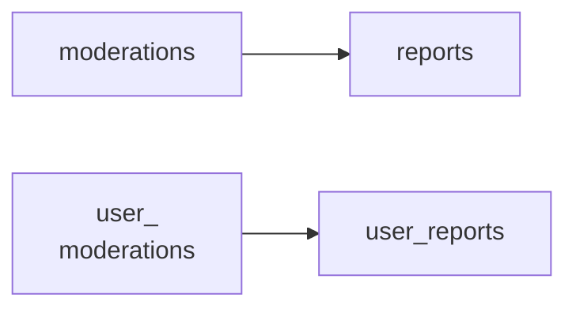

<!-- Gerado por scripts/banco_de_dados.py em 2026-10-09T16:34:04+00:00. Não edite à mão. -->

# Moderação, auditoria e métricas

Denúncias, moderações, bloqueios de usuários, log de ações administrativas, versões (PaperTrail) e métricas agregadas.

**8 tabelas.** Schema versão `20260924162404`. Legenda da coluna **Referência**: *FK* = chave estrangeira declarada no banco; *→* = referência por convenção de nome (sem restrição no banco).

## Relacionamentos

Cada seta vai da tabela referenciada para a tabela que guarda a referência. Referências para outros domínios aparecem na coluna **Referência** das tabelas abaixo.

## Tabelas

| Tabela | Descrição | Colunas | Origem |
|---|---|---:|---|
| [`decidim_action_logs`](#decidim-action-logs) | Log de ações administrativas e de participantes. | 17 | Decidim |
| [`decidim_metrics`](#decidim-metrics) | Métricas agregadas por dia. | 12 | Decidim |
| [`decidim_moderations`](#decidim-moderations) | Moderação de um recurso denunciado (contagem de denúncias, data de ocultação). | 10 | Decidim |
| [`decidim_reports`](#decidim-reports) | Denúncias individuais ligadas a uma moderação. | 8 | Decidim |
| [`decidim_user_blocks`](#decidim-user-blocks) | — | 6 | Decidim |
| [`decidim_user_moderations`](#decidim-user-moderations) | — | 5 | Decidim |
| [`decidim_user_reports`](#decidim-user-reports) | — | 7 | Decidim |
| [`versions`](#versions) | Histórico de versões (PaperTrail). | 9 | Decidim |

### `decidim_action_logs` { #decidim-action-logs }

Log de ações administrativas e de participantes.

Origem: Decidim.

| Coluna | Tipo | Nulo | Padrão | Referência / observação | Origem |
|---|---|:---:|---|---|---|
| `id` | `bigint` | não |  | chave primária |  |
| `action` | `string` | não |  |  |  |
| `created_at` | `datetime` | não |  |  |  |
| `decidim_area_id` | `integer` | sim |  | → [`decidim_areas`](componentes-conteudo.md#decidim-areas) |  |
| `decidim_component_id` | `bigint` | sim |  | → [`decidim_components`](componentes-conteudo.md#decidim-components) |  |
| `decidim_organization_id` | `bigint` | não |  | → [`decidim_organizations`](organizacao-usuarios.md#decidim-organizations) |  |
| `decidim_scope_id` | `integer` | sim |  | → [`decidim_scopes`](componentes-conteudo.md#decidim-scopes) |  |
| `extra` | `jsonb` | sim |  |  |  |
| `participatory_space_id` | `bigint` | sim |  | polimórfico (tipo em `participatory_space_type`) |  |
| `participatory_space_type` | `string` | sim |  |  |  |
| `resource_id` | `bigint` | não |  | polimórfico (tipo em `resource_type`) |  |
| `resource_type` | `string` | não |  |  |  |
| `updated_at` | `datetime` | não |  |  |  |
| `user_id` | `bigint` | não |  | polimórfico (tipo em `user_type`) |  |
| `user_type` | `string` | não | `"Decidim::User"` |  |  |
| `version_id` | `integer` | sim |  |  |  |
| `visibility` | `string` | sim | `"admin-only"` |  |  |

??? note "Índices (11)"

    | Nome | Colunas | Único | Tipo |
    |---|---|:---:|---|
    | `index_decidim_action_logs_on_created_at` | `created_at` |  | btree |
    | `index_decidim_action_logs_on_decidim_area_id` | `decidim_area_id` |  | btree |
    | `index_action_logs_on_component_id` | `decidim_component_id` |  | btree |
    | `index_action_logs_on_organization_id` | `decidim_organization_id` |  | btree |
    | `index_decidim_action_logs_on_decidim_scope_id` | `decidim_scope_id` |  | btree |
    | `index_action_logs_on_space_type_and_id` | `participatory_space_type`, `participatory_space_id` |  | btree |
    | `index_action_logs_on_resource_type_and_id` | `resource_type`, `resource_id` |  | btree |
    | `index_decidim_action_log_on_users` | `user_id`, `user_type` |  | btree |
    | `index_action_logs_on_user_id` | `user_id` |  | btree |
    | `index_decidim_action_logs_on_version_id` | `version_id` |  | btree |
    | `index_decidim_action_logs_on_visibility` | `visibility` |  | btree |

### `decidim_metrics` { #decidim-metrics }

Métricas agregadas por dia.

Origem: Decidim.

| Coluna | Tipo | Nulo | Padrão | Referência / observação | Origem |
|---|---|:---:|---|---|---|
| `id` | `bigint` | não |  | chave primária |  |
| `cumulative` | `integer` | não |  |  |  |
| `day` | `date` | não |  |  |  |
| `decidim_category_id` | `bigint` | sim |  | → [`decidim_categories`](componentes-conteudo.md#decidim-categories) |  |
| `decidim_organization_id` | `bigint` | não |  | → [`decidim_organizations`](organizacao-usuarios.md#decidim-organizations) |  |
| `decidim_taxonomy_id` | `bigint` | sim |  |  |  |
| `metric_type` | `string` | não |  |  |  |
| `participatory_space_id` | `bigint` | sim |  | polimórfico (tipo em `participatory_space_type`) |  |
| `participatory_space_type` | `string` | sim |  |  |  |
| `quantity` | `integer` | não |  |  |  |
| `related_object_id` | `bigint` | sim |  | polimórfico (tipo em `related_object_type`) |  |
| `related_object_type` | `string` | sim |  |  |  |

??? note "Índices (8)"

    | Nome | Colunas | Único | Tipo |
    |---|---|:---:|---|
    | `idx_metric_by_day_type_org_space_object_category` | `day`, `metric_type`, `decidim_organization_id`, `participatory_space_type`, `participatory_space_id`, `related_object_type`, `related_object_id`, `decidim_category_id` | sim | btree |
    | `index_decidim_metrics_on_day` | `day` |  | btree |
    | `index_decidim_metrics_on_decidim_category_id` | `decidim_category_id` |  | btree |
    | `index_decidim_metrics_on_decidim_organization_id` | `decidim_organization_id` |  | btree |
    | `index_decidim_metrics_on_decidim_taxonomy_id` | `decidim_taxonomy_id` |  | btree |
    | `index_decidim_metrics_on_metric_type` | `metric_type` |  | btree |
    | `index_metric_on_participatory_space_id_and_type` | `participatory_space_type`, `participatory_space_id` |  | btree |
    | `index_metric_on_related_object_id_and_type` | `related_object_type`, `related_object_id` |  | btree |

### `decidim_moderations` { #decidim-moderations }

Moderação de um recurso denunciado (contagem de denúncias, data de ocultação).

Origem: Decidim.

| Coluna | Tipo | Nulo | Padrão | Referência / observação | Origem |
|---|---|:---:|---|---|---|
| `id` | `serial` | não |  | chave primária |  |
| `created_at` | `datetime` | não |  |  |  |
| `decidim_participatory_space_id` | `integer` | não |  | polimórfico (tipo em `decidim_participatory_space_type`) | — |
| `decidim_participatory_space_type` | `string` | não |  |  |  |
| `decidim_reportable_id` | `integer` | não |  | polimórfico (tipo em `decidim_reportable_type`) |  |
| `decidim_reportable_type` | `string` | não |  |  |  |
| `hidden_at` | `datetime` | sim |  |  |  |
| `report_count` | `integer` | não | `0` | contador em cache |  |
| `reported_content` | `text` | sim |  |  |  |
| `updated_at` | `datetime` | não |  |  |  |

??? note "Índices (4)"

    | Nome | Colunas | Único | Tipo |
    |---|---|:---:|---|
    | `decidim_moderations_participatory_space` | `decidim_participatory_space_id`, `decidim_participatory_space_type` |  | btree |
    | `decidim_moderations_reportable` | `decidim_reportable_type`, `decidim_reportable_id` | sim | btree |
    | `decidim_moderations_hidden_at` | `hidden_at` |  | btree |
    | `decidim_moderations_report_count` | `report_count` |  | btree |

### `decidim_reports` { #decidim-reports }

Denúncias individuais ligadas a uma moderação.

Origem: Decidim.

| Coluna | Tipo | Nulo | Padrão | Referência / observação | Origem |
|---|---|:---:|---|---|---|
| `id` | `serial` | não |  | chave primária |  |
| `created_at` | `datetime` | não |  |  |  |
| `decidim_moderation_id` | `integer` | não |  | → [`decidim_moderations`](moderacao-auditoria.md#decidim-moderations) |  |
| `decidim_user_id` | `integer` | não |  | → [`decidim_users`](organizacao-usuarios.md#decidim-users) |  |
| `details` | `text` | sim |  |  |  |
| `locale` | `string` | sim |  |  |  |
| `reason` | `string` | não |  |  |  |
| `updated_at` | `datetime` | não |  |  |  |

??? note "Índices (3)"

    | Nome | Colunas | Único | Tipo |
    |---|---|:---:|---|
    | `decidim_reports_moderation_user_unique` | `decidim_moderation_id`, `decidim_user_id` | sim | btree |
    | `decidim_reports_moderation` | `decidim_moderation_id` |  | btree |
    | `decidim_reports_user` | `decidim_user_id` |  | btree |

### `decidim_user_blocks` { #decidim-user-blocks }

Origem: Decidim.

| Coluna | Tipo | Nulo | Padrão | Referência / observação | Origem |
|---|---|:---:|---|---|---|
| `id` | `bigint` | não |  | chave primária |  |
| `blocking_user_id` | `integer` | sim |  | FK → [`decidim_users`](organizacao-usuarios.md#decidim-users) |  |
| `created_at` | `datetime` | não |  |  |  |
| `decidim_user_id` | `bigint` | sim |  | FK → [`decidim_users`](organizacao-usuarios.md#decidim-users) |  |
| `justification` | `text` | sim |  |  |  |
| `updated_at` | `datetime` | não |  |  |  |

??? note "Índices (1)"

    | Nome | Colunas | Único | Tipo |
    |---|---|:---:|---|
    | `index_decidim_user_blocks_on_decidim_user_id` | `decidim_user_id` |  | btree |

### `decidim_user_moderations` { #decidim-user-moderations }

Origem: Decidim.

| Coluna | Tipo | Nulo | Padrão | Referência / observação | Origem |
|---|---|:---:|---|---|---|
| `id` | `bigint` | não |  | chave primária |  |
| `created_at` | `datetime` | não |  |  |  |
| `decidim_user_id` | `bigint` | sim |  | FK → [`decidim_users`](organizacao-usuarios.md#decidim-users) |  |
| `report_count` | `integer` | não | `0` | contador em cache |  |
| `updated_at` | `datetime` | não |  |  |  |

??? note "Índices (1)"

    | Nome | Colunas | Único | Tipo |
    |---|---|:---:|---|
    | `index_decidim_user_moderations_on_decidim_user_id` | `decidim_user_id` |  | btree |

### `decidim_user_reports` { #decidim-user-reports }

Origem: Decidim.

| Coluna | Tipo | Nulo | Padrão | Referência / observação | Origem |
|---|---|:---:|---|---|---|
| `id` | `bigint` | não |  | chave primária |  |
| `created_at` | `datetime` | não |  |  |  |
| `details` | `text` | sim |  |  |  |
| `reason` | `string` | sim |  |  |  |
| `updated_at` | `datetime` | não |  |  |  |
| `user_id` | `integer` | não |  | FK → [`decidim_users`](organizacao-usuarios.md#decidim-users) |  |
| `user_moderation_id` | `integer` | sim |  | FK → [`decidim_user_moderations`](moderacao-auditoria.md#decidim-user-moderations) |  |

### `versions` { #versions }

Histórico de versões (PaperTrail).

Origem: Decidim.

| Coluna | Tipo | Nulo | Padrão | Referência / observação | Origem |
|---|---|:---:|---|---|---|
| `id` | `bigint` | não |  | chave primária |  |
| `created_at` | `datetime` | sim |  |  |  |
| `event` | `string` | não |  |  |  |
| `item_id` | `integer` | não |  | polimórfico (tipo em `item_type`) |  |
| `item_type` | `string` | não |  |  |  |
| `object` | `jsonb` | sim |  |  |  |
| `object_changes` | `jsonb` | sim |  |  |  |
| `old_object_changes` | `text` | sim |  |  |  |
| `whodunnit` | `string` | sim |  |  |  |

??? note "Índices (2)"

    | Nome | Colunas | Único | Tipo |
    |---|---|:---:|---|
    | `index_versions_on_item_id_and_item_type` | `item_id`, `item_type` |  | btree |
    | `index_versions_on_item_type_and_item_id` | `item_type`, `item_id` |  | btree |

