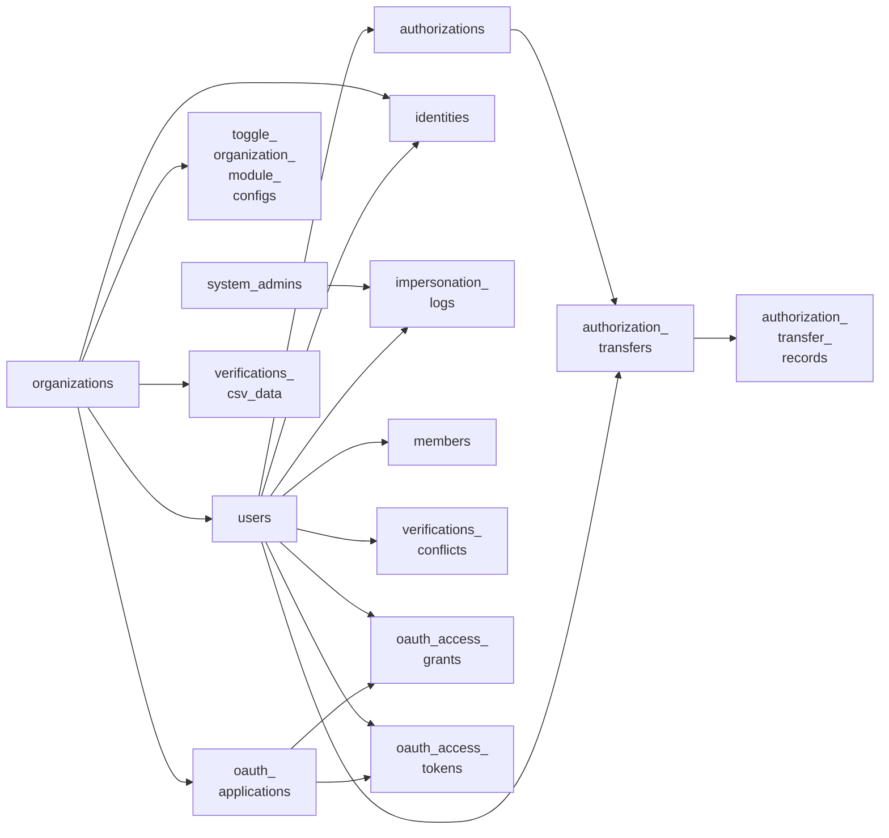

<!-- Gerado por scripts/banco_de_dados.py em 2026-10-09T16:34:04+00:00. Não edite à mão. -->

# Organização, usuários e autenticação

Organizações, usuários, administradores de sistema, identidades de login (gov.br), autorizações, tokens de API e o mapa de schemas do multi-organização.

**18 tabelas.** Schema versão `20260924162404`. Legenda da coluna **Referência**: *FK* = chave estrangeira declarada no banco; *→* = referência por convenção de nome (sem restrição no banco).

## Relacionamentos

Cada seta vai da tabela referenciada para a tabela que guarda a referência. Referências para outros domínios aparecem na coluna **Referência** das tabelas abaixo.

## Tabelas

| Tabela | Descrição | Colunas | Origem |
|---|---|---:|---|
| [`apartment_distribution_keys`](#apartment-distribution-keys) | Mapa entre host e schema: cada organização tem um schema PostgreSQL com nome UUID. Única tabela que fica no schema `public`. | 5 | `decidim-apartment` (LabLivre) |
| [`decidim_api_jwt_denylists`](#decidim-api-jwt-denylists) | — | 3 | Decidim |
| [`decidim_authorization_transfer_records`](#decidim-authorization-transfer-records) | — | 5 | Decidim |
| [`decidim_authorization_transfers`](#decidim-authorization-transfers) | — | 5 | Decidim |
| [`decidim_authorizations`](#decidim-authorizations) | Autorizações (verificações) concedidas a usuários. | 9 | Decidim |
| [`decidim_identities`](#decidim-identities) | Identidades de login externo (OmniAuth). Para o gov.br, `provider = 'govbr'` e `uid` é o CPF. | 7 | Decidim |
| [`decidim_impersonation_logs`](#decidim-impersonation-logs) | — | 9 | Decidim |
| [`decidim_members`](#decidim-members) | — | 8 | Decidim |
| [`decidim_organizations`](#decidim-organizations) | Organização. Cada host atende uma organização; no Participa, cada schema guarda uma única linha desta tabela. | 45 | Decidim |
| [`decidim_private_exports`](#decidim-private-exports) | — | 11 | Decidim |
| [`decidim_system_admins`](#decidim-system-admins) | Administradores do painel `/system`. | 11 | Decidim |
| [`decidim_toggle_organization_module_configs`](#decidim-toggle-organization-module-configs) | Configurações de módulos por organização, editadas em abas do painel `/system` (gem decidim-toggle). | 6 | `decidim-toggle` |
| [`decidim_users`](#decidim-users) | Participantes e grupos de usuários (coluna `type`). Guarda perfil, preferências de notificação e `extended_data`. | 66 | Decidim |
| [`decidim_verifications_conflicts`](#decidim-verifications-conflicts) | — | 8 | Decidim |
| [`decidim_verifications_csv_data`](#decidim-verifications-csv-data) | — | 5 | Decidim |
| [`oauth_access_grants`](#oauth-access-grants) | — | 11 | Decidim |
| [`oauth_access_tokens`](#oauth-access-tokens) | — | 10 | Decidim |
| [`oauth_applications`](#oauth-applications) | — | 14 | Decidim |

### `apartment_distribution_keys` { #apartment-distribution-keys }

Mapa entre host e schema: cada organização tem um schema PostgreSQL com nome UUID. Única tabela que fica no schema `public`.

Origem: `decidim-apartment` (LabLivre).

| Coluna | Tipo | Nulo | Padrão | Referência / observação | Origem |
|---|---|:---:|---|---|---|
| `id` | `bigint` | não |  | chave primária |  |
| `created_at` | `datetime` | não |  |  |  |
| `host` | `string` | não |  |  |  |
| `key` | `uuid` | não | `-> { "gen_random_uuid()" }` |  |  |
| `updated_at` | `datetime` | não |  |  |  |

??? note "Índices (2)"

    | Nome | Colunas | Único | Tipo |
    |---|---|:---:|---|
    | `index_apartment_distribution_keys_on_host` | `host` | sim | btree |
    | `index_apartment_distribution_keys_on_key` | `key` | sim | btree |

### `decidim_api_jwt_denylists` { #decidim-api-jwt-denylists }

Origem: Decidim.

| Coluna | Tipo | Nulo | Padrão | Referência / observação | Origem |
|---|---|:---:|---|---|---|
| `id` | `bigint` | não |  | chave primária |  |
| `exp` | `datetime` | não |  |  |  |
| `jti` | `string` | não |  |  |  |

??? note "Índices (1)"

    | Nome | Colunas | Único | Tipo |
    |---|---|:---:|---|
    | `index_decidim_api_jwt_denylists_on_jti` | `jti` |  | btree |

### `decidim_authorization_transfer_records` { #decidim-authorization-transfer-records }

Origem: Decidim.

| Coluna | Tipo | Nulo | Padrão | Referência / observação | Origem |
|---|---|:---:|---|---|---|
| `id` | `bigint` | não |  | chave primária |  |
| `created_at` | `datetime` | não |  |  |  |
| `resource_id` | `bigint` | não |  | polimórfico (tipo em `resource_type`) |  |
| `resource_type` | `string` | não |  |  |  |
| `transfer_id` | `bigint` | não |  | FK → [`decidim_authorization_transfers`](organizacao-usuarios.md#decidim-authorization-transfers) |  |

??? note "Índices (2)"

    | Nome | Colunas | Único | Tipo |
    |---|---|:---:|---|
    | `index_decidim_authorization_transfer_records_on_resource` | `resource_type`, `resource_id` |  | btree |
    | `index_decidim_authorization_transfer_records_on_transfer_id` | `transfer_id` |  | btree |

### `decidim_authorization_transfers` { #decidim-authorization-transfers }

Origem: Decidim.

| Coluna | Tipo | Nulo | Padrão | Referência / observação | Origem |
|---|---|:---:|---|---|---|
| `id` | `bigint` | não |  | chave primária |  |
| `authorization_id` | `bigint` | não |  | FK → [`decidim_authorizations`](organizacao-usuarios.md#decidim-authorizations) |  |
| `created_at` | `datetime` | não |  |  |  |
| `source_user_id` | `bigint` | não |  | FK → [`decidim_users`](organizacao-usuarios.md#decidim-users) |  |
| `user_id` | `bigint` | não |  | FK → [`decidim_users`](organizacao-usuarios.md#decidim-users) |  |

??? note "Índices (3)"

    | Nome | Colunas | Único | Tipo |
    |---|---|:---:|---|
    | `index_decidim_authorization_transfers_on_authorization_id` | `authorization_id` |  | btree |
    | `index_decidim_authorization_transfers_on_source_user_id` | `source_user_id` |  | btree |
    | `index_decidim_authorization_transfers_on_user_id` | `user_id` |  | btree |

### `decidim_authorizations` { #decidim-authorizations }

Autorizações (verificações) concedidas a usuários.

Origem: Decidim.

| Coluna | Tipo | Nulo | Padrão | Referência / observação | Origem |
|---|---|:---:|---|---|---|
| `id` | `serial` | não |  | chave primária |  |
| `created_at` | `datetime` | não |  |  |  |
| `decidim_user_id` | `integer` | não |  | FK → [`decidim_users`](organizacao-usuarios.md#decidim-users) |  |
| `granted_at` | `datetime` | sim |  |  |  |
| `metadata` | `jsonb` | sim |  |  |  |
| `name` | `string` | não |  |  |  |
| `unique_id` | `string` | sim |  |  |  |
| `updated_at` | `datetime` | não |  |  |  |
| `verification_metadata` | `jsonb` | sim | `{}` |  |  |

??? note "Índices (3)"

    | Nome | Colunas | Único | Tipo |
    |---|---|:---:|---|
    | `index_decidim_authorizations_on_decidim_user_id_and_name` | `decidim_user_id`, `name` | sim | btree |
    | `index_decidim_authorizations_on_decidim_user_id` | `decidim_user_id` |  | btree |
    | `index_decidim_authorizations_on_unique_id` | `unique_id` |  | btree |

### `decidim_identities` { #decidim-identities }

Identidades de login externo (OmniAuth). Para o gov.br, `provider = 'govbr'` e `uid` é o CPF.

Origem: Decidim.

| Coluna | Tipo | Nulo | Padrão | Referência / observação | Origem |
|---|---|:---:|---|---|---|
| `id` | `serial` | não |  | chave primária |  |
| `created_at` | `datetime` | não |  |  |  |
| `decidim_organization_id` | `integer` | sim |  | FK → [`decidim_organizations`](organizacao-usuarios.md#decidim-organizations) |  |
| `decidim_user_id` | `integer` | não |  | → [`decidim_users`](organizacao-usuarios.md#decidim-users) |  |
| `provider` | `string` | não |  |  |  |
| `uid` | `string` | não |  |  |  |
| `updated_at` | `datetime` | não |  |  |  |

??? note "Índices (3)"

    | Nome | Colunas | Único | Tipo |
    |---|---|:---:|---|
    | `index_decidim_identities_on_decidim_organization_id` | `decidim_organization_id` |  | btree |
    | `index_decidim_identities_on_decidim_user_id` | `decidim_user_id` |  | btree |
    | `decidim_identities_provider_uid_organization_unique` | `provider`, `uid`, `decidim_organization_id` | sim | btree |

### `decidim_impersonation_logs` { #decidim-impersonation-logs }

Origem: Decidim.

| Coluna | Tipo | Nulo | Padrão | Referência / observação | Origem |
|---|---|:---:|---|---|---|
| `id` | `bigint` | não |  | chave primária |  |
| `created_at` | `datetime` | não |  |  |  |
| `decidim_admin_id` | `bigint` | sim |  | → [`decidim_system_admins`](organizacao-usuarios.md#decidim-system-admins) |  |
| `decidim_user_id` | `bigint` | sim |  | → [`decidim_users`](organizacao-usuarios.md#decidim-users) |  |
| `ended_at` | `datetime` | sim |  |  |  |
| `expired_at` | `datetime` | sim |  |  |  |
| `reason` | `text` | sim |  |  |  |
| `started_at` | `datetime` | sim |  |  |  |
| `updated_at` | `datetime` | não |  |  |  |

??? note "Índices (2)"

    | Nome | Colunas | Único | Tipo |
    |---|---|:---:|---|
    | `index_decidim_impersonation_logs_on_decidim_admin_id` | `decidim_admin_id` |  | btree |
    | `index_decidim_impersonation_logs_on_decidim_user_id` | `decidim_user_id` |  | btree |

### `decidim_members` { #decidim-members }

Origem: Decidim.

| Coluna | Tipo | Nulo | Padrão | Referência / observação | Origem |
|---|---|:---:|---|---|---|
| `id` | `bigint` | não |  | chave primária |  |
| `created_at` | `datetime` | não |  |  |  |
| `decidim_user_id` | `bigint` | sim |  | → [`decidim_users`](organizacao-usuarios.md#decidim-users) |  |
| `participatory_space_id` | `integer` | sim |  | polimórfico (tipo em `participatory_space_type`) |  |
| `participatory_space_type` | `string` | sim |  |  |  |
| `published` | `boolean` | sim | `false` |  |  |
| `role` | `jsonb` | sim |  |  |  |
| `updated_at` | `datetime` | não |  |  |  |

??? note "Índices (3)"

    | Nome | Colunas | Único | Tipo |
    |---|---|:---:|---|
    | `unique_space_members` | `decidim_user_id`, `participatory_space_type`, `participatory_space_id` | sim | btree |
    | `index_decidim_members_on_user_id` | `decidim_user_id` |  | btree |
    | `index_decidim_members_on_participatory_space` | `participatory_space_type`, `participatory_space_id` |  | btree |

### `decidim_organizations` { #decidim-organizations }

Organização. Cada host atende uma organização; no Participa, cada schema guarda uma única linha desta tabela.

Origem: Decidim.

| Coluna | Tipo | Nulo | Padrão | Referência / observação | Origem |
|---|---|:---:|---|---|---|
| `id` | `serial` | não |  | chave primária |  |
| `admin_terms_of_service_body` | `jsonb` | sim |  |  |  |
| `available_authorizations` | `jsonb` | sim | `{}` |  |  |
| `available_locales` | `string[]` | sim | `[]` |  |  |
| `badges_enabled` | `boolean` | não | `false` |  |  |
| `colors` | `jsonb` | sim | `{}` |  |  |
| `comments_max_length` | `integer` | sim | `1000` |  |  |
| `content_security_policy` | `jsonb` | sim | `{}` |  |  |
| `created_at` | `datetime` | não |  |  |  |
| `default_locale` | `string` | não |  |  |  |
| `description` | `jsonb` | sim |  | traduzível (`{"pt-BR": …}`) |  |
| `enable_machine_translations` | `boolean` | sim | `false` |  |  |
| `enable_omnipresent_banner` | `boolean` | não | `false` |  |  |
| `external_domain_allowlist` | `string[]` | sim | `[]` |  |  |
| `facebook_handler` | `string` | sim |  |  |  |
| `file_upload_settings` | `jsonb` | sim |  |  |  |
| `force_users_to_authenticate_before_access_organization` | `boolean` | sim | `false` |  | — |
| `github_handler` | `string` | sim |  |  |  |
| `header_snippets` | `text` | sim |  |  |  |
| `host` | `string` | não |  |  |  |
| `id_documents_explanation_text` | `jsonb` | sim | `{}` |  |  |
| `id_documents_methods` | `string[]` | sim |  |  |  |
| `instagram_handler` | `string` | sim |  |  |  |
| `machine_translation_display_priority` | `string` | não | `"original"` |  |  |
| `name` | `jsonb` | não | `{}` | traduzível (`{"pt-BR": …}`) |  |
| `official_url` | `string` | sim |  |  |  |
| `omniauth_settings` | `jsonb` | sim |  |  |  |
| `omnipresent_banner_short_description` | `jsonb` | sim |  |  |  |
| `omnipresent_banner_title` | `jsonb` | sim |  |  |  |
| `omnipresent_banner_url` | `string` | sim |  |  |  |
| `permitted_institutional_email_domains` | `text[]` | sim |  |  | — |
| `reference_prefix` | `string` | não |  |  |  |
| `rich_text_editor_in_public_views` | `boolean` | sim | `false` |  | — |
| `secondary_hosts` | `string[]` | sim | `[]` |  |  |
| `send_welcome_notification` | `boolean` | não | `false` |  |  |
| `short_name` | `jsonb` | não | `{}` |  |  |
| `smtp_settings` | `jsonb` | sim |  |  |  |
| `time_zone` | `string` | sim | `"UTC"` |  |  |
| `tos_version` | `datetime` | sim |  |  |  |
| `twitter_handler` | `string` | sim |  |  |  |
| `updated_at` | `datetime` | não |  |  |  |
| `users_registration_mode` | `integer` | não | `0` |  |  |
| `welcome_notification_body` | `jsonb` | sim |  |  |  |
| `welcome_notification_subject` | `jsonb` | sim |  |  |  |
| `youtube_handler` | `string` | sim |  |  |  |

??? note "Índices (1)"

    | Nome | Colunas | Único | Tipo |
    |---|---|:---:|---|
    | `index_decidim_organizations_on_host` | `host` | sim | btree |

### `decidim_private_exports` { #decidim-private-exports }

Origem: Decidim.

| Coluna | Tipo | Nulo | Padrão | Referência / observação | Origem |
|---|---|:---:|---|---|---|
| `id` | `bigint` | não |  | chave primária |  |
| `attached_to_id` | `integer` | sim |  | polimórfico (tipo em `attached_to_type`) |  |
| `attached_to_type` | `string` | sim |  |  |  |
| `content_type` | `string` | não |  |  |  |
| `created_at` | `datetime` | não |  |  |  |
| `expires_at` | `datetime` | sim |  |  |  |
| `export_type` | `string` | não |  |  |  |
| `file_size` | `string` | não |  |  |  |
| `metadata` | `jsonb` | sim | `{}` |  |  |
| `updated_at` | `datetime` | não |  |  |  |
| `uuid` | `uuid` | não |  |  |  |

??? note "Índices (1)"

    | Nome | Colunas | Único | Tipo |
    |---|---|:---:|---|
    | `index_decidim_private_exports_on_uuid` | `uuid` | sim | btree |

### `decidim_system_admins` { #decidim-system-admins }

Administradores do painel `/system`.

Origem: Decidim.

| Coluna | Tipo | Nulo | Padrão | Referência / observação | Origem |
|---|---|:---:|---|---|---|
| `id` | `serial` | não |  | chave primária |  |
| `created_at` | `datetime` | não |  |  |  |
| `email` | `string` | não | `""` |  |  |
| `encrypted_password` | `string` | não | `""` |  |  |
| `failed_attempts` | `integer` | não | `0` |  |  |
| `locked_at` | `datetime` | sim |  |  |  |
| `remember_created_at` | `datetime` | sim |  |  |  |
| `reset_password_sent_at` | `datetime` | sim |  |  |  |
| `reset_password_token` | `string` | sim |  |  |  |
| `unlock_token` | `string` | sim |  |  |  |
| `updated_at` | `datetime` | não |  |  |  |

??? note "Índices (2)"

    | Nome | Colunas | Único | Tipo |
    |---|---|:---:|---|
    | `index_decidim_system_admins_on_email` | `email` | sim | btree |
    | `index_decidim_system_admins_on_reset_password_token` | `reset_password_token` | sim | btree |

### `decidim_toggle_organization_module_configs` { #decidim-toggle-organization-module-configs }

Configurações de módulos por organização, editadas em abas do painel `/system` (gem decidim-toggle).

Origem: `decidim-toggle`.

| Coluna | Tipo | Nulo | Padrão | Referência / observação | Origem |
|---|---|:---:|---|---|---|
| `id` | `bigint` | não |  | chave primária |  |
| `config` | `jsonb` | não | `{}` |  |  |
| `created_at` | `datetime` | não |  |  |  |
| `decidim_organization_id` | `bigint` | não |  | FK → [`decidim_organizations`](organizacao-usuarios.md#decidim-organizations) |  |
| `module_name` | `string` | não |  |  |  |
| `updated_at` | `datetime` | não |  |  |  |

??? note "Índices (2)"

    | Nome | Colunas | Único | Tipo |
    |---|---|:---:|---|
    | `idx_dtoggle_org_module_configs_unique` | `decidim_organization_id`, `module_name` | sim | btree |
    | `idx_dtoggle_omc_on_org` | `decidim_organization_id` |  | btree |

### `decidim_users` { #decidim-users }

Participantes e grupos de usuários (coluna `type`). Guarda perfil, preferências de notificação e `extended_data`.

Origem: Decidim.

| Coluna | Tipo | Nulo | Padrão | Referência / observação | Origem |
|---|---|:---:|---|---|---|
| `id` | `serial` | não |  | chave primária |  |
| `about` | `text` | sim |  |  |  |
| `accepted_tos_version` | `datetime` | sim |  |  |  |
| `admin` | `boolean` | não | `false` |  |  |
| `admin_terms_accepted_at` | `datetime` | sim |  |  |  |
| `api_key` | `string` | sim |  |  |  |
| `block_id` | `integer` | sim |  |  |  |
| `blocked` | `boolean` | não | `false` |  |  |
| `blocked_at` | `datetime` | sim |  |  |  |
| `confirmation_sent_at` | `datetime` | sim |  |  |  |
| `confirmation_token` | `string` | sim |  |  |  |
| `confirmed_at` | `datetime` | sim |  |  |  |
| `created_at` | `datetime` | não |  |  |  |
| `current_sign_in_at` | `datetime` | sim |  |  |  |
| `current_sign_in_ip` | `string` | sim |  |  |  |
| `decidim_organization_id` | `integer` | sim |  | FK → [`decidim_organizations`](organizacao-usuarios.md#decidim-organizations) |  |
| `delete_reason` | `text` | sim |  |  |  |
| `deleted_at` | `datetime` | sim |  |  |  |
| `digest_sent_at` | `datetime` | sim |  |  |  |
| `direct_message_types` | `string` | não | `"all"` |  |  |
| `document_number` | `string` | sim |  |  | [:flag_br: Participa](https://gitlab.com/lappis-unb/decidimbr/participa/-/blob/main/db/migrate/20251014185725_add_document_number_to_decidim_users.decidim_govbr.rb "20251014185725_add_document_number_to_decidim_users.decidim_govbr.rb") |
| `email` | `string` | não | `""` |  |  |
| `email_on_assigned_proposals` | `boolean` | sim | `true` |  |  |
| `email_on_moderations` | `boolean` | sim | `true` |  |  |
| `encrypted_password` | `string` | não | `""` |  |  |
| `extended_data` | `jsonb` | sim | `{}` |  |  |
| `failed_attempts` | `integer` | não | `0` |  |  |
| `followers_count` | `integer` | não | `0` | contador em cache |  |
| `following_count` | `integer` | não | `0` | contador em cache |  |
| `follows_count` | `integer` | não | `0` | contador em cache |  |
| `invitation_accepted_at` | `datetime` | sim |  |  |  |
| `invitation_created_at` | `datetime` | sim |  |  |  |
| `invitation_limit` | `integer` | sim |  |  |  |
| `invitation_sent_at` | `datetime` | sim |  |  |  |
| `invitation_token` | `string` | sim |  |  |  |
| `invitations_count` | `integer` | sim | `0` | contador em cache |  |
| `invited_by_id` | `integer` | sim |  | polimórfico (tipo em `invited_by_type`) |  |
| `invited_by_type` | `string` | sim |  |  |  |
| `last_sign_in_at` | `datetime` | sim |  |  |  |
| `last_sign_in_ip` | `string` | sim |  |  |  |
| `locale` | `string` | sim |  |  |  |
| `locked_at` | `datetime` | sim |  |  |  |
| `managed` | `boolean` | não | `false` |  |  |
| `name` | `string` | não |  |  |  |
| `newsletter_notifications_at` | `datetime` | sim |  |  |  |
| `newsletter_token` | `string` | sim | `""` |  |  |
| `nickname` | `string` | não | `""` |  |  |
| `notification_settings` | `jsonb` | sim | `{}` |  |  |
| `notification_types` | `string` | não | `"all"` |  |  |
| `notifications_sending_frequency` | `string` | sim | `"daily"` |  |  |
| `officialized_as` | `jsonb` | sim |  |  |  |
| `officialized_at` | `datetime` | sim |  |  |  |
| `password_updated_at` | `datetime` | sim |  |  |  |
| `personal_email` | `string` | sim |  |  | — |
| `personal_url` | `string` | sim |  |  |  |
| `previous_passwords` | `string[]` | sim | `[]` |  |  |
| `remember_created_at` | `datetime` | sim |  |  |  |
| `reset_password_sent_at` | `datetime` | sim |  |  |  |
| `reset_password_token` | `string` | sim |  |  |  |
| `roles` | `string[]` | sim | `[]` |  |  |
| `session_token` | `string` | sim |  |  |  |
| `sign_in_count` | `integer` | não | `0` | contador em cache |  |
| `type` | `string` | não |  |  |  |
| `unconfirmed_email` | `string` | sim |  |  |  |
| `unlock_token` | `string` | sim |  |  |  |
| `updated_at` | `datetime` | não |  |  |  |

??? note "Índices (14)"

    | Nome | Colunas | Único | Tipo |
    |---|---|:---:|---|
    | `index_decidim_users_on_confirmation_token` | `confirmation_token` | sim | btree |
    | `index_decidim_users_on_decidim_organization_id` | `decidim_organization_id` |  | btree |
    | `index_decidim_users_on_document_number_and_org` | `document_number`, `decidim_organization_id` | sim | btree (parcial: `((document_number IS NOT NULL) AND (deleted_at IS NULL) AND (managed = false) AND ((type)::text = 'Decidim::User'::text))`) |
    | `index_decidim_users_on_email_and_decidim_organization_id` | `email`, `decidim_organization_id` | sim | btree (parcial: `((deleted_at IS NULL) AND (managed = false) AND ((type)::text = 'Decidim::User'::text))`) |
    | `index_decidim_users_on_id_and_type` | `id`, `type` |  | btree |
    | `index_decidim_users_on_invitation_token` | `invitation_token` | sim | btree |
    | `index_decidim_users_on_invitations_count` | `invitations_count` |  | btree |
    | `index_decidim_users_on_invited_by_id_and_invited_by_type` | `invited_by_id`, `invited_by_type` |  | btree |
    | `index_decidim_users_on_invited_by_id` | `invited_by_id` |  | btree |
    | `index_decidim_users_on_nickame_and_decidim_organization_id` | `nickname`, `decidim_organization_id` | sim | btree (parcial: `((deleted_at IS NULL) AND (managed = false))`) |
    | `index_decidim_users_on_notifications_sending_frequency` | `notifications_sending_frequency` |  | btree |
    | `index_decidim_users_on_officialized_at` | `officialized_at` |  | btree |
    | `index_decidim_users_on_reset_password_token` | `reset_password_token` | sim | btree |
    | `index_decidim_users_on_unlock_token` | `unlock_token` | sim | btree |

### `decidim_verifications_conflicts` { #decidim-verifications-conflicts }

Origem: Decidim.

| Coluna | Tipo | Nulo | Padrão | Referência / observação | Origem |
|---|---|:---:|---|---|---|
| `id` | `bigint` | não |  | chave primária |  |
| `created_at` | `datetime` | não |  |  |  |
| `current_user_id` | `bigint` | sim |  | FK → [`decidim_users`](organizacao-usuarios.md#decidim-users) |  |
| `managed_user_id` | `bigint` | sim |  | FK → [`decidim_users`](organizacao-usuarios.md#decidim-users) |  |
| `solved` | `boolean` | sim | `false` |  |  |
| `times` | `integer` | sim | `0` |  |  |
| `unique_id` | `string` | sim |  |  |  |
| `updated_at` | `datetime` | não |  |  |  |

??? note "Índices (2)"

    | Nome | Colunas | Único | Tipo |
    |---|---|:---:|---|
    | `authorization_current_user` | `current_user_id` |  | btree |
    | `authorization_managed_user` | `managed_user_id` |  | btree |

### `decidim_verifications_csv_data` { #decidim-verifications-csv-data }

Origem: Decidim.

| Coluna | Tipo | Nulo | Padrão | Referência / observação | Origem |
|---|---|:---:|---|---|---|
| `id` | `bigint` | não |  | chave primária |  |
| `created_at` | `datetime` | não |  |  |  |
| `decidim_organization_id` | `bigint` | sim |  | FK → [`decidim_organizations`](organizacao-usuarios.md#decidim-organizations) |  |
| `email` | `string` | sim |  |  |  |
| `updated_at` | `datetime` | não |  |  |  |

??? note "Índices (1)"

    | Nome | Colunas | Único | Tipo |
    |---|---|:---:|---|
    | `index_verifications_csv_census_to_organization` | `decidim_organization_id` |  | btree |

### `oauth_access_grants` { #oauth-access-grants }

Origem: Decidim.

| Coluna | Tipo | Nulo | Padrão | Referência / observação | Origem |
|---|---|:---:|---|---|---|
| `id` | `bigint` | não |  | chave primária |  |
| `application_id` | `bigint` | não |  | FK → [`oauth_applications`](organizacao-usuarios.md#oauth-applications) |  |
| `code_challenge` | `string` | sim |  |  |  |
| `code_challenge_method` | `string` | sim |  |  |  |
| `created_at` | `datetime` | não |  |  |  |
| `expires_in` | `integer` | não |  |  |  |
| `redirect_uri` | `text` | não |  |  |  |
| `resource_owner_id` | `integer` | não |  | FK → [`decidim_users`](organizacao-usuarios.md#decidim-users) |  |
| `revoked_at` | `datetime` | sim |  |  |  |
| `scopes` | `string` | sim |  |  |  |
| `token` | `string` | não |  |  |  |

??? note "Índices (3)"

    | Nome | Colunas | Único | Tipo |
    |---|---|:---:|---|
    | `index_oauth_access_grants_on_application_id` | `application_id` |  | btree |
    | `index_oauth_access_grants_on_resource_owner_id` | `resource_owner_id` |  | btree |
    | `index_oauth_access_grants_on_token` | `token` | sim | btree |

### `oauth_access_tokens` { #oauth-access-tokens }

Origem: Decidim.

| Coluna | Tipo | Nulo | Padrão | Referência / observação | Origem |
|---|---|:---:|---|---|---|
| `id` | `bigint` | não |  | chave primária |  |
| `application_id` | `bigint` | sim |  | FK → [`oauth_applications`](organizacao-usuarios.md#oauth-applications) |  |
| `created_at` | `datetime` | não |  |  |  |
| `expires_in` | `integer` | sim |  |  |  |
| `previous_refresh_token` | `string` | não | `""` |  |  |
| `refresh_token` | `string` | sim |  |  |  |
| `resource_owner_id` | `integer` | sim |  | FK → [`decidim_users`](organizacao-usuarios.md#decidim-users) |  |
| `revoked_at` | `datetime` | sim |  |  |  |
| `scopes` | `string` | sim |  |  |  |
| `token` | `string` | não |  |  |  |

??? note "Índices (4)"

    | Nome | Colunas | Único | Tipo |
    |---|---|:---:|---|
    | `index_oauth_access_tokens_on_application_id` | `application_id` |  | btree |
    | `index_oauth_access_tokens_on_refresh_token` | `refresh_token` | sim | btree |
    | `index_oauth_access_tokens_on_resource_owner_id` | `resource_owner_id` |  | btree |
    | `index_oauth_access_tokens_on_token` | `token` | sim | btree |

### `oauth_applications` { #oauth-applications }

Origem: Decidim.

| Coluna | Tipo | Nulo | Padrão | Referência / observação | Origem |
|---|---|:---:|---|---|---|
| `id` | `bigint` | não |  | chave primária |  |
| `confidential` | `boolean` | não | `true` |  | — |
| `created_at` | `datetime` | não |  |  |  |
| `decidim_organization_id` | `bigint` | sim |  | FK → [`decidim_organizations`](organizacao-usuarios.md#decidim-organizations) |  |
| `name` | `string` | não |  |  |  |
| `organization_name` | `string` | não |  |  |  |
| `organization_url` | `string` | não |  |  |  |
| `redirect_uri` | `text` | não |  |  |  |
| `refresh_tokens_enabled` | `boolean` | sim | `false` |  |  |
| `scopes` | `string` | não | `""` |  |  |
| `secret` | `string` | não |  |  |  |
| `type` | `string` | sim |  |  |  |
| `uid` | `string` | não |  |  |  |
| `updated_at` | `datetime` | não |  |  |  |

??? note "Índices (2)"

    | Nome | Colunas | Único | Tipo |
    |---|---|:---:|---|
    | `index_oauth_applications_on_decidim_organization_id` | `decidim_organization_id` |  | btree |
    | `index_oauth_applications_on_uid` | `uid` | sim | btree |

