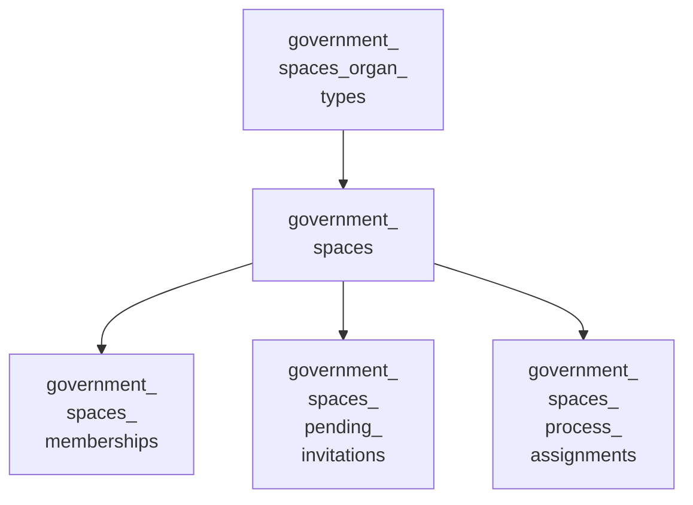

<!-- Gerado por scripts/banco_de_dados.py em 2026-10-09T16:34:04+00:00. Não edite à mão. -->

# Órgãos e setores

Hierarquia de governo Órgão → Setor da gem decidim-government_spaces: tipos de órgão, membros, convites e atribuição de processos a setores.

**5 tabelas.** Schema versão `20260924162404`. Legenda da coluna **Referência**: *FK* = chave estrangeira declarada no banco; *→* = referência por convenção de nome (sem restrição no banco).

## Relacionamentos

Cada seta vai da tabela referenciada para a tabela que guarda a referência. Referências para outros domínios aparecem na coluna **Referência** das tabelas abaixo.

## Tabelas

| Tabela | Descrição | Colunas | Origem |
|---|---|---:|---|
| [`decidim_government_spaces`](#decidim-government-spaces) | Órgãos e setores (herança por `type`: Organ, Sector); `parent_id` liga o setor ao órgão. | 10 | `decidim-government_spaces` (LabLivre) |
| [`decidim_government_spaces_memberships`](#decidim-government-spaces-memberships) | Administradores com escopo de um órgão ou setor. | 5 | `decidim-government_spaces` (LabLivre) |
| [`decidim_government_spaces_organ_types`](#decidim-government-spaces-organ-types) | Tipos de órgão. | 5 | `decidim-government_spaces` (LabLivre) |
| [`decidim_government_spaces_pending_invitations`](#decidim-government-spaces-pending-invitations) | Convites pendentes para administrar um órgão ou setor. Nenhuma migração de `main` cria esta tabela. | 9 | — |
| [`decidim_government_spaces_process_assignments`](#decidim-government-spaces-process-assignments) | Setor responsável por cada processo participativo (um por processo). | 5 | `decidim-government_spaces` (LabLivre) |

### `decidim_government_spaces` { #decidim-government-spaces }

Órgãos e setores (herança por `type`: Organ, Sector); `parent_id` liga o setor ao órgão.

Origem: `decidim-government_spaces` (LabLivre).

| Coluna | Tipo | Nulo | Padrão | Referência / observação | Origem |
|---|---|:---:|---|---|---|
| `id` | `bigint` | não |  | chave primária |  |
| `created_at` | `datetime` | não |  |  |  |
| `decidim_organization_id` | `bigint` | não |  | → [`decidim_organizations`](organizacao-usuarios.md#decidim-organizations) |  |
| `description` | `jsonb` | não | `{}` | traduzível (`{"pt-BR": …}`) |  |
| `organ_type_id` | `bigint` | sim |  | FK → [`decidim_government_spaces_organ_types`](orgaos-setores.md#decidim-government-spaces-organ-types) |  |
| `parent_id` | `bigint` | sim |  | FK → [`decidim_government_spaces`](orgaos-setores.md#decidim-government-spaces) |  |
| `title` | `jsonb` | não | `{}` | traduzível (`{"pt-BR": …}`) |  |
| `type` | `string` | não |  |  |  |
| `updated_at` | `datetime` | não |  |  |  |
| `website_url` | `string` | sim |  |  |  |

??? note "Índices (4)"

    | Nome | Colunas | Único | Tipo |
    |---|---|:---:|---|
    | `index_decidim_government_spaces_on_decidim_organization_id` | `decidim_organization_id` |  | btree |
    | `idx_govspace_organ_type` | `organ_type_id` |  | btree |
    | `index_decidim_government_spaces_on_parent_id` | `parent_id` |  | btree |
    | `index_decidim_government_spaces_on_type` | `type` |  | btree |

### `decidim_government_spaces_memberships` { #decidim-government-spaces-memberships }

Administradores com escopo de um órgão ou setor.

Origem: `decidim-government_spaces` (LabLivre).

| Coluna | Tipo | Nulo | Padrão | Referência / observação | Origem |
|---|---|:---:|---|---|---|
| `id` | `bigint` | não |  | chave primária |  |
| `created_at` | `datetime` | não |  |  |  |
| `decidim_user_id` | `bigint` | não |  | → [`decidim_users`](organizacao-usuarios.md#decidim-users) |  |
| `government_space_id` | `bigint` | não |  | → [`decidim_government_spaces`](orgaos-setores.md#decidim-government-spaces) |  |
| `updated_at` | `datetime` | não |  |  |  |

??? note "Índices (3)"

    | Nome | Colunas | Único | Tipo |
    |---|---|:---:|---|
    | `idx_gov_spaces_memberships_unique` | `decidim_user_id`, `government_space_id` | sim | btree |
    | `idx_govspace_membership_user` | `decidim_user_id` |  | btree |
    | `idx_govspace_membership_space` | `government_space_id` |  | btree |

### `decidim_government_spaces_organ_types` { #decidim-government-spaces-organ-types }

Tipos de órgão.

Origem: `decidim-government_spaces` (LabLivre).

| Coluna | Tipo | Nulo | Padrão | Referência / observação | Origem |
|---|---|:---:|---|---|---|
| `id` | `bigint` | não |  | chave primária |  |
| `created_at` | `datetime` | não |  |  |  |
| `decidim_organization_id` | `bigint` | não |  | → [`decidim_organizations`](organizacao-usuarios.md#decidim-organizations) |  |
| `name` | `jsonb` | não | `{}` | traduzível (`{"pt-BR": …}`) |  |
| `updated_at` | `datetime` | não |  |  |  |

??? note "Índices (1)"

    | Nome | Colunas | Único | Tipo |
    |---|---|:---:|---|
    | `idx_govspace_organ_type_org` | `decidim_organization_id` |  | btree |

### `decidim_government_spaces_pending_invitations` { #decidim-government-spaces-pending-invitations }

Convites pendentes para administrar um órgão ou setor. Nenhuma migração de `main` cria esta tabela.

Origem: —.

| Coluna | Tipo | Nulo | Padrão | Referência / observação | Origem |
|---|---|:---:|---|---|---|
| `id` | `bigint` | não |  | chave primária |  |
| `created_at` | `datetime` | não |  |  |  |
| `document_number` | `string` | não |  |  |  |
| `expires_at` | `datetime` | não |  |  |  |
| `government_space_id` | `bigint` | não |  | → [`decidim_government_spaces`](orgaos-setores.md#decidim-government-spaces) |  |
| `institutional_email` | `string` | não |  |  |  |
| `invitation_token` | `string` | não |  |  |  |
| `invited_by_id` | `bigint` | não |  | → [`decidim_users`](organizacao-usuarios.md#decidim-users) |  |
| `updated_at` | `datetime` | não |  |  |  |

??? note "Índices (2)"

    | Nome | Colunas | Único | Tipo |
    |---|---|:---:|---|
    | `index_gov_space_pending_invitations_on_document_number` | `document_number` |  | btree |
    | `index_gov_space_pending_invitations_on_token` | `invitation_token` | sim | btree |

### `decidim_government_spaces_process_assignments` { #decidim-government-spaces-process-assignments }

Setor responsável por cada processo participativo (um por processo).

Origem: `decidim-government_spaces` (LabLivre).

| Coluna | Tipo | Nulo | Padrão | Referência / observação | Origem |
|---|---|:---:|---|---|---|
| `id` | `bigint` | não |  | chave primária |  |
| `created_at` | `datetime` | não |  |  |  |
| `decidim_participatory_process_id` | `bigint` | não |  | → [`decidim_participatory_processes`](processos-instancias.md#decidim-participatory-processes) |  |
| `government_space_id` | `bigint` | não |  | → [`decidim_government_spaces`](orgaos-setores.md#decidim-government-spaces) |  |
| `updated_at` | `datetime` | não |  |  |  |

??? note "Índices (2)"

    | Nome | Colunas | Único | Tipo |
    |---|---|:---:|---|
    | `idx_govspace_assignment_process` | `decidim_participatory_process_id` | sim | btree |
    | `idx_govspace_assignment_space` | `government_space_id` |  | btree |

