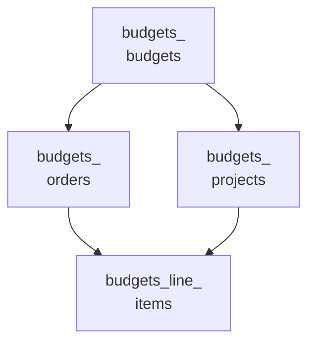
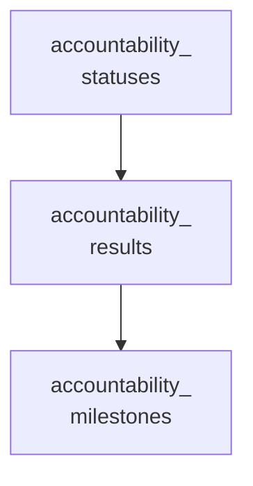

<!-- Gerado por scripts/banco_de_dados.py em 2026-10-09T16:34:04+00:00. Não edite à mão. -->

# Orçamentos, debates, blog e outros módulos

Demais módulos nativos do Decidim: orçamentos, prestação de contas, debates, blog e páginas, mais a tabela legada de sorteios.

**11 tabelas.** Schema versão `20260924162404`. Legenda da coluna **Referência**: *FK* = chave estrangeira declarada no banco; *→* = referência por convenção de nome (sem restrição no banco).

## Relacionamentos

Cada seta vai da tabela referenciada para a tabela que guarda a referência. Referências para outros domínios aparecem na coluna **Referência** das tabelas abaixo.

**A partir de `decidim_budgets_budgets`**

**A partir de `decidim_accountability_statuses`**

## Tabelas

| Tabela | Descrição | Colunas | Origem |
|---|---|---:|---|
| [`decidim_accountability_milestones`](#decidim-accountability-milestones) | — | 7 | Decidim |
| [`decidim_accountability_results`](#decidim-accountability-results) | Resultados acompanhados na prestação de contas. | 21 | Decidim |
| [`decidim_accountability_statuses`](#decidim-accountability-statuses) | — | 8 | Decidim |
| [`decidim_blogs_posts`](#decidim-blogs-posts) | Posts do blog (notícias). | 13 | Decidim |
| [`decidim_budgets_budgets`](#decidim-budgets-budgets) | Orçamentos de um componente. | 10 | Decidim |
| [`decidim_budgets_line_items`](#decidim-budgets-line-items) | — | 3 | Decidim |
| [`decidim_budgets_orders`](#decidim-budgets-orders) | Votos (carrinhos) de participantes num orçamento. | 6 | Decidim |
| [`decidim_budgets_projects`](#decidim-budgets-projects) | Projetos votáveis de um orçamento. | 16 | Decidim |
| [`decidim_debates_debates`](#decidim-debates-debates) | Debates. | 25 | Decidim |
| [`decidim_pages_pages`](#decidim-pages-pages) | Conteúdo do componente Páginas. | 6 | Decidim |
| [`decidim_sortitions_sortitions`](#decidim-sortitions-sortitions) | Sorteios de propostas (tabela legada; o módulo não existe no Decidim 0.32). | 21 | Decidim |

### `decidim_accountability_milestones` { #decidim-accountability-milestones }

Origem: Decidim.

| Coluna | Tipo | Nulo | Padrão | Referência / observação | Origem |
|---|---|:---:|---|---|---|
| `id` | `serial` | não |  | chave primária |  |
| `created_at` | `datetime` | não |  |  |  |
| `decidim_accountability_result_id` | `integer` | sim |  | → [`decidim_accountability_results`](outros-modulos.md#decidim-accountability-results) |  |
| `description` | `jsonb` | sim |  | traduzível (`{"pt-BR": …}`) |  |
| `entry_date` | `date` | sim |  |  |  |
| `title` | `jsonb` | sim |  | traduzível (`{"pt-BR": …}`) |  |
| `updated_at` | `datetime` | não |  |  |  |

??? note "Índices (2)"

    | Nome | Colunas | Único | Tipo |
    |---|---|:---:|---|
    | `index_decidim_accountability_milestones_on_results_id` | `decidim_accountability_result_id` |  | btree |
    | `index_decidim_accountability_milestones_on_entry_date` | `entry_date` |  | btree |

### `decidim_accountability_results` { #decidim-accountability-results }

Resultados acompanhados na prestação de contas.

Origem: Decidim.

| Coluna | Tipo | Nulo | Padrão | Referência / observação | Origem |
|---|---|:---:|---|---|---|
| `id` | `serial` | não |  | chave primária |  |
| `address` | `text` | sim |  |  |  |
| `children_count` | `integer` | sim | `0` | contador em cache |  |
| `comments_count` | `integer` | não | `0` | contador em cache |  |
| `created_at` | `datetime` | não |  |  |  |
| `decidim_accountability_status_id` | `integer` | sim |  | → [`decidim_accountability_statuses`](outros-modulos.md#decidim-accountability-statuses) |  |
| `decidim_component_id` | `integer` | sim |  | → [`decidim_components`](componentes-conteudo.md#decidim-components) |  |
| `decidim_scope_id` | `integer` | sim |  | → [`decidim_scopes`](componentes-conteudo.md#decidim-scopes) |  |
| `deleted_at` | `datetime` | sim |  |  |  |
| `description` | `jsonb` | sim |  | traduzível (`{"pt-BR": …}`) |  |
| `end_date` | `date` | sim |  |  |  |
| `external_id` | `string` | sim |  |  |  |
| `latitude` | `float` | sim |  |  |  |
| `longitude` | `float` | sim |  |  |  |
| `parent_id` | `integer` | sim |  | → [`decidim_accountability_results`](outros-modulos.md#decidim-accountability-results) |  |
| `progress` | `decimal` | sim |  |  |  |
| `reference` | `string` | sim |  |  |  |
| `start_date` | `date` | sim |  |  |  |
| `title` | `jsonb` | sim |  | traduzível (`{"pt-BR": …}`) |  |
| `updated_at` | `datetime` | não |  |  |  |
| `weight` | `float` | sim | `1.0` |  |  |

??? note "Índices (6)"

    | Nome | Colunas | Único | Tipo |
    |---|---|:---:|---|
    | `decidim_accountability_results_on_status_id` | `decidim_accountability_status_id` |  | btree |
    | `index_decidim_accountability_results_on_decidim_component_id` | `decidim_component_id` |  | btree |
    | `index_decidim_accountability_results_on_decidim_scope_id` | `decidim_scope_id` |  | btree |
    | `index_decidim_accountability_results_on_deleted_at` | `deleted_at` |  | btree |
    | `index_decidim_accountability_results_on_external_id` | `external_id` |  | btree |
    | `decidim_accountability_results_on_parent_id` | `parent_id` |  | btree |

### `decidim_accountability_statuses` { #decidim-accountability-statuses }

Origem: Decidim.

| Coluna | Tipo | Nulo | Padrão | Referência / observação | Origem |
|---|---|:---:|---|---|---|
| `id` | `serial` | não |  | chave primária |  |
| `created_at` | `datetime` | não |  |  |  |
| `decidim_component_id` | `integer` | sim |  | → [`decidim_components`](componentes-conteudo.md#decidim-components) |  |
| `description` | `jsonb` | sim |  | traduzível (`{"pt-BR": …}`) |  |
| `key` | `string` | sim |  |  |  |
| `name` | `jsonb` | sim |  | traduzível (`{"pt-BR": …}`) |  |
| `progress` | `integer` | sim |  |  |  |
| `updated_at` | `datetime` | não |  |  |  |

??? note "Índices (1)"

    | Nome | Colunas | Único | Tipo |
    |---|---|:---:|---|
    | `index_decidim_accountability_statuses_on_decidim_component_id` | `decidim_component_id` |  | btree |

### `decidim_blogs_posts` { #decidim-blogs-posts }

Posts do blog (notícias).

Origem: Decidim.

| Coluna | Tipo | Nulo | Padrão | Referência / observação | Origem |
|---|---|:---:|---|---|---|
| `id` | `serial` | não |  | chave primária |  |
| `body` | `jsonb` | sim |  | traduzível (`{"pt-BR": …}`) |  |
| `comments_count` | `integer` | não | `0` | contador em cache |  |
| `created_at` | `datetime` | não |  |  |  |
| `decidim_author_id` | `integer` | não |  | polimórfico (tipo em `decidim_author_type`) |  |
| `decidim_author_type` | `string` | não |  |  |  |
| `decidim_component_id` | `integer` | sim |  | → [`decidim_components`](componentes-conteudo.md#decidim-components) |  |
| `deleted_at` | `datetime` | sim |  |  |  |
| `follows_count` | `integer` | não | `0` | contador em cache |  |
| `likes_count` | `integer` | não | `0` | contador em cache |  |
| `published_at` | `datetime` | sim |  |  |  |
| `title` | `jsonb` | sim |  | traduzível (`{"pt-BR": …}`) |  |
| `updated_at` | `datetime` | não |  |  |  |

??? note "Índices (3)"

    | Nome | Colunas | Único | Tipo |
    |---|---|:---:|---|
    | `index_decidim_blogs_posts_on_decidim_author` | `decidim_author_id`, `decidim_author_type` |  | btree |
    | `index_decidim_blogs_posts_on_decidim_component_id` | `decidim_component_id` |  | btree |
    | `index_decidim_blogs_posts_on_deleted_at` | `deleted_at` |  | btree |

### `decidim_budgets_budgets` { #decidim-budgets-budgets }

Orçamentos de um componente.

Origem: Decidim.

| Coluna | Tipo | Nulo | Padrão | Referência / observação | Origem |
|---|---|:---:|---|---|---|
| `id` | `serial` | não |  | chave primária |  |
| `created_at` | `datetime` | não |  |  |  |
| `decidim_component_id` | `integer` | sim |  | → [`decidim_components`](componentes-conteudo.md#decidim-components) |  |
| `decidim_scope_id` | `bigint` | sim |  | FK → [`decidim_scopes`](componentes-conteudo.md#decidim-scopes) |  |
| `deleted_at` | `datetime` | sim |  |  |  |
| `description` | `jsonb` | sim |  | traduzível (`{"pt-BR": …}`) |  |
| `title` | `jsonb` | sim |  | traduzível (`{"pt-BR": …}`) |  |
| `total_budget` | `bigint` | sim | `0` |  |  |
| `updated_at` | `datetime` | não |  |  |  |
| `weight` | `integer` | não | `0` |  |  |

??? note "Índices (3)"

    | Nome | Colunas | Único | Tipo |
    |---|---|:---:|---|
    | `index_decidim_budgets_budgets_on_decidim_component_id` | `decidim_component_id` |  | btree |
    | `index_decidim_budgets_budgets_on_decidim_scope_id` | `decidim_scope_id` |  | btree |
    | `index_decidim_budgets_budgets_on_deleted_at` | `deleted_at` |  | btree |

### `decidim_budgets_line_items` { #decidim-budgets-line-items }

Origem: Decidim.

| Coluna | Tipo | Nulo | Padrão | Referência / observação | Origem |
|---|---|:---:|---|---|---|
| `id` | `serial` | não |  | chave primária |  |
| `decidim_order_id` | `integer` | sim |  | → [`decidim_budgets_orders`](outros-modulos.md#decidim-budgets-orders) |  |
| `decidim_project_id` | `integer` | sim |  | → [`decidim_budgets_projects`](outros-modulos.md#decidim-budgets-projects) |  |

??? note "Índices (3)"

    | Nome | Colunas | Único | Tipo |
    |---|---|:---:|---|
    | `decidim_budgets_line_items_order_project_unique` | `decidim_order_id`, `decidim_project_id` | sim | btree |
    | `index_decidim_budgets_line_items_on_decidim_order_id` | `decidim_order_id` |  | btree |
    | `index_decidim_budgets_line_items_on_decidim_project_id` | `decidim_project_id` |  | btree |

### `decidim_budgets_orders` { #decidim-budgets-orders }

Votos (carrinhos) de participantes num orçamento.

Origem: Decidim.

| Coluna | Tipo | Nulo | Padrão | Referência / observação | Origem |
|---|---|:---:|---|---|---|
| `id` | `serial` | não |  | chave primária |  |
| `checked_out_at` | `datetime` | sim |  |  |  |
| `created_at` | `datetime` | não |  |  |  |
| `decidim_budgets_budget_id` | `bigint` | sim |  | FK → [`decidim_budgets_budgets`](outros-modulos.md#decidim-budgets-budgets) |  |
| `decidim_user_id` | `integer` | sim |  | → [`decidim_users`](organizacao-usuarios.md#decidim-users) |  |
| `updated_at` | `datetime` | não |  |  |  |

??? note "Índices (2)"

    | Nome | Colunas | Único | Tipo |
    |---|---|:---:|---|
    | `index_decidim_budgets_orders_on_decidim_budgets_budget_id` | `decidim_budgets_budget_id` |  | btree |
    | `index_decidim_budgets_orders_on_decidim_user_id` | `decidim_user_id` |  | btree |

### `decidim_budgets_projects` { #decidim-budgets-projects }

Projetos votáveis de um orçamento.

Origem: Decidim.

| Coluna | Tipo | Nulo | Padrão | Referência / observação | Origem |
|---|---|:---:|---|---|---|
| `id` | `serial` | não |  | chave primária |  |
| `address` | `text` | sim |  |  |  |
| `budget_amount` | `bigint` | não |  |  |  |
| `comments_count` | `integer` | não | `0` | contador em cache |  |
| `created_at` | `datetime` | não |  |  |  |
| `decidim_budgets_budget_id` | `bigint` | sim |  | FK → [`decidim_budgets_budgets`](outros-modulos.md#decidim-budgets-budgets) |  |
| `decidim_scope_id` | `integer` | sim |  | → [`decidim_scopes`](componentes-conteudo.md#decidim-scopes) |  |
| `deleted_at` | `datetime` | sim |  |  |  |
| `description` | `jsonb` | sim |  | traduzível (`{"pt-BR": …}`) |  |
| `follows_count` | `integer` | não | `0` | contador em cache |  |
| `latitude` | `float` | sim |  |  |  |
| `longitude` | `float` | sim |  |  |  |
| `reference` | `string` | sim |  |  |  |
| `selected_at` | `date` | sim |  |  |  |
| `title` | `jsonb` | sim |  | traduzível (`{"pt-BR": …}`) |  |
| `updated_at` | `datetime` | não |  |  |  |

??? note "Índices (3)"

    | Nome | Colunas | Único | Tipo |
    |---|---|:---:|---|
    | `index_decidim_budgets_projects_on_decidim_budgets_budget_id` | `decidim_budgets_budget_id` |  | btree |
    | `index_decidim_budgets_projects_on_decidim_scope_id` | `decidim_scope_id` |  | btree |
    | `index_decidim_budgets_projects_on_deleted_at` | `deleted_at` |  | btree |

### `decidim_debates_debates` { #decidim-debates-debates }

Debates.

Origem: Decidim.

| Coluna | Tipo | Nulo | Padrão | Referência / observação | Origem |
|---|---|:---:|---|---|---|
| `id` | `serial` | não |  | chave primária |  |
| `closed_at` | `datetime` | sim |  |  |  |
| `comments_count` | `integer` | não | `0` | contador em cache |  |
| `comments_enabled` | `boolean` | sim | `true` |  |  |
| `comments_layout` | `string` | sim |  |  |  |
| `conclusions` | `jsonb` | sim |  |  |  |
| `created_at` | `datetime` | não |  |  |  |
| `decidim_author_id` | `integer` | não |  | polimórfico (tipo em `decidim_author_type`) |  |
| `decidim_author_type` | `string` | não |  |  |  |
| `decidim_component_id` | `integer` | sim |  | → [`decidim_components`](componentes-conteudo.md#decidim-components) |  |
| `decidim_scope_id` | `bigint` | sim |  | FK → [`decidim_scopes`](componentes-conteudo.md#decidim-scopes) |  |
| `deleted_at` | `datetime` | sim |  |  |  |
| `description` | `jsonb` | sim |  | traduzível (`{"pt-BR": …}`) |  |
| `end_time` | `datetime` | sim |  |  |  |
| `follows_count` | `integer` | não | `0` | contador em cache |  |
| `information_updates` | `jsonb` | sim |  |  |  |
| `instructions` | `jsonb` | sim |  |  |  |
| `last_comment_at` | `datetime` | sim |  |  |  |
| `last_comment_by_id` | `integer` | sim |  | polimórfico (tipo em `last_comment_by_type`) |  |
| `last_comment_by_type` | `string` | sim |  |  |  |
| `likes_count` | `integer` | não | `0` | contador em cache |  |
| `reference` | `string` | sim |  |  |  |
| `start_time` | `datetime` | sim |  |  |  |
| `title` | `jsonb` | sim |  | traduzível (`{"pt-BR": …}`) |  |
| `updated_at` | `datetime` | não |  |  |  |

??? note "Índices (6)"

    | Nome | Colunas | Único | Tipo |
    |---|---|:---:|---|
    | `index_decidim_debates_debates_on_closed_at` | `closed_at` |  | btree |
    | `index_decidim_debates_debates_on_decidim_author` | `decidim_author_id`, `decidim_author_type` |  | btree |
    | `index_decidim_debates_debates_on_decidim_component_id` | `decidim_component_id` |  | btree |
    | `index_decidim_debates_debates_on_decidim_scope_id` | `decidim_scope_id` |  | btree |
    | `index_decidim_debates_debates_on_deleted_at` | `deleted_at` |  | btree |
    | `index_decidim_debates_debates_on_likes_count` | `likes_count` |  | btree |

### `decidim_pages_pages` { #decidim-pages-pages }

Conteúdo do componente Páginas.

Origem: Decidim.

| Coluna | Tipo | Nulo | Padrão | Referência / observação | Origem |
|---|---|:---:|---|---|---|
| `id` | `serial` | não |  | chave primária |  |
| `body` | `jsonb` | sim |  | traduzível (`{"pt-BR": …}`) |  |
| `created_at` | `datetime` | não |  |  |  |
| `decidim_component_id` | `integer` | sim |  | → [`decidim_components`](componentes-conteudo.md#decidim-components) |  |
| `deleted_at` | `datetime` | sim |  |  |  |
| `updated_at` | `datetime` | não |  |  |  |

??? note "Índices (2)"

    | Nome | Colunas | Único | Tipo |
    |---|---|:---:|---|
    | `index_decidim_pages_pages_on_decidim_component_id` | `decidim_component_id` |  | btree |
    | `index_decidim_pages_pages_on_deleted_at` | `deleted_at` |  | btree |

### `decidim_sortitions_sortitions` { #decidim-sortitions-sortitions }

Sorteios de propostas (tabela legada; o módulo não existe no Decidim 0.32).

Origem: Decidim.

| Coluna | Tipo | Nulo | Padrão | Referência / observação | Origem |
|---|---|:---:|---|---|---|
| `id` | `bigint` | não |  | chave primária |  |
| `additional_info` | `jsonb` | sim |  |  |  |
| `cancel_reason` | `jsonb` | sim |  |  |  |
| `cancelled_by_user_id` | `integer` | sim |  |  |  |
| `cancelled_on` | `datetime` | sim |  |  |  |
| `candidate_proposals` | `jsonb` | sim |  |  |  |
| `comments_count` | `integer` | não | `0` | contador em cache |  |
| `created_at` | `datetime` | não |  |  |  |
| `decidim_author_id` | `bigint` | não |  | polimórfico (tipo em `decidim_author_type`) |  |
| `decidim_author_type` | `string` | não |  |  |  |
| `decidim_component_id` | `bigint` | sim |  | → [`decidim_components`](componentes-conteudo.md#decidim-components) |  |
| `decidim_proposals_component_id` | `integer` | sim |  |  |  |
| `deleted_at` | `datetime` | sim |  |  |  |
| `dice` | `integer` | não |  |  |  |
| `reference` | `string` | sim |  |  |  |
| `request_timestamp` | `datetime` | não |  |  |  |
| `selected_proposals` | `jsonb` | sim |  |  |  |
| `target_items` | `integer` | não |  |  |  |
| `title` | `jsonb` | sim |  | traduzível (`{"pt-BR": …}`) |  |
| `updated_at` | `datetime` | não |  |  |  |
| `witnesses` | `jsonb` | sim |  |  |  |

??? note "Índices (6)"

    | Nome | Colunas | Único | Tipo |
    |---|---|:---:|---|
    | `index_decidim_sortitions_sortitions_on_cancelled_by_user_id` | `cancelled_by_user_id` |  | btree |
    | `index_decidim_sortitions_sortitions_on_decidim_author` | `decidim_author_id`, `decidim_author_type` |  | btree |
    | `index_decidim_sortitions_sortitions_on_decidim_author_id` | `decidim_author_id` |  | btree |
    | `index_sortitions__on_feature` | `decidim_component_id` |  | btree |
    | `index_sortitions__on_proposals_feature` | `decidim_proposals_component_id` |  | btree |
    | `index_decidim_sortitions_sortitions_on_deleted_at` | `deleted_at` |  | btree |

