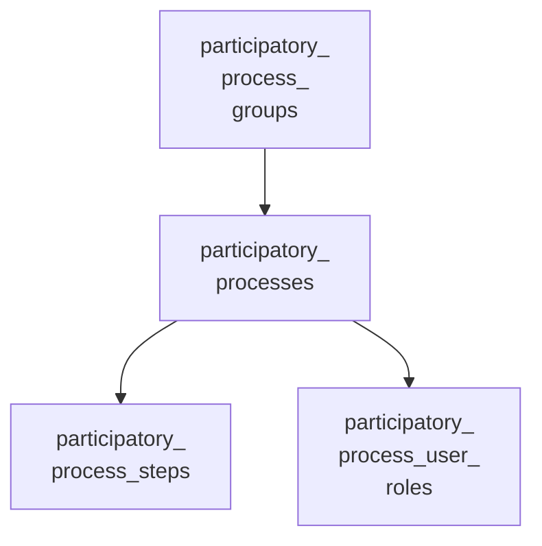
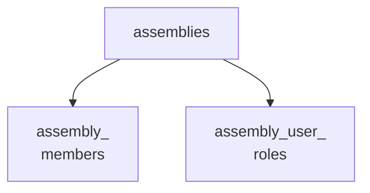

<!-- Gerado por scripts/banco_de_dados.py em 2026-10-09T16:34:04+00:00. Não edite à mão. -->

# Processos participativos e instâncias

Processos participativos, etapas, grupos e assembleias, chamadas de instâncias na interface.

**9 tabelas.** Schema versão `20260924162404`. Legenda da coluna **Referência**: *FK* = chave estrangeira declarada no banco; *→* = referência por convenção de nome (sem restrição no banco).

## Relacionamentos

Cada seta vai da tabela referenciada para a tabela que guarda a referência. Referências para outros domínios aparecem na coluna **Referência** das tabelas abaixo.

**A partir de `decidim_participatory_process_groups`**

**A partir de `decidim_assemblies`**

## Tabelas

| Tabela | Descrição | Colunas | Origem |
|---|---|---:|---|
| [`decidim_assemblies`](#decidim-assemblies) | Assembleias, chamadas de instâncias na interface. `parent_id` forma a hierarquia de sub-instâncias. | 48 | Decidim |
| [`decidim_assemblies_settings`](#decidim-assemblies-settings) | — | 3 | Decidim |
| [`decidim_assembly_members`](#decidim-assembly-members) | Membros de uma assembleia. | 14 | Decidim |
| [`decidim_assembly_user_roles`](#decidim-assembly-user-roles) | Papéis de usuários em assembleias. | 6 | Decidim |
| [`decidim_participatory_process_groups`](#decidim-participatory-process-groups) | Grupos de processos. | 14 | Decidim |
| [`decidim_participatory_process_steps`](#decidim-participatory-process-steps) | Etapas (fases) de cada processo. | 10 | Decidim |
| [`decidim_participatory_process_user_roles`](#decidim-participatory-process-user-roles) | Papéis de usuários em processos (admin, moderador, avaliador, colaborador). | 6 | Decidim |
| [`decidim_participatory_processes`](#decidim-participatory-processes) | Processos participativos. `automatic_step_activation` liga a troca automática de etapa (decidim-govbr). | 33 | Decidim |
| [`decidim_participatory_space_links`](#decidim-participatory-space-links) | — | 7 | Decidim |

### `decidim_assemblies` { #decidim-assemblies }

Assembleias, chamadas de instâncias na interface. `parent_id` forma a hierarquia de sub-instâncias.

Origem: Decidim.

| Coluna | Tipo | Nulo | Padrão | Referência / observação | Origem |
|---|---|:---:|---|---|---|
| `id` | `serial` | não |  | chave primária |  |
| `access_mode` | `integer` | não | `0` |  |  |
| `announcement` | `jsonb` | sim |  | traduzível (`{"pt-BR": …}`) |  |
| `children_count` | `integer` | sim | `0` | contador em cache |  |
| `closing_date` | `date` | sim |  |  |  |
| `closing_date_reason` | `jsonb` | sim |  |  |  |
| `composition` | `jsonb` | sim |  |  |  |
| `created_at` | `datetime` | não |  |  |  |
| `created_by` | `string` | sim |  |  |  |
| `created_by_other` | `jsonb` | sim |  |  |  |
| `creation_date` | `date` | sim |  |  |  |
| `decidim_area_id` | `bigint` | sim |  | → [`decidim_areas`](componentes-conteudo.md#decidim-areas) |  |
| `decidim_organization_id` | `integer` | sim |  | → [`decidim_organizations`](organizacao-usuarios.md#decidim-organizations) |  |
| `decidim_scope_id` | `integer` | sim |  | → [`decidim_scopes`](componentes-conteudo.md#decidim-scopes) |  |
| `deleted_at` | `datetime` | sim |  |  |  |
| `description` | `jsonb` | não |  | traduzível (`{"pt-BR": …}`) |  |
| `developer_group` | `jsonb` | sim |  |  |  |
| `duration` | `date` | sim |  |  |  |
| `facebook_handler` | `string` | sim |  |  |  |
| `follows_count` | `integer` | não | `0` | contador em cache |  |
| `github_handler` | `string` | sim |  |  |  |
| `has_members` | `boolean` | sim | `false` |  |  |
| `included_at` | `date` | sim |  |  |  |
| `instagram_handler` | `string` | sim |  |  |  |
| `internal_organisation` | `jsonb` | sim |  |  |  |
| `is_transparent` | `boolean` | sim | `true` |  |  |
| `local_area` | `jsonb` | sim |  |  |  |
| `meta_scope` | `jsonb` | sim |  |  |  |
| `parent_id` | `bigint` | sim |  | → [`decidim_assemblies`](processos-instancias.md#decidim-assemblies) |  |
| `parents_path` | `ltree` | sim |  |  |  |
| `participatory_scope` | `jsonb` | sim |  |  |  |
| `participatory_structure` | `jsonb` | sim |  |  |  |
| `private_space` | `boolean` | sim | `false` |  |  |
| `promoted` | `boolean` | sim | `false` |  |  |
| `published_at` | `datetime` | sim |  |  |  |
| `purpose_of_action` | `jsonb` | sim |  |  |  |
| `reference` | `string` | sim |  |  |  |
| `scopes_enabled` | `boolean` | não | `true` |  |  |
| `short_description` | `jsonb` | não |  | traduzível (`{"pt-BR": …}`) |  |
| `slug` | `string` | não |  |  |  |
| `special_features` | `jsonb` | sim |  |  |  |
| `subtitle` | `jsonb` | não |  | traduzível (`{"pt-BR": …}`) |  |
| `target` | `jsonb` | sim |  |  |  |
| `title` | `jsonb` | não |  | traduzível (`{"pt-BR": …}`) |  |
| `twitter_handler` | `string` | sim |  |  |  |
| `updated_at` | `datetime` | não |  |  |  |
| `weight` | `integer` | não | `1` |  |  |
| `youtube_handler` | `string` | sim |  |  |  |

??? note "Índices (6)"

    | Nome | Colunas | Único | Tipo |
    |---|---|:---:|---|
    | `index_decidim_assemblies_on_decidim_area_id` | `decidim_area_id` |  | btree |
    | `index_unique_assembly_slug_and_organization` | `decidim_organization_id`, `slug` | sim | btree |
    | `index_decidim_assemblies_on_decidim_organization_id` | `decidim_organization_id` |  | btree |
    | `index_decidim_assemblies_on_decidim_scope_id` | `decidim_scope_id` |  | btree |
    | `index_decidim_assemblies_on_deleted_at` | `deleted_at` |  | btree |
    | `decidim_assemblies_assemblies_on_parent_id` | `parent_id` |  | btree |

### `decidim_assemblies_settings` { #decidim-assemblies-settings }

Origem: Decidim.

| Coluna | Tipo | Nulo | Padrão | Referência / observação | Origem |
|---|---|:---:|---|---|---|
| `id` | `bigint` | não |  | chave primária |  |
| `decidim_organization_id` | `bigint` | sim |  | FK → [`decidim_organizations`](organizacao-usuarios.md#decidim-organizations) |  |
| `enable_organization_chart` | `boolean` | sim | `true` |  |  |

??? note "Índices (1)"

    | Nome | Colunas | Único | Tipo |
    |---|---|:---:|---|
    | `index_decidim_assemblies_settings_on_decidim_organization_id` | `decidim_organization_id` |  | btree |

### `decidim_assembly_members` { #decidim-assembly-members }

Membros de uma assembleia.

Origem: Decidim.

| Coluna | Tipo | Nulo | Padrão | Referência / observação | Origem |
|---|---|:---:|---|---|---|
| `id` | `bigint` | não |  | chave primária |  |
| `birthday` | `date` | sim |  |  |  |
| `birthplace` | `string` | sim |  |  |  |
| `ceased_date` | `date` | sim |  |  |  |
| `created_at` | `datetime` | não |  |  |  |
| `decidim_assembly_id` | `bigint` | sim |  | → [`decidim_assemblies`](processos-instancias.md#decidim-assemblies) |  |
| `decidim_user_id` | `bigint` | sim |  | → [`decidim_users`](organizacao-usuarios.md#decidim-users) |  |
| `designation_date` | `date` | sim |  |  |  |
| `full_name` | `string` | sim |  |  |  |
| `gender` | `string` | sim |  |  |  |
| `position` | `string` | sim |  |  |  |
| `position_other` | `string` | sim |  |  |  |
| `updated_at` | `datetime` | não |  |  |  |
| `weight` | `integer` | não | `0` |  |  |

??? note "Índices (3)"

    | Nome | Colunas | Único | Tipo |
    |---|---|:---:|---|
    | `index_decidim_assembly_members_on_decidim_assembly_id` | `decidim_assembly_id` |  | btree |
    | `index_decidim_assembly_members_on_decidim_user_id` | `decidim_user_id` |  | btree |
    | `index_decidim_assembly_members_on_weight_and_created_at` | `weight`, `created_at` |  | btree |

### `decidim_assembly_user_roles` { #decidim-assembly-user-roles }

Papéis de usuários em assembleias.

Origem: Decidim.

| Coluna | Tipo | Nulo | Padrão | Referência / observação | Origem |
|---|---|:---:|---|---|---|
| `id` | `bigint` | não |  | chave primária |  |
| `created_at` | `datetime` | não |  |  |  |
| `decidim_assembly_id` | `integer` | sim |  | → [`decidim_assemblies`](processos-instancias.md#decidim-assemblies) |  |
| `decidim_user_id` | `integer` | sim |  | → [`decidim_users`](organizacao-usuarios.md#decidim-users) |  |
| `role` | `string` | sim |  |  |  |
| `updated_at` | `datetime` | não |  |  |  |

??? note "Índices (2)"

    | Nome | Colunas | Único | Tipo |
    |---|---|:---:|---|
    | `index_unique_user_and_assembly_role` | `decidim_assembly_id`, `decidim_user_id`, `role` | sim | btree |
    | `index_decidim_assembly_user_roles_on_decidim_user_id` | `decidim_user_id` |  | btree |

### `decidim_participatory_process_groups` { #decidim-participatory-process-groups }

Grupos de processos.

Origem: Decidim.

| Coluna | Tipo | Nulo | Padrão | Referência / observação | Origem |
|---|---|:---:|---|---|---|
| `id` | `serial` | não |  | chave primária |  |
| `created_at` | `datetime` | não |  |  |  |
| `decidim_organization_id` | `integer` | sim |  | → [`decidim_organizations`](organizacao-usuarios.md#decidim-organizations) |  |
| `description` | `jsonb` | não |  | traduzível (`{"pt-BR": …}`) |  |
| `developer_group` | `jsonb` | sim |  |  |  |
| `group_url` | `string` | sim |  |  |  |
| `local_area` | `jsonb` | sim |  |  |  |
| `meta_scope` | `jsonb` | sim |  |  |  |
| `participatory_scope` | `jsonb` | sim |  |  |  |
| `participatory_structure` | `jsonb` | sim |  |  |  |
| `promoted` | `boolean` | sim | `false` |  |  |
| `target` | `jsonb` | sim |  |  |  |
| `title` | `jsonb` | não |  | traduzível (`{"pt-BR": …}`) |  |
| `updated_at` | `datetime` | não |  |  |  |

??? note "Índices (1)"

    | Nome | Colunas | Único | Tipo |
    |---|---|:---:|---|
    | `decidim_participatory_process_group_organization` | `decidim_organization_id` |  | btree |

### `decidim_participatory_process_steps` { #decidim-participatory-process-steps }

Etapas (fases) de cada processo.

Origem: Decidim.

| Coluna | Tipo | Nulo | Padrão | Referência / observação | Origem |
|---|---|:---:|---|---|---|
| `id` | `serial` | não |  | chave primária |  |
| `active` | `boolean` | sim | `false` |  |  |
| `created_at` | `datetime` | não |  |  |  |
| `decidim_participatory_process_id` | `integer` | sim |  | → [`decidim_participatory_processes`](processos-instancias.md#decidim-participatory-processes) |  |
| `description` | `jsonb` | sim |  | traduzível (`{"pt-BR": …}`) |  |
| `end_date` | `datetime` | sim |  |  |  |
| `position` | `integer` | sim |  |  |  |
| `start_date` | `datetime` | sim |  |  |  |
| `title` | `jsonb` | não |  | traduzível (`{"pt-BR": …}`) |  |
| `updated_at` | `datetime` | não |  |  |  |

??? note "Índices (4)"

    | Nome | Colunas | Único | Tipo |
    |---|---|:---:|---|
    | `unique_index_to_avoid_duplicate_active_steps` | `decidim_participatory_process_id`, `active` | sim | btree (parcial: `(active = true)`) |
    | `index_unique_position_for_process` | `decidim_participatory_process_id`, `position` | sim | btree |
    | `index_decidim_processes_steps__on_decidim_process_id` | `decidim_participatory_process_id` |  | btree |
    | `index_order_by_position_for_steps` | `position` |  | btree |

### `decidim_participatory_process_user_roles` { #decidim-participatory-process-user-roles }

Papéis de usuários em processos (admin, moderador, avaliador, colaborador).

Origem: Decidim.

| Coluna | Tipo | Nulo | Padrão | Referência / observação | Origem |
|---|---|:---:|---|---|---|
| `id` | `serial` | não |  | chave primária |  |
| `created_at` | `datetime` | não |  |  |  |
| `decidim_participatory_process_id` | `integer` | sim |  | → [`decidim_participatory_processes`](processos-instancias.md#decidim-participatory-processes) |  |
| `decidim_user_id` | `integer` | sim |  | → [`decidim_users`](organizacao-usuarios.md#decidim-users) |  |
| `role` | `string` | sim |  |  |  |
| `updated_at` | `datetime` | não |  |  |  |

??? note "Índices (2)"

    | Nome | Colunas | Único | Tipo |
    |---|---|:---:|---|
    | `index_unique_user_and_process_role` | `decidim_participatory_process_id`, `decidim_user_id`, `role` | sim | btree |
    | `idx_proces_user_role_on_user_id` | `decidim_user_id` |  | btree |

### `decidim_participatory_processes` { #decidim-participatory-processes }

Processos participativos. `automatic_step_activation` liga a troca automática de etapa (decidim-govbr).

Origem: Decidim.

| Coluna | Tipo | Nulo | Padrão | Referência / observação | Origem |
|---|---|:---:|---|---|---|
| `id` | `serial` | não |  | chave primária |  |
| `access_mode` | `integer` | não | `0` |  |  |
| `announcement` | `jsonb` | sim |  | traduzível (`{"pt-BR": …}`) |  |
| `automatic_step_activation` | `boolean` | não | `false` |  | [:flag_br: Participa](https://gitlab.com/lappis-unb/decidimbr/participa/-/blob/main/db/migrate/20260924162404_add_automatic_step_activation_to_participatory_processes.decidim_govbr.rb "20260924162404_add_automatic_step_activation_to_participatory_processes.decidim_govbr.rb") |
| `created_at` | `datetime` | não |  |  |  |
| `decidim_area_id` | `bigint` | sim |  | → [`decidim_areas`](componentes-conteudo.md#decidim-areas) |  |
| `decidim_organization_id` | `integer` | sim |  | FK → [`decidim_organizations`](organizacao-usuarios.md#decidim-organizations) |  |
| `decidim_participatory_process_group_id` | `integer` | sim |  | → [`decidim_participatory_process_groups`](processos-instancias.md#decidim-participatory-process-groups) |  |
| `decidim_scope_id` | `integer` | sim |  | → [`decidim_scopes`](componentes-conteudo.md#decidim-scopes) |  |
| `decidim_scope_type_id` | `bigint` | sim |  | FK → [`decidim_scope_types`](componentes-conteudo.md#decidim-scope-types) |  |
| `deleted_at` | `datetime` | sim |  |  |  |
| `description` | `jsonb` | não |  | traduzível (`{"pt-BR": …}`) |  |
| `developer_group` | `jsonb` | sim |  |  |  |
| `end_date` | `date` | sim |  |  |  |
| `follows_count` | `integer` | não | `0` | contador em cache |  |
| `has_members` | `boolean` | sim | `false` |  |  |
| `local_area` | `jsonb` | sim |  |  |  |
| `meta_scope` | `jsonb` | sim |  |  |  |
| `participatory_scope` | `jsonb` | sim |  |  |  |
| `participatory_structure` | `jsonb` | sim |  |  |  |
| `private_space` | `boolean` | sim | `false` |  |  |
| `promoted` | `boolean` | sim | `false` |  |  |
| `published_at` | `datetime` | sim |  |  |  |
| `reference` | `string` | sim |  |  |  |
| `scopes_enabled` | `boolean` | não | `true` |  |  |
| `short_description` | `jsonb` | não |  | traduzível (`{"pt-BR": …}`) |  |
| `slug` | `string` | não |  |  |  |
| `start_date` | `date` | sim |  |  |  |
| `subtitle` | `jsonb` | não |  | traduzível (`{"pt-BR": …}`) |  |
| `target` | `jsonb` | sim |  |  |  |
| `title` | `jsonb` | não |  | traduzível (`{"pt-BR": …}`) |  |
| `updated_at` | `datetime` | não |  |  |  |
| `weight` | `integer` | não | `1` |  |  |

??? note "Índices (7)"

    | Nome | Colunas | Único | Tipo |
    |---|---|:---:|---|
    | `index_decidim_participatory_processes_on_decidim_area_id` | `decidim_area_id` |  | btree |
    | `index_unique_process_slug_and_organization` | `decidim_organization_id`, `slug` | sim | btree |
    | `index_decidim_processes_on_decidim_organization_id` | `decidim_organization_id` |  | btree |
    | `idx_process_on_process_group_id` | `decidim_participatory_process_group_id` |  | btree |
    | `idx_process_on_scope_id` | `decidim_scope_id` |  | btree |
    | `index_decidim_participatory_processes_on_decidim_scope_type_id` | `decidim_scope_type_id` |  | btree |
    | `index_decidim_participatory_processes_on_deleted_at` | `deleted_at` |  | btree |

### `decidim_participatory_space_links` { #decidim-participatory-space-links }

Origem: Decidim.

| Coluna | Tipo | Nulo | Padrão | Referência / observação | Origem |
|---|---|:---:|---|---|---|
| `id` | `serial` | não |  | chave primária |  |
| `data` | `jsonb` | sim |  |  |  |
| `from_id` | `integer` | não |  | polimórfico (tipo em `from_type`) |  |
| `from_type` | `string` | não |  |  |  |
| `name` | `string` | não |  |  |  |
| `to_id` | `integer` | não |  | polimórfico (tipo em `to_type`) |  |
| `to_type` | `string` | não |  |  |  |

??? note "Índices (3)"

    | Nome | Colunas | Único | Tipo |
    |---|---|:---:|---|
    | `index_participatory_space_links_on_from` | `from_type`, `from_id` |  | btree |
    | `index_participatory_space_links_name` | `name` |  | btree |
    | `index_participatory_space_links_on_to` | `to_type`, `to_id` |  | btree |

