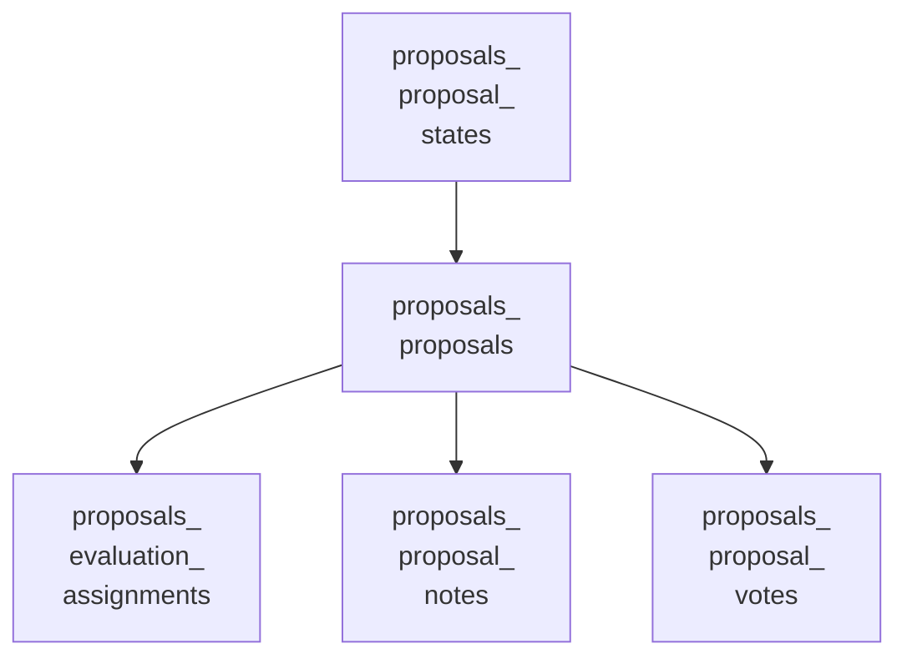
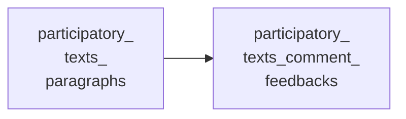

<!-- Gerado por scripts/banco_de_dados.py em 2026-10-09T16:34:04+00:00. Não edite à mão. -->

# Propostas e texto participativo

Propostas, votos, emendas, coautorias, rascunhos colaborativos, avaliação e o componente de texto participativo (parágrafos e devolutivas).

**10 tabelas.** Schema versão `20260924162404`. Legenda da coluna **Referência**: *FK* = chave estrangeira declarada no banco; *→* = referência por convenção de nome (sem restrição no banco).

## Relacionamentos

Cada seta vai da tabela referenciada para a tabela que guarda a referência. Referências para outros domínios aparecem na coluna **Referência** das tabelas abaixo.

**A partir de `decidim_proposals_proposal_states`**

**Outras relações**

## Tabelas

| Tabela | Descrição | Colunas | Origem |
|---|---|---:|---|
| [`decidim_amendments`](#decidim-amendments) | Emendas entre recursos emendáveis (propostas). | 9 | Decidim |
| [`decidim_coauthorships`](#decidim-coauthorships) | Coautoria polimórfica de recursos. | 7 | Decidim |
| [`decidim_participatory_texts_comment_feedbacks`](#decidim-participatory-texts-comment-feedbacks) | Devolutiva a um comentário de parágrafo: incorporado, parcialmente, não incorporado ou aguardando análise. | 8 | `decidim-participatory_texts` (LabLivre) |
| [`decidim_participatory_texts_paragraphs`](#decidim-participatory-texts-paragraphs) | Parágrafos do componente Texto participativo (gem decidim-participatory_texts). | 12 | `decidim-participatory_texts` (LabLivre) |
| [`decidim_proposals_evaluation_assignments`](#decidim-proposals-evaluation-assignments) | — | 6 | Decidim |
| [`decidim_proposals_participatory_texts`](#decidim-proposals-participatory-texts) | Texto participativo do componente de propostas do Decidim (o Participa usa o componente próprio). | 6 | Decidim |
| [`decidim_proposals_proposal_notes`](#decidim-proposals-proposal-notes) | Notas privadas de administradores sobre propostas. | 7 | Decidim |
| [`decidim_proposals_proposal_states`](#decidim-proposals-proposal-states) | — | 8 | Decidim |
| [`decidim_proposals_proposal_votes`](#decidim-proposals-proposal-votes) | Votos em propostas. | 6 | Decidim |
| [`decidim_proposals_proposals`](#decidim-proposals-proposals) | Propostas. No Decidim, também representam parágrafos do texto participativo do componente de propostas. | 35 | Decidim |

### `decidim_amendments` { #decidim-amendments }

Emendas entre recursos emendáveis (propostas).

Origem: Decidim.

| Coluna | Tipo | Nulo | Padrão | Referência / observação | Origem |
|---|---|:---:|---|---|---|
| `id` | `bigint` | não |  | chave primária |  |
| `created_at` | `datetime` | não |  |  |  |
| `decidim_amendable_id` | `bigint` | sim |  | polimórfico (tipo em `decidim_amendable_type`) |  |
| `decidim_amendable_type` | `string` | sim |  |  |  |
| `decidim_emendation_id` | `bigint` | sim |  | polimórfico (tipo em `decidim_emendation_type`) |  |
| `decidim_emendation_type` | `string` | sim |  |  |  |
| `decidim_user_id` | `bigint` | não |  | → [`decidim_users`](organizacao-usuarios.md#decidim-users) |  |
| `state` | `integer` | não | `0` |  |  |
| `updated_at` | `datetime` | não |  |  |  |

??? note "Índices (4)"

    | Nome | Colunas | Único | Tipo |
    |---|---|:---:|---|
    | `index_on_amendable` | `decidim_amendable_id`, `decidim_amendable_type` |  | btree |
    | `index_decidim_amendments_on_decidim_emendation_id` | `decidim_emendation_id` |  | btree |
    | `index_on_amender_and_amendable` | `decidim_user_id`, `decidim_amendable_id`, `decidim_amendable_type` |  | btree |
    | `index_decidim_amendments_on_decidim_user_id` | `decidim_user_id` |  | btree |

### `decidim_coauthorships` { #decidim-coauthorships }

Coautoria polimórfica de recursos.

Origem: Decidim.

| Coluna | Tipo | Nulo | Padrão | Referência / observação | Origem |
|---|---|:---:|---|---|---|
| `id` | `bigint` | não |  | chave primária |  |
| `coauthorable_id` | `bigint` | sim |  | polimórfico (tipo em `coauthorable_type`) |  |
| `coauthorable_type` | `string` | sim |  |  |  |
| `created_at` | `datetime` | não |  |  |  |
| `decidim_author_id` | `bigint` | não |  | polimórfico (tipo em `decidim_author_type`) |  |
| `decidim_author_type` | `string` | não |  |  |  |
| `updated_at` | `datetime` | não |  |  |  |

??? note "Índices (2)"

    | Nome | Colunas | Único | Tipo |
    |---|---|:---:|---|
    | `index_coauthorable_on_coauthorship` | `coauthorable_type`, `coauthorable_id` |  | btree |
    | `index_decidim_coauthorships_on_decidim_author` | `decidim_author_id`, `decidim_author_type` |  | btree |

### `decidim_participatory_texts_comment_feedbacks` { #decidim-participatory-texts-comment-feedbacks }

Devolutiva a um comentário de parágrafo: incorporado, parcialmente, não incorporado ou aguardando análise.

Origem: `decidim-participatory_texts` (LabLivre).

| Coluna | Tipo | Nulo | Padrão | Referência / observação | Origem |
|---|---|:---:|---|---|---|
| `id` | `bigint` | não |  | chave primária |  |
| `body` | `text` | sim |  |  |  |
| `created_at` | `datetime` | não |  |  |  |
| `decidim_author_id` | `bigint` | não |  | FK → [`decidim_users`](organizacao-usuarios.md#decidim-users) |  |
| `decidim_comment_id` | `bigint` | não |  | FK → [`decidim_comments_comments`](interacao.md#decidim-comments-comments) |  |
| `decidim_paragraph_id` | `bigint` | não |  | FK → [`decidim_participatory_texts_paragraphs`](propostas.md#decidim-participatory-texts-paragraphs) |  |
| `status` | `string` | não | `"awaiting_review"` |  |  |
| `updated_at` | `datetime` | não |  |  |  |

??? note "Índices (3)"

    | Nome | Colunas | Único | Tipo |
    |---|---|:---:|---|
    | `index_pt_comment_feedbacks_on_author_id` | `decidim_author_id` |  | btree |
    | `index_pt_comment_feedbacks_on_comment_id` | `decidim_comment_id` | sim | btree |
    | `index_pt_comment_feedbacks_on_paragraph_id` | `decidim_paragraph_id` |  | btree |

### `decidim_participatory_texts_paragraphs` { #decidim-participatory-texts-paragraphs }

Parágrafos do componente Texto participativo (gem decidim-participatory_texts).

Origem: `decidim-participatory_texts` (LabLivre).

| Coluna | Tipo | Nulo | Padrão | Referência / observação | Origem |
|---|---|:---:|---|---|---|
| `id` | `bigint` | não |  | chave primária |  |
| `body` | `jsonb` | sim | `{}` | traduzível (`{"pt-BR": …}`) |  |
| `comments_count` | `integer` | não | `0` | contador em cache |  |
| `created_at` | `datetime` | não |  |  |  |
| `decidim_component_id` | `bigint` | não |  | → [`decidim_components`](componentes-conteudo.md#decidim-components) |  |
| `is_hidden` | `boolean` | não | `false` |  |  |
| `is_interactive` | `boolean` | não | `true` |  |  |
| `level` | `string` | não | `"article"` |  |  |
| `position` | `integer` | não | `0` |  |  |
| `published_at` | `datetime` | sim |  |  |  |
| `title` | `jsonb` | sim | `{}` | traduzível (`{"pt-BR": …}`) |  |
| `updated_at` | `datetime` | não |  |  |  |

??? note "Índices (2)"

    | Nome | Colunas | Único | Tipo |
    |---|---|:---:|---|
    | `index_pt_paragraphs_on_component_and_position` | `decidim_component_id`, `position` |  | btree |
    | `index_pt_paragraphs_on_component_id` | `decidim_component_id` |  | btree |

### `decidim_proposals_evaluation_assignments` { #decidim-proposals-evaluation-assignments }

Origem: Decidim.

| Coluna | Tipo | Nulo | Padrão | Referência / observação | Origem |
|---|---|:---:|---|---|---|
| `id` | `bigint` | não |  | chave primária |  |
| `created_at` | `datetime` | não |  |  |  |
| `decidim_proposal_id` | `bigint` | não |  | → [`decidim_proposals_proposals`](propostas.md#decidim-proposals-proposals) |  |
| `evaluator_role_id` | `bigint` | não |  | polimórfico (tipo em `evaluator_role_type`) |  |
| `evaluator_role_type` | `string` | não |  |  |  |
| `updated_at` | `datetime` | não |  |  |  |

??? note "Índices (2)"

    | Nome | Colunas | Único | Tipo |
    |---|---|:---:|---|
    | `decidim_proposals_evaluation_assignment_proposal` | `decidim_proposal_id` |  | btree |
    | `decidim_proposals_evaluation_assignment_valuator_role` | `evaluator_role_type`, `evaluator_role_id` |  | btree |

### `decidim_proposals_participatory_texts` { #decidim-proposals-participatory-texts }

Texto participativo do componente de propostas do Decidim (o Participa usa o componente próprio).

Origem: Decidim.

| Coluna | Tipo | Nulo | Padrão | Referência / observação | Origem |
|---|---|:---:|---|---|---|
| `id` | `bigint` | não |  | chave primária |  |
| `created_at` | `datetime` | não |  |  |  |
| `decidim_component_id` | `bigint` | não |  | → [`decidim_components`](componentes-conteudo.md#decidim-components) |  |
| `description` | `jsonb` | sim |  | traduzível (`{"pt-BR": …}`) |  |
| `title` | `jsonb` | sim |  | traduzível (`{"pt-BR": …}`) |  |
| `updated_at` | `datetime` | não |  |  |  |

??? note "Índices (1)"

    | Nome | Colunas | Único | Tipo |
    |---|---|:---:|---|
    | `idx_participatory_texts_on_decidim_component_id` | `decidim_component_id` |  | btree |

### `decidim_proposals_proposal_notes` { #decidim-proposals-proposal-notes }

Notas privadas de administradores sobre propostas.

Origem: Decidim.

| Coluna | Tipo | Nulo | Padrão | Referência / observação | Origem |
|---|---|:---:|---|---|---|
| `id` | `bigint` | não |  | chave primária |  |
| `body` | `text` | não |  |  |  |
| `created_at` | `datetime` | não |  |  |  |
| `decidim_author_id` | `bigint` | não |  |  |  |
| `decidim_proposal_id` | `bigint` | não |  | → [`decidim_proposals_proposals`](propostas.md#decidim-proposals-proposals) |  |
| `parent_id` | `bigint` | sim |  | → [`decidim_proposals_proposal_notes`](propostas.md#decidim-proposals-proposal-notes) |  |
| `updated_at` | `datetime` | não |  |  |  |

??? note "Índices (4)"

    | Nome | Colunas | Único | Tipo |
    |---|---|:---:|---|
    | `index_decidim_proposals_proposal_notes_on_created_at` | `created_at` |  | btree |
    | `decidim_proposals_proposal_note_author` | `decidim_author_id` |  | btree |
    | `decidim_proposals_proposal_note_proposal` | `decidim_proposal_id` |  | btree |
    | `decidim_proposals_proposal_notes_on_parent_id` | `parent_id` |  | btree |

### `decidim_proposals_proposal_states` { #decidim-proposals-proposal-states }

Origem: Decidim.

| Coluna | Tipo | Nulo | Padrão | Referência / observação | Origem |
|---|---|:---:|---|---|---|
| `id` | `bigint` | não |  | chave primária |  |
| `announcement_title` | `jsonb` | sim |  |  |  |
| `bg_color` | `string` | não | `"#F6F8FA"` |  |  |
| `decidim_component_id` | `bigint` | não |  | → [`decidim_components`](componentes-conteudo.md#decidim-components) |  |
| `proposals_count` | `integer` | não | `0` | contador em cache |  |
| `text_color` | `string` | não | `"#4B5058"` |  |  |
| `title` | `jsonb` | sim |  | traduzível (`{"pt-BR": …}`) |  |
| `token` | `string` | não |  |  |  |

??? note "Índices (1)"

    | Nome | Colunas | Único | Tipo |
    |---|---|:---:|---|
    | `index_decidim_proposals_proposal_states_on_decidim_component_id` | `decidim_component_id` |  | btree |

### `decidim_proposals_proposal_votes` { #decidim-proposals-proposal-votes }

Votos em propostas.

Origem: Decidim.

| Coluna | Tipo | Nulo | Padrão | Referência / observação | Origem |
|---|---|:---:|---|---|---|
| `id` | `serial` | não |  | chave primária |  |
| `created_at` | `datetime` | não |  |  |  |
| `decidim_author_id` | `integer` | não |  |  |  |
| `decidim_proposal_id` | `integer` | não |  | → [`decidim_proposals_proposals`](propostas.md#decidim-proposals-proposals) |  |
| `temporary` | `boolean` | não | `false` |  |  |
| `updated_at` | `datetime` | não |  |  |  |

??? note "Índices (3)"

    | Nome | Colunas | Único | Tipo |
    |---|---|:---:|---|
    | `decidim_proposals_proposal_vote_author` | `decidim_author_id` |  | btree |
    | `decidim_proposals_proposal_vote_proposal_author_unique` | `decidim_proposal_id`, `decidim_author_id` | sim | btree |
    | `decidim_proposals_proposal_vote_proposal` | `decidim_proposal_id` |  | btree |

### `decidim_proposals_proposals` { #decidim-proposals-proposals }

Propostas. No Decidim, também representam parágrafos do texto participativo do componente de propostas.

Origem: Decidim.

| Coluna | Tipo | Nulo | Padrão | Referência / observação | Origem |
|---|---|:---:|---|---|---|
| `id` | `serial` | não |  | chave primária |  |
| `address` | `text` | sim |  |  |  |
| `answer` | `jsonb` | sim |  | traduzível (`{"pt-BR": …}`) |  |
| `answered_at` | `datetime` | sim |  |  |  |
| `body` | `jsonb` | sim |  | traduzível (`{"pt-BR": …}`) |  |
| `coauthorships_count` | `integer` | não | `0` | contador em cache |  |
| `comments_count` | `integer` | não | `0` | contador em cache |  |
| `cost` | `decimal` | sim |  |  |  |
| `cost_report` | `jsonb` | sim |  |  |  |
| `created_at` | `datetime` | não |  |  |  |
| `created_in_meeting` | `boolean` | sim | `false` |  |  |
| `decidim_categories_category_id` | `bigint` | sim |  | polimórfico (tipo em `decidim_categories_category_type`) | — |
| `decidim_categories_category_ids` | `integer[]` | sim | `[]` |  | — |
| `decidim_categories_category_type` | `string` | sim |  |  | — |
| `decidim_component_id` | `integer` | não |  | → [`decidim_components`](componentes-conteudo.md#decidim-components) |  |
| `decidim_proposals_proposal_state_id` | `integer` | sim |  | FK → [`decidim_proposals_proposal_states`](propostas.md#decidim-proposals-proposal-states) |  |
| `decidim_scope_id` | `integer` | sim |  | → [`decidim_scopes`](componentes-conteudo.md#decidim-scopes) |  |
| `deleted_at` | `datetime` | sim |  |  |  |
| `evaluation_assignments_count` | `integer` | sim | `0` | contador em cache |  |
| `execution_period` | `jsonb` | sim |  |  |  |
| `follows_count` | `integer` | não | `0` | contador em cache |  |
| `latitude` | `float` | sim |  |  |  |
| `likes_count` | `integer` | não | `0` | contador em cache |  |
| `longitude` | `float` | sim |  |  |  |
| `old_state` | `integer` | não | `0` |  |  |
| `participatory_text_level` | `string` | sim |  |  |  |
| `position` | `integer` | sim |  |  |  |
| `proposal_notes_count` | `integer` | não | `0` | contador em cache |  |
| `proposal_votes_count` | `integer` | não | `0` | contador em cache |  |
| `published_at` | `datetime` | sim |  |  |  |
| `reference` | `string` | sim |  |  |  |
| `state_published_at` | `datetime` | sim |  |  |  |
| `title` | `jsonb` | sim |  | traduzível (`{"pt-BR": …}`) |  |
| `updated_at` | `datetime` | não |  |  |  |
| `withdrawn_at` | `datetime` | sim |  |  |  |

??? note "Índices (9)"

    | Nome | Colunas | Único | Tipo |
    |---|---|:---:|---|
    | `decidim_proposals_proposal_body_search` | `md5((body)::text)` |  | btree |
    | `decidim_proposals_proposal_title_search` | `md5((title)::text)` |  | btree |
    | `index_decidim_proposals_proposals_on_created_at` | `created_at` |  | btree |
    | `idx_proposals_on_custom_category_ids` | `decidim_categories_category_ids` |  | gin |
    | `idx_proposals_on_custom_category` | `decidim_categories_category_type`, `decidim_categories_category_id` |  | btree |
    | `index_decidim_proposals_proposals_on_decidim_component_id` | `decidim_component_id` |  | btree |
    | `index_decidim_proposals_proposals_on_decidim_scope_id` | `decidim_scope_id` |  | btree |
    | `index_decidim_proposals_proposals_on_deleted_at` | `deleted_at` |  | btree |
    | `index_decidim_proposals_proposals_on_proposal_votes_count` | `proposal_votes_count` |  | btree |

