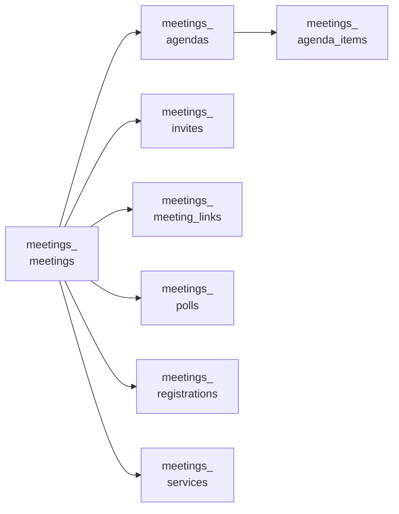
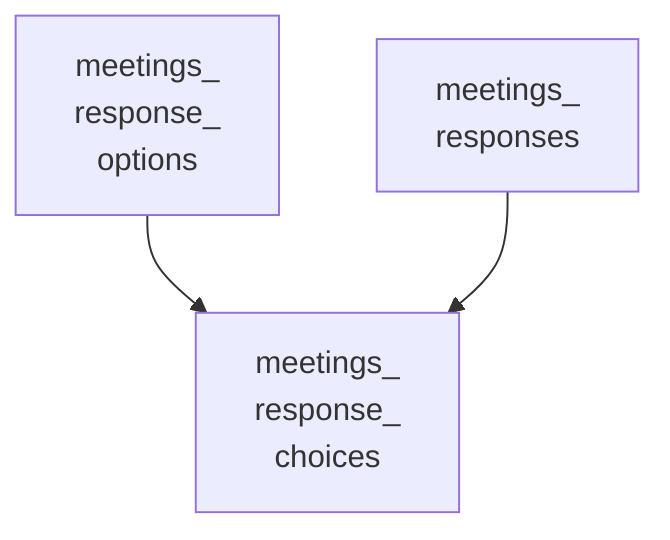

<!-- Gerado por scripts/banco_de_dados.py em 2026-10-09T16:34:04+00:00. Não edite à mão. -->

# Reuniões e eventos

Reuniões, inscrições, convites, pautas e enquetes ao vivo.

**13 tabelas.** Schema versão `20260924162404`. Legenda da coluna **Referência**: *FK* = chave estrangeira declarada no banco; *→* = referência por convenção de nome (sem restrição no banco).

## Relacionamentos

Cada seta vai da tabela referenciada para a tabela que guarda a referência. Referências para outros domínios aparecem na coluna **Referência** das tabelas abaixo.

**A partir de `decidim_meetings_meetings`**

**A partir de `decidim_meetings_response_options`, `decidim_meetings_responses`**

## Tabelas

| Tabela | Descrição | Colunas | Origem |
|---|---|---:|---|
| [`decidim_meetings_agenda_items`](#decidim-meetings-agenda-items) | — | 9 | Decidim |
| [`decidim_meetings_agendas`](#decidim-meetings-agendas) | — | 6 | Decidim |
| [`decidim_meetings_invites`](#decidim-meetings-invites) | — | 8 | Decidim |
| [`decidim_meetings_meeting_links`](#decidim-meetings-meeting-links) | — | 5 | Decidim |
| [`decidim_meetings_meetings`](#decidim-meetings-meetings) | Reuniões e eventos. | 56 | Decidim |
| [`decidim_meetings_polls`](#decidim-meetings-polls) | — | 4 | Decidim |
| [`decidim_meetings_questionnaires`](#decidim-meetings-questionnaires) | — | 5 | Decidim |
| [`decidim_meetings_questions`](#decidim-meetings-questions) | — | 9 | Decidim |
| [`decidim_meetings_registrations`](#decidim-meetings-registrations) | Inscrições em reuniões. | 9 | Decidim |
| [`decidim_meetings_response_choices`](#decidim-meetings-response-choices) | — | 6 | Decidim |
| [`decidim_meetings_response_options`](#decidim-meetings-response-options) | — | 3 | Decidim |
| [`decidim_meetings_responses`](#decidim-meetings-responses) | — | 6 | Decidim |
| [`decidim_meetings_services`](#decidim-meetings-services) | — | 6 | Decidim |

### `decidim_meetings_agenda_items` { #decidim-meetings-agenda-items }

Origem: Decidim.

| Coluna | Tipo | Nulo | Padrão | Referência / observação | Origem |
|---|---|:---:|---|---|---|
| `id` | `bigint` | não |  | chave primária |  |
| `created_at` | `datetime` | não |  |  |  |
| `decidim_agenda_id` | `bigint` | sim |  | → [`decidim_meetings_agendas`](reunioes.md#decidim-meetings-agendas) |  |
| `description` | `jsonb` | sim |  | traduzível (`{"pt-BR": …}`) |  |
| `duration` | `integer` | sim |  |  |  |
| `parent_id` | `bigint` | sim |  | → [`decidim_meetings_agenda_items`](reunioes.md#decidim-meetings-agenda-items) |  |
| `position` | `integer` | sim |  |  |  |
| `title` | `jsonb` | sim |  | traduzível (`{"pt-BR": …}`) |  |
| `updated_at` | `datetime` | não |  |  |  |

??? note "Índices (2)"

    | Nome | Colunas | Único | Tipo |
    |---|---|:---:|---|
    | `index_decidim_meetings_agenda_items_on_decidim_agenda_id` | `decidim_agenda_id` |  | btree |
    | `index_decidim_meetings_agenda_items_on_parent_id` | `parent_id` |  | btree |

### `decidim_meetings_agendas` { #decidim-meetings-agendas }

Origem: Decidim.

| Coluna | Tipo | Nulo | Padrão | Referência / observação | Origem |
|---|---|:---:|---|---|---|
| `id` | `bigint` | não |  | chave primária |  |
| `created_at` | `datetime` | não |  |  |  |
| `decidim_meeting_id` | `bigint` | não |  | → [`decidim_meetings_meetings`](reunioes.md#decidim-meetings-meetings) |  |
| `title` | `jsonb` | sim |  | traduzível (`{"pt-BR": …}`) |  |
| `updated_at` | `datetime` | não |  |  |  |
| `visible` | `boolean` | sim |  |  |  |

??? note "Índices (1)"

    | Nome | Colunas | Único | Tipo |
    |---|---|:---:|---|
    | `index_decidim_meetings_agendas_on_decidim_meeting_id` | `decidim_meeting_id` |  | btree |

### `decidim_meetings_invites` { #decidim-meetings-invites }

Origem: Decidim.

| Coluna | Tipo | Nulo | Padrão | Referência / observação | Origem |
|---|---|:---:|---|---|---|
| `id` | `bigint` | não |  | chave primária |  |
| `accepted_at` | `datetime` | sim |  |  |  |
| `created_at` | `datetime` | não |  |  |  |
| `decidim_meeting_id` | `bigint` | não |  | → [`decidim_meetings_meetings`](reunioes.md#decidim-meetings-meetings) |  |
| `decidim_user_id` | `bigint` | não |  | → [`decidim_users`](organizacao-usuarios.md#decidim-users) |  |
| `rejected_at` | `datetime` | sim |  |  |  |
| `sent_at` | `datetime` | sim |  |  |  |
| `updated_at` | `datetime` | não |  |  |  |

??? note "Índices (2)"

    | Nome | Colunas | Único | Tipo |
    |---|---|:---:|---|
    | `index_decidim_meetings_invites_on_decidim_meeting_id` | `decidim_meeting_id` |  | btree |
    | `index_decidim_meetings_invites_on_decidim_user_id` | `decidim_user_id` |  | btree |

### `decidim_meetings_meeting_links` { #decidim-meetings-meeting-links }

Origem: Decidim.

| Coluna | Tipo | Nulo | Padrão | Referência / observação | Origem |
|---|---|:---:|---|---|---|
| `id` | `bigint` | não |  | chave primária |  |
| `created_at` | `datetime` | não |  |  |  |
| `decidim_component_id` | `bigint` | não |  | → [`decidim_components`](componentes-conteudo.md#decidim-components) |  |
| `decidim_meeting_id` | `bigint` | não |  | → [`decidim_meetings_meetings`](reunioes.md#decidim-meetings-meetings) |  |
| `updated_at` | `datetime` | não |  |  |  |

??? note "Índices (2)"

    | Nome | Colunas | Único | Tipo |
    |---|---|:---:|---|
    | `index_decidim_meetings_meeting_links_on_decidim_component_id` | `decidim_component_id` |  | btree |
    | `index_decidim_meetings_meeting_links_on_decidim_meeting_id` | `decidim_meeting_id` |  | btree |

### `decidim_meetings_meetings` { #decidim-meetings-meetings }

Reuniões e eventos.

Origem: Decidim.

| Coluna | Tipo | Nulo | Padrão | Referência / observação | Origem |
|---|---|:---:|---|---|---|
| `id` | `serial` | não |  | chave primária |  |
| `address` | `text` | sim |  |  |  |
| `attendees_count` | `integer` | sim |  | contador em cache |  |
| `attending_organizations` | `text` | sim |  |  |  |
| `audio_url` | `string` | sim |  |  |  |
| `available_slots` | `integer` | não | `0` |  |  |
| `closed_at` | `time` | sim |  |  |  |
| `closing_report` | `jsonb` | sim |  |  |  |
| `closing_visible` | `boolean` | sim |  |  |  |
| `comments_count` | `integer` | não | `0` | contador em cache |  |
| `comments_enabled` | `boolean` | sim | `true` |  |  |
| `comments_end_time` | `datetime` | sim |  |  |  |
| `comments_start_time` | `datetime` | sim |  |  |  |
| `contributions_count` | `integer` | sim |  | contador em cache |  |
| `created_at` | `datetime` | não |  |  |  |
| `customize_registration_email` | `boolean` | sim | `false` |  |  |
| `decidim_author_id` | `integer` | sim |  | polimórfico (tipo em `decidim_author_type`) |  |
| `decidim_author_type` | `string` | sim |  |  |  |
| `decidim_categories_category_id` | `bigint` | sim |  | polimórfico (tipo em `decidim_categories_category_type`) | — |
| `decidim_categories_category_ids` | `integer[]` | sim | `[]` |  | — |
| `decidim_categories_category_type` | `string` | sim |  |  | — |
| `decidim_component_id` | `integer` | sim |  | → [`decidim_components`](componentes-conteudo.md#decidim-components) |  |
| `decidim_scope_id` | `integer` | sim |  | → [`decidim_scopes`](componentes-conteudo.md#decidim-scopes) |  |
| `deleted_at` | `datetime` | sim |  |  |  |
| `description` | `jsonb` | sim |  | traduzível (`{"pt-BR": …}`) |  |
| `end_time` | `datetime` | sim |  |  |  |
| `follows_count` | `integer` | não | `0` | contador em cache |  |
| `iframe_access_level` | `integer` | sim | `0` |  |  |
| `iframe_embed_type` | `integer` | sim | `0` |  |  |
| `latitude` | `float` | sim |  |  |  |
| `location` | `jsonb` | sim |  |  |  |
| `location_hints` | `jsonb` | sim |  |  |  |
| `longitude` | `float` | sim |  |  |  |
| `online_meeting_url` | `string` | sim |  |  |  |
| `private_meeting` | `boolean` | sim | `false` |  |  |
| `published_at` | `datetime` | sim |  |  |  |
| `reference` | `string` | sim |  |  |  |
| `registration_email_custom_content` | `jsonb` | sim |  |  |  |
| `registration_form_enabled` | `boolean` | sim | `false` |  |  |
| `registration_terms` | `jsonb` | sim |  |  |  |
| `registration_type` | `integer` | não | `0` |  |  |
| `registration_url` | `string` | sim |  |  |  |
| `registrations_enabled` | `boolean` | não | `false` |  |  |
| `reminder_enabled` | `boolean` | não | `true` |  |  |
| `reminder_message_custom_content` | `jsonb` | não | `{}` |  |  |
| `reserved_slots` | `integer` | não | `0` |  |  |
| `salt` | `string` | sim |  |  |  |
| `send_reminders_before_hours` | `integer` | sim |  |  |  |
| `start_time` | `datetime` | sim |  |  |  |
| `state` | `string` | sim |  |  |  |
| `title` | `jsonb` | sim |  | traduzível (`{"pt-BR": …}`) |  |
| `transparent` | `boolean` | sim | `true` |  |  |
| `type_of_meeting` | `integer` | não | `0` |  |  |
| `updated_at` | `datetime` | não |  |  |  |
| `video_url` | `string` | sim |  |  |  |
| `withdrawn_at` | `datetime` | sim |  |  |  |

??? note "Índices (7)"

    | Nome | Colunas | Único | Tipo |
    |---|---|:---:|---|
    | `index_decidim_meetings_meetings_on_author` | `decidim_author_id`, `decidim_author_type` |  | btree |
    | `index_decidim_meetings_meetings_on_decidim_author_id` | `decidim_author_id` |  | btree |
    | `idx_meetings_on_custom_category_ids` | `decidim_categories_category_ids` |  | gin |
    | `idx_meetings_on_custom_category` | `decidim_categories_category_type`, `decidim_categories_category_id` |  | btree |
    | `index_decidim_meetings_meetings_on_decidim_component_id` | `decidim_component_id` |  | btree |
    | `index_decidim_meetings_meetings_on_decidim_scope_id` | `decidim_scope_id` |  | btree |
    | `index_decidim_meetings_meetings_on_deleted_at` | `deleted_at` |  | btree |

### `decidim_meetings_polls` { #decidim-meetings-polls }

Origem: Decidim.

| Coluna | Tipo | Nulo | Padrão | Referência / observação | Origem |
|---|---|:---:|---|---|---|
| `id` | `bigint` | não |  | chave primária |  |
| `created_at` | `datetime` | não |  |  |  |
| `decidim_meeting_id` | `bigint` | sim |  | → [`decidim_meetings_meetings`](reunioes.md#decidim-meetings-meetings) |  |
| `updated_at` | `datetime` | não |  |  |  |

??? note "Índices (1)"

    | Nome | Colunas | Único | Tipo |
    |---|---|:---:|---|
    | `index_decidim_meetings_polls_on_decidim_meeting_id` | `decidim_meeting_id` |  | btree |

### `decidim_meetings_questionnaires` { #decidim-meetings-questionnaires }

Origem: Decidim.

| Coluna | Tipo | Nulo | Padrão | Referência / observação | Origem |
|---|---|:---:|---|---|---|
| `id` | `bigint` | não |  | chave primária |  |
| `created_at` | `datetime` | não |  |  |  |
| `questionnaire_for_id` | `bigint` | sim |  | polimórfico (tipo em `questionnaire_for_type`) |  |
| `questionnaire_for_type` | `string` | sim |  |  |  |
| `updated_at` | `datetime` | não |  |  |  |

??? note "Índices (1)"

    | Nome | Colunas | Único | Tipo |
    |---|---|:---:|---|
    | `index_decidim_meetings_questionnaires_questionnaire_for` | `questionnaire_for_type`, `questionnaire_for_id` |  | btree |

### `decidim_meetings_questions` { #decidim-meetings-questions }

Origem: Decidim.

| Coluna | Tipo | Nulo | Padrão | Referência / observação | Origem |
|---|---|:---:|---|---|---|
| `id` | `bigint` | não |  | chave primária |  |
| `body` | `jsonb` | sim |  | traduzível (`{"pt-BR": …}`) |  |
| `created_at` | `datetime` | não |  |  |  |
| `decidim_questionnaire_id` | `bigint` | sim |  | → [`decidim_forms_questionnaires`](formularios.md#decidim-forms-questionnaires) |  |
| `max_choices` | `integer` | sim |  |  |  |
| `position` | `integer` | sim |  |  |  |
| `question_type` | `string` | sim |  |  |  |
| `status` | `integer` | sim | `0` |  |  |
| `updated_at` | `datetime` | não |  |  |  |

??? note "Índices (2)"

    | Nome | Colunas | Único | Tipo |
    |---|---|:---:|---|
    | `index_decidim_meetings_questions_on_decidim_questionnaire_id` | `decidim_questionnaire_id` |  | btree |
    | `index_decidim_meetings_questions_on_position` | `position` |  | btree |

### `decidim_meetings_registrations` { #decidim-meetings-registrations }

Inscrições em reuniões.

Origem: Decidim.

| Coluna | Tipo | Nulo | Padrão | Referência / observação | Origem |
|---|---|:---:|---|---|---|
| `id` | `bigint` | não |  | chave primária |  |
| `code` | `string` | sim |  |  |  |
| `created_at` | `datetime` | não |  |  |  |
| `decidim_meeting_id` | `bigint` | não |  | → [`decidim_meetings_meetings`](reunioes.md#decidim-meetings-meetings) |  |
| `decidim_user_id` | `bigint` | não |  | → [`decidim_users`](organizacao-usuarios.md#decidim-users) |  |
| `public_participation` | `boolean` | sim | `false` |  |  |
| `status` | `string` | sim | `"registered"` |  |  |
| `updated_at` | `datetime` | não |  |  |  |
| `validated_at` | `datetime` | sim |  |  |  |

??? note "Índices (4)"

    | Nome | Colunas | Único | Tipo |
    |---|---|:---:|---|
    | `index_decidim_meetings_registrations_on_decidim_meeting_id` | `decidim_meeting_id` |  | btree |
    | `decidim_meetings_registrations_user_meeting_unique` | `decidim_user_id`, `decidim_meeting_id` | sim | btree |
    | `index_decidim_meetings_registrations_on_decidim_user_id` | `decidim_user_id` |  | btree |
    | `index_decidim_meetings_registrations_on_status` | `status` |  | btree |

### `decidim_meetings_response_choices` { #decidim-meetings-response-choices }

Origem: Decidim.

| Coluna | Tipo | Nulo | Padrão | Referência / observação | Origem |
|---|---|:---:|---|---|---|
| `id` | `bigint` | não |  | chave primária |  |
| `body` | `jsonb` | sim |  | traduzível (`{"pt-BR": …}`) |  |
| `custom_body` | `text` | sim |  |  |  |
| `decidim_response_id` | `bigint` | sim |  | → [`decidim_meetings_responses`](reunioes.md#decidim-meetings-responses) |  |
| `decidim_response_option_id` | `bigint` | sim |  | → [`decidim_meetings_response_options`](reunioes.md#decidim-meetings-response-options) |  |
| `position` | `integer` | sim |  |  |  |

??? note "Índices (2)"

    | Nome | Colunas | Único | Tipo |
    |---|---|:---:|---|
    | `index_decidim_meetings_response_choices_response_id` | `decidim_response_id` |  | btree |
    | `index_decidim_meetings_response_choices_response_option_id` | `decidim_response_option_id` |  | btree |

### `decidim_meetings_response_options` { #decidim-meetings-response-options }

Origem: Decidim.

| Coluna | Tipo | Nulo | Padrão | Referência / observação | Origem |
|---|---|:---:|---|---|---|
| `id` | `bigint` | não |  | chave primária |  |
| `body` | `jsonb` | sim |  | traduzível (`{"pt-BR": …}`) |  |
| `decidim_question_id` | `bigint` | sim |  | → [`decidim_forms_questions`](formularios.md#decidim-forms-questions) |  |

??? note "Índices (1)"

    | Nome | Colunas | Único | Tipo |
    |---|---|:---:|---|
    | `index_decidim_meetings_response_options_question_id` | `decidim_question_id` |  | btree |

### `decidim_meetings_responses` { #decidim-meetings-responses }

Origem: Decidim.

| Coluna | Tipo | Nulo | Padrão | Referência / observação | Origem |
|---|---|:---:|---|---|---|
| `id` | `bigint` | não |  | chave primária |  |
| `created_at` | `datetime` | não |  |  |  |
| `decidim_question_id` | `bigint` | sim |  | → [`decidim_forms_questions`](formularios.md#decidim-forms-questions) |  |
| `decidim_questionnaire_id` | `bigint` | sim |  | → [`decidim_forms_questionnaires`](formularios.md#decidim-forms-questionnaires) |  |
| `decidim_user_id` | `bigint` | sim |  | → [`decidim_users`](organizacao-usuarios.md#decidim-users) |  |
| `updated_at` | `datetime` | não |  |  |  |

??? note "Índices (3)"

    | Nome | Colunas | Único | Tipo |
    |---|---|:---:|---|
    | `index_decidim_meetings_responses_question_id` | `decidim_question_id` |  | btree |
    | `index_decidim_meetings_responses_on_decidim_questionnaire_id` | `decidim_questionnaire_id` |  | btree |
    | `index_decidim_meetings_responses_on_decidim_user_id` | `decidim_user_id` |  | btree |

### `decidim_meetings_services` { #decidim-meetings-services }

Origem: Decidim.

| Coluna | Tipo | Nulo | Padrão | Referência / observação | Origem |
|---|---|:---:|---|---|---|
| `id` | `bigint` | não |  | chave primária |  |
| `created_at` | `datetime` | não |  |  |  |
| `decidim_meeting_id` | `bigint` | não |  | → [`decidim_meetings_meetings`](reunioes.md#decidim-meetings-meetings) |  |
| `description` | `jsonb` | sim |  | traduzível (`{"pt-BR": …}`) |  |
| `title` | `jsonb` | sim |  | traduzível (`{"pt-BR": …}`) |  |
| `updated_at` | `datetime` | não |  |  |  |

??? note "Índices (1)"

    | Nome | Colunas | Único | Tipo |
    |---|---|:---:|---|
    | `index_decidim_meetings_services_on_decidim_meeting_id` | `decidim_meeting_id` |  | btree |

