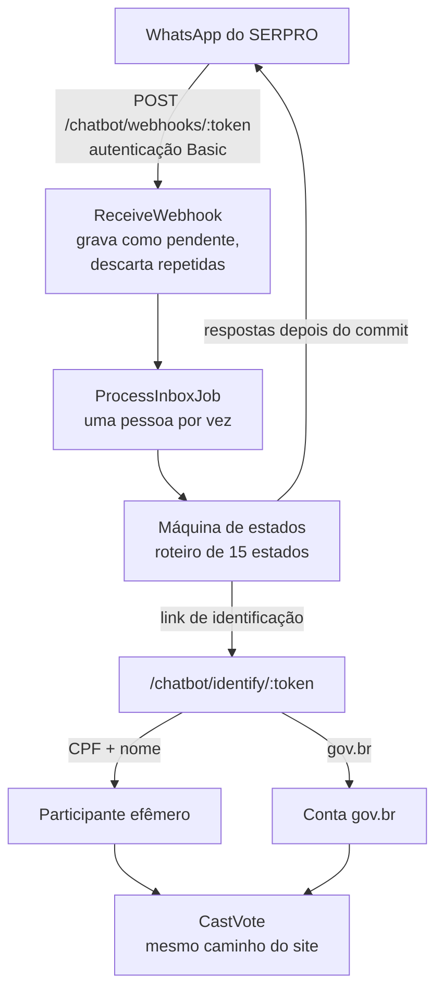

# Chatbot

O módulo `decidim-chatbot/` atende participantes por **WhatsApp** com um roteiro fixo e registra **votos em propostas** do Decidim. É um módulo de nível de organização (não é componente nem espaço) e entrou na `main` em outubro de 2026 (merge `9253a99`).

!!! info "Não é a API OP-BP"
    O chatbot fala direto com o WhatsApp do SERPRO, de dentro do Participa. Ele não usa a [participação multicanal](../multicanal/index.md) (API OP-BP), e o repositório do Participa não a cita. Se os dois vão coexistir ou se um substitui o outro está **a confirmar**. Veja o [Glossário](../visao-geral/glossario.md).

## Fluxo



1. O SERPRO entrega as mensagens no webhook da organização, autenticado por Basic Auth com o token do provedor.
2. As mensagens ficam pendentes; repetições do SERPRO são descartadas, com limite de 20 mensagens por telefone por minuto.
3. Um job processa uma pessoa por vez, avança o roteiro e prepara as respostas na mesma transação. O envio acontece depois, com limite de 30 respostas por telefone por hora e novas tentativas em erro do provedor.
4. Para votar, o participante recebe um **link de identificação** e escolhe entre **CPF e nome** (participação efêmera) ou **login gov.br**.
5. O voto é registrado pelo mesmo comando do site (`Decidim::Proposals::VoteProposal`), respeitando as permissões do componente.

## Roteiro

O roteiro está em `config/flows/general_script.yml`, transcrito do documento "Textos BP Genérico". Tem 15 estados: boas-vindas, escolha, recusa, saiba mais, sem participação, confirmação do voto, aguardando login, link reenviado, login cancelado, identidade recusada, troca de voto, participação validada, compartilhar, encerrado e já participou.

O administrador edita só os **termos** do roteiro: nome da plataforma, entidade responsável, público, local, tipo de local, número do WhatsApp e três textos longos (saiba mais, recusa e compartilhar).

## Requisitos do componente de propostas

O chatbot exige que o componente escolhido:

- permita **um voto por participante** (`vote_limit == 1`);
- exija a verificação por CPF (`govbr_authorization_handler`) na ação de votar.

## Painel

O item **Chatbot** aparece no menu do painel da organização (acima de "Moderações globais"), só para administradores da organização.

| Tela | O que permite |
|------|---------------|
| **Visão geral** | Números de 24 horas, 7 dias e total (pessoas, mensagens recebidas, enviadas e com falha, votos confirmados) e a lista "Para colocar no ar", com 9 itens a cumprir |
| **Provedores de mensageria** | Configurar, ligar e desligar o provedor; testar conexão; enviar mensagem de teste; registrar o webhook no SERPRO |
| **Textos do roteiro** | Assistente em 4 passos (geral, propostas, suporte, publicar) com prévia num celular simulado e publicação |

As ações ficam no log do painel.

## Dados

| Tabela | Conteúdo |
|--------|----------|
| `decidim_chatbot_broker_configs` | Provedor da organização, com segredos cifrados e dados do webhook |
| `decidim_chatbot_conversations` | Uma conversa por pessoa e provedor: estado, participante vinculado e voto confirmado |
| `decidim_chatbot_events` | Mensagens recebidas e enviadas, com situação; o corpo de saída fica cifrado até o envio e é apagado depois |
| `decidim_chatbot_flow_settings` | Roteiro da organização: termos, componente, modo de identificação, rascunho e versão publicada |
| `decidim_chatbot_identity_links` | Links de identificação: só o resumo do token, válido por 1 hora, uso único, bloqueio após 5 tentativas erradas |

Detalhes no [Banco de Dados › Chatbot](banco-de-dados/chatbot.md).

## Extensão

O único provedor implementado é o WhatsApp do SERPRO. Novos provedores herdam de `Decidim::Chatbot::Broker` (métodos `deliver`, `parse_webhook`, `register_webhook`, `test_connection` e `delivery_status`) e se registram com `Decidim::Chatbot.register_broker`.

## Ferramentas

```bash
bin/rails chatbot:validate                                   # estrutura e limites do WhatsApp
PHONE=<telefone> HOST=<host> bin/rails chatbot:simulate      # conversa no terminal
bin/rails chatbot:render_payload KIND=<tipo> TO=<telefone>   # payload de uma mensagem
```

O módulo tem 61 arquivos de teste. Logs de telefones, mensagens e textos de exceção foram retirados em setembro de 2026.
