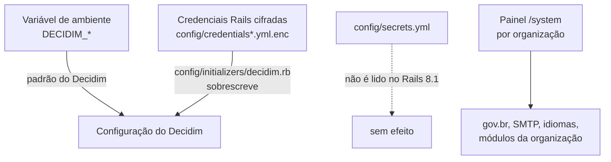

# Configuração

O Participa lê configuração de três fontes. Entender a ordem entre elas é o primeiro passo para mudar qualquer comportamento.

## De onde vem cada valor

1. **`config/secrets.yml` não é lido.** O Rails 8 não tem mais `Rails.application.secrets`. Variáveis que só aparecem nele não têm efeito, a menos que outro código as leia.
2. O Decidim 0.32 lê várias `DECIDIM_*` direto do ambiente como **padrão**.
3. `config/initializers/decidim.rb` **sobrescreve** muitos desses padrões com valores das **credenciais Rails cifradas**, em geral sem recorrer ao ambiente. Exemplos: nome da aplicação, remetente de e-mail, `force_ssl`, limite de denúncias, snippets HTML no cabeçalho, limites de requisição.
4. Por organização, o painel `/system` guarda gov.br, SMTP, idiomas e as abas de módulos (`decidim-toggle`).

!!! warning "Variáveis do Helm sem efeito"
    Por causa do item 3, variáveis como `DECIDIM_APPLICATION_NAME`, `DECIDIM_ENABLE_HTML_HEADER_SNIPPETS`, `DECIDIM_FORCE_SSL` e `MEETINGS_EMBEDDABLE_SERVICES`, definidas no chart, podem não ter efeito. O valor real depende do conteúdo das credenciais cifradas, que não pode ser verificado pelo repositório. Revise as credenciais com a equipe atual antes da transferência.

As credenciais cifradas estão versionadas (`config/credentials.yml.enc`, `config/credentials/development.yml.enc`, `config/credentials/production.yml.enc`). As chaves que as decifram ficam fora do Git.

## Variáveis lidas pelo código

Os valores não estão nesta documentação. O modelo de desenvolvimento é o `.env.sample`.

### Banco, filas e processos

| Variável | Uso |
|----------|-----|
| `DATABASE_URL` | Conexão em produção |
| `DATABASE_HOST`, `DATABASE_PORT`, `DATABASE_USERNAME`, `DATABASE_PASSWORD` | Conexão em desenvolvimento |
| `RAILS_MAX_THREADS` | Threads do Puma (padrão 6) e tamanho do pool do banco (padrão 5) |
| `RAILS_MIN_THREADS`, `WEB_CONCURRENCY`, `PORT` | Puma |
| `REDIS_URL` | Sidekiq, sidekiq-cron e Action Cable |
| `REDIS_CACHE_URL` | Cache Rails, com namespace por organização |
| `QUEUE_ADAPTER` | Adaptador do ActiveJob em produção (`sidekiq`) |
| `SIDEKIQ_CONCURRENCY` | Threads do Sidekiq (padrão 5) |
| `PROCESS_STEP_AUTO_ACTIVATION_CRON` | Agenda da troca automática de etapa (padrão a cada hora; vazio desliga) |

!!! note "Pool menor que as threads"
    Com os padrões, o Puma usa 6 threads e o pool do banco tem 5 conexões (`config/database.yml`). Defina `RAILS_MAX_THREADS` explicitamente para alinhar os dois.

### Rails

| Variável | Uso |
|----------|-----|
| `RAILS_ENV` | Ambiente |
| `SECRET_KEY_BASE` | Segredo da aplicação; também compõe o identificador da verificação por CPF |
| `RAILS_MASTER_KEY` | Decifra as credenciais |
| `RAILS_FORCE_SSL` | `force_ssl` (padrão `true`) |
| `RAILS_LOG_LEVEL`, `RAILS_LOG_TO_STDOUT` | Logs |
| `RAILS_SERVE_STATIC_FILES`, `RAILS_ASSET_HOST` | Arquivos estáticos |
| `DECIDIM_AVAILABLE_LOCALES`, `DECIDIM_DEFAULT_LOCALE` | Idiomas, se as credenciais não definirem (padrão `en`) |
| `DECIDIM_CACHE_EXPIRATION_TIME` | Duração do cache (padrão 60 min) |
| `DECIDIM_HOST` | Host da organização criada pelas seeds (padrão `localhost`) |
| `APARTMENT_DISABLE_INIT` | Fixada em `true` na imagem |

### gov.br

| Variável | Uso |
|----------|-----|
| `OMNIAUTH_GOVBR_CLIENT_ID` | Liga o provedor e define o `client_id` padrão |
| `OMNIAUTH_GOVBR_CLIENT_SECRET` | Segredo do cliente |
| `OMNIAUTH_GOVBR_SITE_SECRET` | **URL do SSO** (o nome engana; não é segredo) |
| `OMNIAUTH_GOVBR_REDIRECT_URL` | URL de retorno |
| `OMNIAUTH_GOVBR_SCOPE` | Escopos (padrão `openid email profile govbr_confiabilidades`) |
| `OMNIAUTH_GOVBR_FAKE` | Só em desenvolvimento: troca o SSO por um formulário local |

As opções efetivas vêm, a cada requisição, da configuração gov.br **da organização** no `/system`. As variáveis servem de padrão.

### Arquivos, e-mail e mapas

| Variável | Uso |
|----------|-----|
| `STORAGE_PROVIDER` | `local` (padrão) ou `s3` |
| `AWS_ENDPOINT`, `AWS_BUCKET`, `AWS_REGION`, `AWS_ACCESS_KEY_ID`, `AWS_SECRET_ACCESS_KEY` | S3 ou MinIO |
| `SMTP_ADDRESS`, `SMTP_PORT`, `SMTP_AUTHENTICATION`, `SMTP_USERNAME`, `SMTP_PASSWORD`, `SMTP_DOMAIN`, `SMTP_ENABLE_STARTTLS_AUTO` | SMTP global em produção (cada organização pode ter o seu) |
| `OSM_URL`, `OSM_STATIC_MAPS_URL` | Blocos e mapa estático do OpenStreetMap |
| `MAPS_HERE_API_KEY` ou `MAPS_API_KEY` | Chave HERE (geocodificação, autocompletar e mapa estático) |
| `MAPS_GEOCODING_HOST` | Photon, quando não há chave HERE |

### Análise de uso, observabilidade e CORS

| Variável | Uso |
|----------|-----|
| `MATOMO_CONTAINER_ID`, `MATOMO_URL`, `MATOMO_USER_ID_SALT` | Matomo Tag Manager |
| `POSTHOG_API_KEY`, `POSTHOG_HOST`, `POSTHOG_SECRET_KEY`, `POSTHOG_URL` | PostHog |
| `PYROSCOPE_APP_NAME`, `PYROSCOPE_SERVER_ADDRESS` | Pyroscope |
| `ALLOWED_ORIGINS` | Origens com CORS em `/api*` |

### Customizações do Brasil Participativo

| Variável | Uso |
|----------|-----|
| `GOVBR_LAYOUT_HOSTS` | Hosts que usam a barra de navegação e o rodapé gov.br (separados por vírgula) |
| `ENABLE_GOVBR_COMPONENT` | `true` registra o componente legado `govbr` |
| `CHATBOT_PUBLIC_URL` | Endereço público usado pelo chatbot (padrão: o host da organização) |
| `CHATBOT_RESET_COMMAND` | Liga um comando de reinício da conversa para testes; nunca em produção |
| `TEMPLATE_GIT_URL`, `TEMPLATE_GIT_BRANCH`, `TEMPLATE_GIT_USERNAME`, `TEMPLATE_GIT_PASSWORD`, `TEMPLATE_GIT_AUTHOR_NAME`, `TEMPLATE_GIT_AUTHOR_EMAIL` | Repositório do [catálogo de modelos](modelos.md) |
| `TEMPLATE_DEMO_HOST`, `TEMPLATE_DEMO_NAME`, `TEMPLATE_DEMO_DEFAULT_LOCALE`, `TEMPLATE_DEMO_*_COLOR` | Organização de demonstração dos modelos |

## Variáveis sem efeito

Presentes no `.env.sample` ou no Helm, mas não lidas pelo código da `main`: `ALLOW_HOSTS`, `DEFAULT_HOST`, `DEFAULT_PROTOCOL`, `ADMIN_EMAIL`, `ADMIN_PASSWORD`, além das que só aparecem em `config/secrets.yml`. No Helm, `DATABASE_USER` e `DATABASE_NAME` só servem para montar a `DATABASE_URL`.

## Idiomas

Os idiomas vêm de `DECIDIM_AVAILABLE_LOCALES` e `DECIDIM_DEFAULT_LOCALE` (padrão `en`), porque as credenciais ficaram vazias após a migração de `secrets` para `credentials`. O chart define `en,pt-BR` com padrão `en`. Toda chave sem tradução cai para o inglês (`config/initializers/decidim.rb`). Há traduções próprias só em `en` e `pt-BR` (`config/locales/`).
