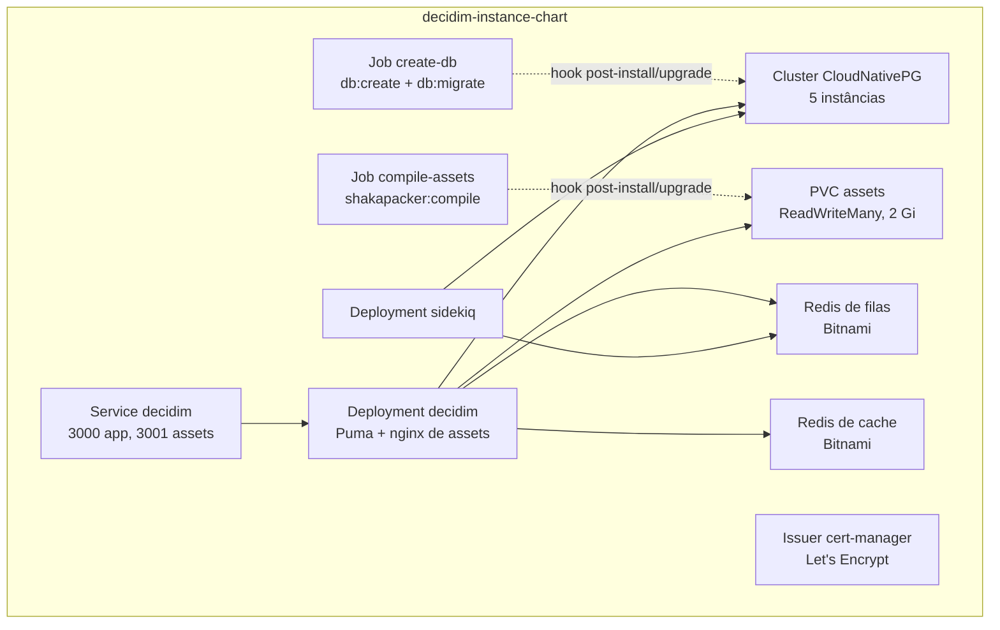

# Implantação

O Participa roda em **Kubernetes** com o chart Helm em `deploy/decidim-instance-chart/`. A mesma imagem Docker serve a todos os ambientes.

## Imagem

O `Dockerfile` tem dois estágios: `node` (`node:22.14.0-bookworm-slim`) e o final, sobre `ruby:3.4.7-slim-bookworm`.

- Instala as gems sem os grupos de desenvolvimento e teste (`ENVIRONMENT=production`, padrão).
- Copia as engines `decidim-govbr/` e `decidim-chatbot/` antes do `bundle install`, porque são gems por caminho.
- Pré-compila as views alteradas por Deface (`rails deface:precompile`).
- **Não** compila os assets: isso é feito por um job do Helm.
- Não define `CMD`, `ENTRYPOINT` nem porta: os comandos vêm do Helm ou do Docker Compose.

| Job do CI | Quando | Imagem publicada |
|-----------|--------|------------------|
| `build_dev_image` | Push na `main` ou disparo manual | `registry.gitlab.com/lappis-unb/decidimbr/participa/dev:<sha>` |
| `build_bump_image` | Branches `release/0.32.1-*` | `.../participa/bump:<sha>` |
| `build_prod_image` | Tags | `.../participa:<sha>` (etiquetada com o SHA, não com o nome da tag) |
| `release` | Tags | Release no GitLab com as mensagens de commit desde a tag anterior |

## Chart Helm

| Recurso | Detalhes |
|---------|----------|
| `deployment.yaml` | 1 réplica; Puma com `config/puma.rb` substituído por ConfigMap; sidecar `nginx:1.27` servindo `/decidim-packs` do volume de assets; credenciais Rails montadas de um secret |
| `sidekiq-deployment.yaml` | 1 réplica, estratégia `Recreate`; configuração de filas por ConfigMap |
| `postgres-cluster.yaml` | CloudNativePG com 5 instâncias, replicação síncrona, pgaudit, 5 Gi, monitoramento por PodMonitor; papel `airflow` para ingestão de dados. Backup em S3 ainda é um TODO comentado |
| Redis | Dois subcharts Bitnami `redis` 19.6.1: filas com persistência de 4 Gi; cache sem persistência |
| `create-db-job.yaml` | Hook `post-install`, `post-upgrade` e `post-rollback`: `rails db:create` e `rails db:migrate` |
| `assets-job.yaml` | Mesmo hook: compila os packs e troca a versão publicada no volume |
| `issuer.yaml` | cert-manager com Let's Encrypt (HTTP-01, ingress class `external-nginx`) |

Pré-requisitos no cluster: operador CloudNativePG, cert-manager, ingress-nginx com a classe `external-nginx`, CRDs do Prometheus Operator e uma StorageClass com `ReadWriteMany`.

O chart **não** tem Ingress, HPA, CronJob nem templates de Secret.

!!! warning "Migrações depois dos pods"
    As migrações rodam num hook **post**-install/upgrade, então os pods da versão nova podem subir antes de elas terminarem (**inferido** do tipo de hook). Em versões com migração incompatível, planeje uma janela de manutenção.

### Secrets criados à mão

Segundo `deploy/decidim-instance-chart/README.md`:

| Secret | Conteúdo |
|--------|----------|
| `decidim-secret-key-base` | `SECRET_KEY_BASE` |
| `decidim-govbr` | `OMNIAUTH_GOVBR_CLIENT_ID`, `OMNIAUTH_GOVBR_CLIENT_SECRET`, `OMNIAUTH_GOVBR_SITE_SECRET` (é a URL do SSO, apesar do nome), `OMNIAUTH_GOVBR_REDIRECT_URL` |
| `decidim-rails-credentials` | `master.key` e `credentials.yml.enc` |

Instalação: `helm upgrade --install -n <namespace> decidim . --values .values.yaml`.

!!! note "Qual arquivo de credenciais vale em produção"
    O repositório versiona `config/credentials/production.yml.enc`, e o Rails o prefere a `config/credentials.yml.enc`, que é o arquivo montado pelo Helm. Qual dos dois é lido em produção, e se o `RAILS_MASTER_KEY` decifra o arquivo certo, está **a confirmar** com a equipe de infraestrutura.

### Valores desatualizados

O `Chart.yaml` declara `appVersion: "0.29.3"`, e o `values.yaml` aponta para uma imagem `dev` de outubro de 2025. Ajuste os dois antes de usar o chart como referência.

## Criar uma organização no cluster

Neste repositório, a organização é criada pelo painel `/system` ([Multi-organização](multi-organizacao.md#criar-uma-organizacao)). O que falta para ela ficar acessível fica fora do chart:

- DNS do host;
- Ingress com TLS para `/` (porta 3000) e `/decidim-packs` (porta 3001);
- conteúdo inicial (`decidim_admin:seed_organization[HOST]`).

Até maio de 2026, o repositório tinha um chart de organização que fazia isso (login no `/system` por `curl`, Ingress por organização, seed e conexão no Airflow), além de uma aplicação de demonstração que criava organizações por formulário. Eles foram movidos para o repositório `infra/decidim-saas` (commit `5879315`, não analisado; **a confirmar**).

## Docker Compose

| Arquivo | Uso |
|---------|-----|
| `docker-compose.yml` | Desenvolvimento: `decidim`, `postgres` (17.5), `redis` (filas, 6379), `redis-cache` (6380) e `sidekiq` |
| `docker-compose.proxy.yml` | Acrescenta um `nginx-proxy` (80/443) com o host de homologação |
| `docker-compose-etherpad.yml` | Modelo de Etherpad para Docker Swarm, independente |

Detalhes em [Desenvolvimento](desenvolvimento.md).
