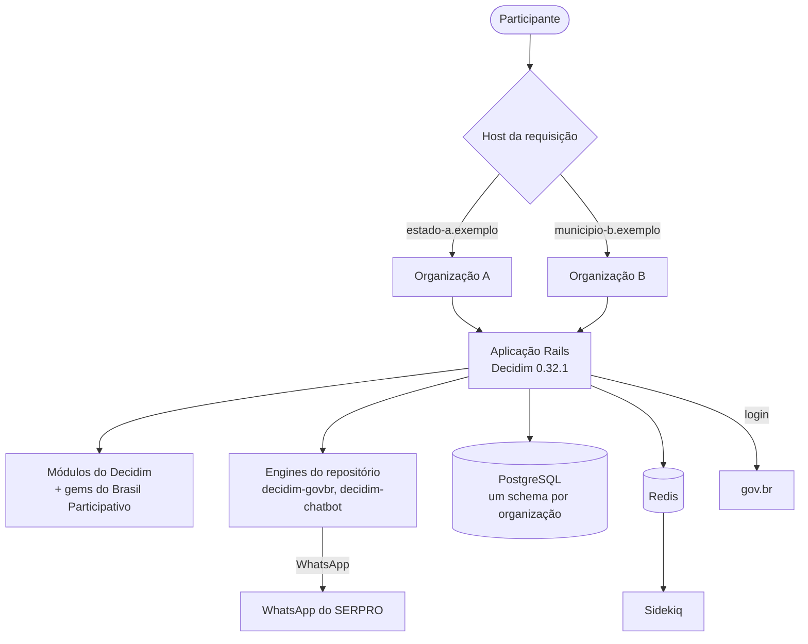

# Participa

O **Participa** é a plataforma de participação do Brasil Participativo oferecida **como serviço**: uma única instalação atende várias **organizações** (estados, municípios, órgãos), cada uma com endereço, participantes, espaços e configurações próprios. O código está no repositório [`participa`](https://gitlab.com/lappis-unb/decidimbr/participa).

É uma aplicação **Decidim 0.32.1** (Rails 8.1, Ruby 3.4.7) que instala módulos do Decidim e as customizações do Brasil Participativo como gems, em vez de sobrescrever o Decidim.

## Em resumo

| Item | Participa |
|------|-----------|
| Base | Decidim 0.32.1, Rails 8.1.4, Ruby 3.4.7, Node 22.14.0 |
| Organizações | Várias por instalação; cada uma num schema PostgreSQL próprio ([Multi-organização](multi-organizacao.md)) |
| Módulos do Decidim | 21, incluindo iniciativas, conferências e eleições ([Módulos e gems](modulos.md)) |
| Gems do Brasil Participativo e de terceiros | 14, instaladas a partir de repositórios git |
| Engines no próprio repositório | `decidim-govbr` (login gov.br, layout e blocos) e `decidim-chatbot` (WhatsApp) |
| Sobrescritas do Decidim | 31 arquivos de mesmo caminho ([inventário](../transferencia/sobrescritas.md)), contra 492 no core antigo |
| Implantação | Kubernetes, com chart Helm em `deploy/` ([Implantação](implantacao.md)) |
| Banco de dados | 153 tabelas por organização ([Banco de Dados](banco-de-dados/index.md)) |
| Licença | AGPLv3 (`LICENSE-AGPLv3.txt`) |

## Como as peças se encaixam

## O que muda em relação ao Brasil Participativo

| Tema | Brasil Participativo (`decidim-govbr`, Decidim 0.27.2) | Participa (Decidim 0.32.1) |
|------|------|------|
| Organizações | Uma instalação, uma organização | Várias organizações, uma por schema |
| Customização | 492 sobrescritas e 532 arquivos próprios no core | 31 sobrescritas; o restante em gems, `prepend` e Deface |
| Órgãos | Escopos do Decidim e instância criada por órgão | Hierarquia própria Órgão → Setor com administradores com escopo |
| Texto participativo | Recurso do componente de propostas | Componente próprio, com devolutiva por comentário |
| Mensageria | API OP-BP externa | Chatbot de WhatsApp dentro do Participa |
| Participação sem conta | Não havia | Participação efêmera com CPF e nome |
| Modelos de processo | Não havia | Catálogo de modelos em repositório Git |

Detalhes em [Inovação](../inovacao/index.md).

## Histórico de versões

| Data | Versão do Decidim |
|------|-------------------|
| mai. 2025 | 0.29.1 (início) e 0.29.3 |
| ago. 2025 | 0.30.1; multi-organização com um schema por organização |
| mai. 2026 | 0.30.9 |
| set. 2026 | 0.32.1 (Rails 8.1); versão `0.32.1-v1.0.0` com eleições, participação efêmera e blocos extras |
| out. 2026 | `0.32.1-v1.0.2`: troca automática de etapa e `sidekiq-cron` |

Fonte: histórico da branch `main`. Veja [Estatísticas › Participa](../estatisticas/participa/index.md).

!!! warning "Documentação interna ausente"
    O README do repositório cita as pastas `docs/` (guias de desenvolvimento e de Kubernetes) e `openspec/` (especificações), mas elas **não estão** na branch `main`. A única especificação versionada (`add-government-spaces`) está na branch `feat/govspace`.

## Nesta seção

-   :material-layers-triple:{ .lg .middle } **[Arquitetura](arquitetura.md)**

    Monolito Rails, processos em execução e onde fica cada camada.

-   :material-office-building:{ .lg .middle } **[Multi-organização](multi-organizacao.md)**

    Um schema por organização com Apartment.

-   :material-puzzle:{ .lg .middle } **[Módulos e gems](modulos.md)**

    O que vem do Decidim e o que vem de gems próprias.

-   :material-flag:{ .lg .middle } **[Engine decidim-govbr](govbr.md)**

    Login gov.br, CPF, layout e blocos da página inicial.

-   :material-whatsapp:{ .lg .middle } **[Chatbot](chatbot.md)**

    Votação por WhatsApp com identificação por CPF ou gov.br.

-   :material-domain:{ .lg .middle } **[Órgãos e setores](orgaos-setores.md)**

    Hierarquia de governo e administradores com escopo.

-   :material-account-clock:{ .lg .middle } **[Participação efêmera](participacao-efemera.md)**

    Participar com CPF e nome, sem cadastro completo.

-   :material-file-document-edit:{ .lg .middle } **[Texto participativo](texto-participativo.md)**

    Componente de comentários por parágrafo com devolutiva.

-   :material-content-copy:{ .lg .middle } **[Modelos de processo](modelos.md)**

    Catálogo de modelos e organização de demonstração.

-   :material-code-braces:{ .lg .middle } **[Customização do Decidim](customizacao.md)**

    Sobrescritas, `prepend` e Deface.

-   :material-database:{ .lg .middle } **[Banco de Dados](banco-de-dados/index.md)**

    Dicionário de dados gerado do `schema.rb`.

