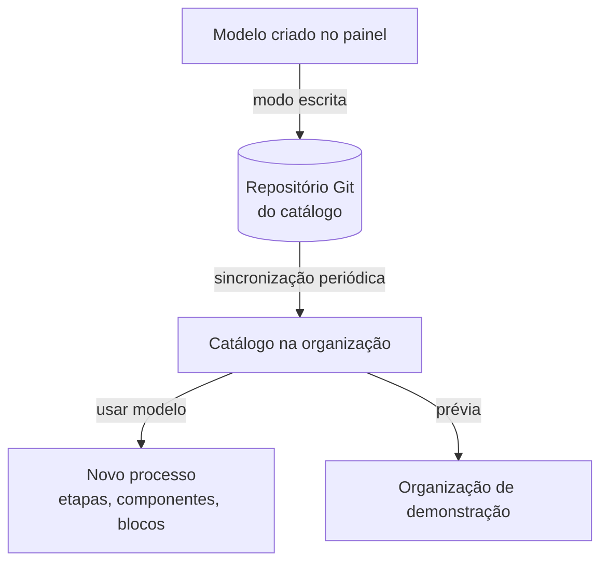

# Modelos de processo

A gem `decidim-community_templates` (fork LabLivre de `decidim-ice/decidim-module-community_templates`, branch `core/bump-32`) mantém um **catálogo de modelos de processo** num repositório Git. O gestor de processo cria um processo a partir de um modelo, com etapas, componentes, blocos e conteúdo de partida.

## Como funciona

- O catálogo é sincronizado de um repositório Git (`TEMPLATE_GIT_URL`, `TEMPLATE_GIT_BRANCH` e credenciais).
- Em modo escrita, modelos criados no painel são publicados no repositório.
- Uma **organização de demonstração** (`TEMPLATE_DEMO_HOST`, `TEMPLATE_DEMO_NAME`) serve para pré-visualizar modelos.
- Há importadores e serializadores para processo, etapa, componente, bloco de conteúdo, página, proposta e questionário.

## Ajustes do Participa

| Arquivo | Para quê |
|---------|----------|
| `config/initializers/community_templates_content_block_weight.rb` | Bloco sem peso vira peso 0; a falha de um modelo não aborta a importação inteira; remove organizações temporárias órfãs |
| `config/initializers/community_templates_demo_reset_gate.rb` | Impede que a demonstração seja recriada a cada expiração do cache |

## Dados

| Tabela | Conteúdo |
|--------|----------|
| `community_template_sources` | Origem dos modelos usados ou publicados pela organização |
| `community_template_uses` | Recursos criados a partir de um modelo |

!!! note "README desatualizado"
    `.disabled-for-0.32/README.md` diz que a gem ficou desativada durante a atualização para o Decidim 0.32. Hoje ela está ativa no `Gemfile`, e um dos arquivos retidos voltou para `config/initializers/`.
