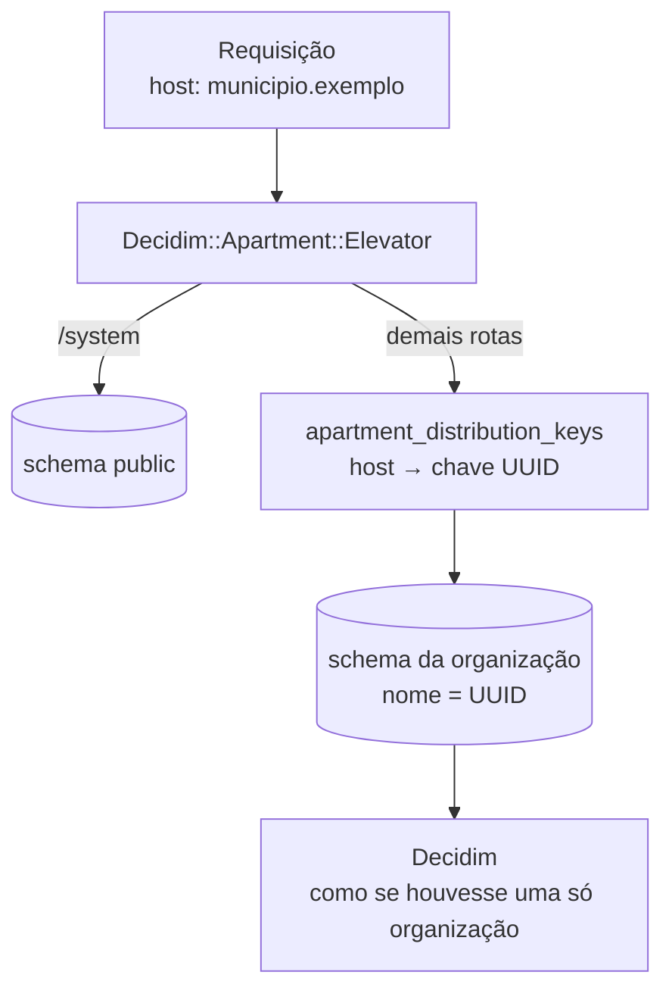

# Multi-organização

O Participa atende várias **organizações** numa só instalação. Cada organização tem um **schema PostgreSQL próprio**, e a aplicação escolhe o schema pelo host de cada requisição. A peça que faz isso é a gem `decidim-apartment` ([participa-gem](https://gitlab.com/lappis-unb/decidimbr/infra/participa-gem)), que integra a gem `ros-apartment` ao Decidim.

## Como uma requisição chega à organização



1. O middleware `Decidim::Apartment::Elevator` lê o host.
2. Procura o host na tabela `apartment_distribution_keys`, a única que fica no schema `public`.
3. Troca o `search_path` do PostgreSQL para o schema da organização, cujo nome é a chave UUID.
4. Dali em diante, o Decidim trabalha como numa instalação de uma só organização.

O painel `/system` fica no schema `public`. A edição de uma organização troca para o schema dela. Host desconhecido também cai no `public`.

O `Elevator` entra antes do middleware do Decidim que identifica a organização (`Decidim::Middleware::CurrentOrganization`), que então a encontra pelo host dentro do schema (`participa-gem/lib/decidim/apartment/elevator.rb`).

## Onde fica cada coisa

| Schema | Conteúdo |
|--------|----------|
| `public` | `apartment_distribution_keys` (host → chave) e o modelo das tabelas usado para criar novos schemas |
| `shared_extensions` | Extensões do PostgreSQL (`hstore`, `ltree`, `pg_trgm`), visíveis em todos os schemas |
| Um por organização (nome UUID) | Todas as demais tabelas: organização, usuários, espaços, componentes, chatbot, órgãos e setores |

Configuração em `lib/decidim/apartment/engine.rb` da participa-gem: `default_tenant = "public"`, `persistent_schemas = ["shared_extensions"]` e `excluded_models = %w(Decidim::Apartment::DistributionKey)`. O `schema.rb` do Participa descreve só o schema `public` (`config.active_record.dump_schemas = "public"` em `config/application.rb`).

## Criar uma organização

A criação pelo painel `/system` (`lib/decidim/apartment/overrides/create_organization_command.rb` da participa-gem):

1. valida o host (obrigatório, único, só letras, números, pontos e hífens);
2. cria a chave em `apartment_distribution_keys` e o schema, carregando o `schema.rb`;
3. troca para o schema e roda o comando original do Decidim (organização e convite do administrador);
4. se algo falhar, apaga a chave e o schema.

O SMTP é configurado **por organização**, nos campos do `/system`. O host novo precisa de DNS, rota de entrada e certificado, providenciados fora deste repositório (veja [Implantação](implantacao.md#criar-uma-organizacao-no-cluster)).

As seeds (`db/seeds.rb`) também criam primeiro o schema do host `DECIDIM_HOST` (padrão `localhost`) e rodam dentro dele. Para uma organização nova com conteúdo de partida, há duas tarefas em `lib/tasks/seeds.rake`:

```bash
# administrador da organização no schema do host
bin/rails "decidim_admin:create_admin[NOME,EMAIL,SENHA,HOST]"

# taxonomias padrão, banner, blocos da página inicial, grupos, páginas e 4 processos de exemplo
bin/rails "decidim_admin:seed_organization[HOST]"
```

O conteúdo da segunda tarefa está em `lib/tasks/seeds/seed_rake.json`: 18 grupos de processos com nomes de secretarias municipais, três páginas e quatro processos (Consulta Pública, Plano Participativo, Audiência Pública e Conferência).

## O que muda para quem desenvolve

| Ponto | Consequência |
|-------|--------------|
| Ids de organização se repetem | Cada schema tem sua própria tabela `decidim_organizations`. Chaves de cache que usam o id da organização precisam incluir o host (exemplo: `decidim-chatbot/app/services/decidim/chatbot/stats.rb`) |
| Jobs | Ao enfileirar, o job recebe o schema atual nos argumentos; um middleware do Sidekiq troca para ele antes de executar |
| Jobs agendados | São enfileirados fora de qualquer organização (`public`) e precisam percorrer os schemas por conta própria, como faz a troca automática de etapa |
| Arquivos | Armazenamento em disco e em S3 separado por organização (`app/services/active_storage/service/apartment_*_storage_service.rb` da participa-gem); o app troca de schema também em `ActiveStorage::BaseController` (`config/initializers/active_storage_apartment_patch.rb`) |
| Redis | O namespace do Redis é o schema (`config/environments/production.rb`) |
| Análise de uso | O Matomo identifica o usuário por um HMAC de `schema:usuário` |
| Migrações | `db:migrate` migra o `public` e, pela extensão do ros-apartment, todos os schemas de organização. As gems que trazem as próprias migrações entram pela lista de caminhos em `config/initializers/apartment.rb` |

## Manutenção dos schemas

Tarefas em `lib/tasks/apartment_*.rake`:

| Tarefa | Para quê |
|--------|----------|
| `apartment:check_column[tabela,coluna]` | Verifica se a coluna existe em todos os schemas |
| `apartment:schema_drift` | Lista tabelas e colunas do `public` que faltam em algum schema de organização |
| `apartment:repair_plan[schema]` | Encontra migrações registradas num schema cujo efeito não existe nele e sugere o comando para desfazer o registro |
| `apartment:sync_schema_migrations` | Hoje vazia. A versão original copiava o registro de migrações para os schemas **sem rodá-las**, origem provável dos casos que o `repair_plan` diagnostica |

A participa-gem traz ainda versões por organização de tarefas do Decidim (resumos de notificação, dados abertos, lembretes, troca de etapa, limpeza de inscrições e direito ao esquecimento), acionadas pelas tarefas de mesmo nome, e `decidim_apartment:install_pg_extension`, que cria o schema `shared_extensions` e as extensões.

!!! tip "Antes de uma migração em produção"
    Rode `apartment:schema_drift` para garantir que todos os schemas estão iguais. Um schema atrasado faz a migração falhar só naquela organização.

!!! warning "Sem migração a partir de um Decidim tradicional"
    A documentação da participa-gem informa que não há suporte para converter um banco Decidim de uma só organização para o modelo de um schema por organização (`website/docs/install.md`). Levar dados do Brasil Participativo para o Participa exige um plano próprio, ainda **a confirmar**.
