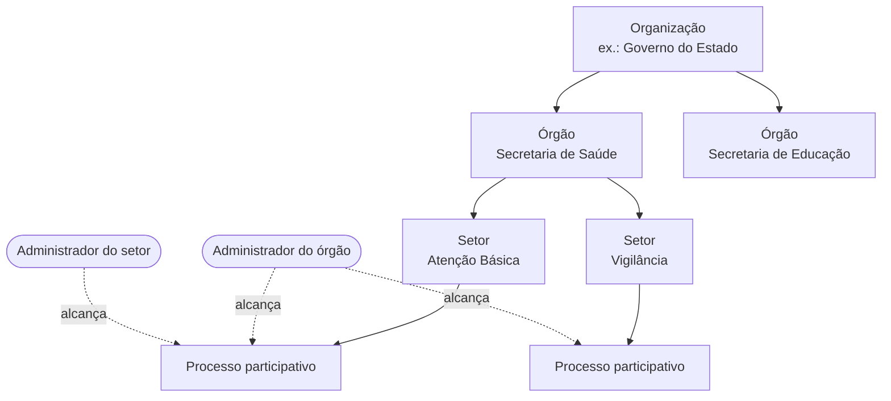

# Órgãos e setores

A gem `decidim-government_spaces` organiza cada organização numa hierarquia de governo em dois níveis, **Órgão → Setor**, e dá a gestores acesso só aos processos da sua parte da hierarquia.

## Regras

- Cada processo participativo pertence a **um setor**.
- O administrador da organização monta a hierarquia, cadastra **tipos de órgão** e convida **administradores com escopo** para um órgão ou setor.
- Quem administra um órgão alcança os processos de todos os seus setores.
- O administrador com escopo faz tudo o que um administrador de processo faz, **exceto excluir**, e nunca recebe o papel de administrador da organização.
- O acesso é calculado a partir da participação na hierarquia: revogar a participação revoga o acesso.

## Onde aparece

| Lugar | Endereço |
|-------|----------|
| Painel | `/:locale/admin/government_spaces` |
| Páginas públicas | `/orgaos` (lista e página de cada órgão) e `/orgaos/setores/:id` |
| Menu da página inicial | Item "Órgãos Públicos" (`config/initializers/decidim_home_menu.rb`) |
| Formulário do processo | Campo de setor, inserido por Deface |

## Dados

| Tabela | Conteúdo |
|--------|----------|
| `decidim_government_spaces` | Órgãos e setores (herança por `type`) |
| `decidim_government_spaces_organ_types` | Tipos de órgão |
| `decidim_government_spaces_memberships` | Administradores com escopo |
| `decidim_government_spaces_process_assignments` | Setor de cada processo |
| `decidim_government_spaces_pending_invitations` | Convites pendentes. **Nenhuma migração da `main` cria esta tabela**: ela vem de um trabalho de convite por CPF que só está na branch `release/0.32.1-v1.0.0-cpf-invite` |

## Diferença em relação ao Brasil Participativo

No `decidim-govbr` (0.27.2), órgãos são **escopos** do Decidim, e um job cria automaticamente uma **instância** (assembleia) por órgão e uma sub-instância por setor. No Participa, órgãos e setores são entidades próprias, e a gem **não cria instâncias**. Veja o [Glossário](../visao-geral/glossario.md).

A especificação original do módulo (proposta, desenho, tarefas e três especificações de requisitos) está na branch `feat/govspace`, em `openspec/changes/add-government-spaces/`, escrita para o Decidim 0.30.9.
