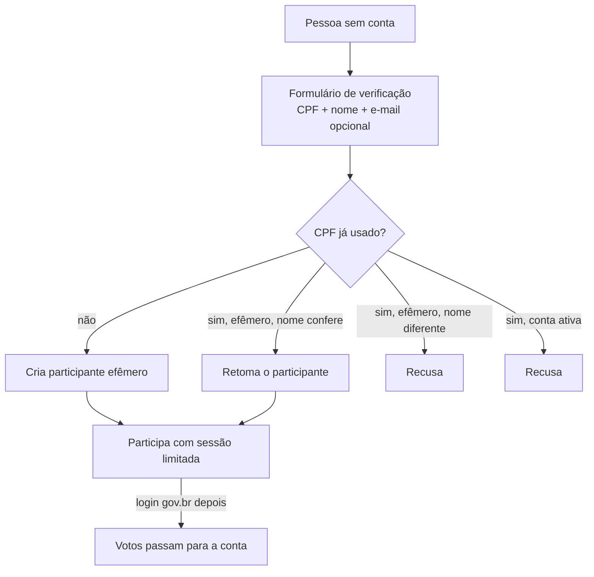

# Participação efêmera

A **participação efêmera** permite participar sem cadastro completo: a pessoa informa **CPF e nome** e passa a votar ou contribuir nos espaços configurados para isso. A funcionalidade combina a gem `decidim-ephemeral_participation` (Octree, originada no Decidim Barcelona) com a verificação `GovbrAuthorizationHandler` da [engine decidim-govbr](govbr.md).

## Como funciona

- A verificação `govbr_authorization_handler` é registrada como **efêmera** em `config/initializers/ephemeral_auth.rb`.
- O CPF é validado pelos dígitos verificadores; o nome precisa ter ao menos duas palavras (partículas como "de" e "da" são ignoradas).
- Para retomar um participante efêmero, o nome precisa conferir, sem diferença de acento, caixa ou espaços.
- O participante efêmero vê no rodapé quanto tempo resta da sessão e um link para completar o cadastro.
- Se a pessoa entra depois com o gov.br, a verificação por CPF passa para a conta, e os votos vão junto.

## Configuração por espaço

A participação efêmera vale onde a ação (por exemplo, votar numa proposta) exige a verificação `govbr_authorization_handler`. O [chatbot](chatbot.md) usa o mesmo caminho quando o modo de identificação é `ephemeral`.

A gem também converte `decidim_organizations.available_authorizations` de lista para JSON, para guardar configurações por verificação.

## Cuidados

- O CPF nunca vai para o log: `cpf`, `document_number` e o nome da identidade estão nos parâmetros filtrados (`config/initializers/filter_parameter_logging.rb`).
- Sem o gov.br, a verificação não prova que a pessoa é dona do CPF informado. Avalie, para cada processo, se o método é adequado ao risco da participação.
