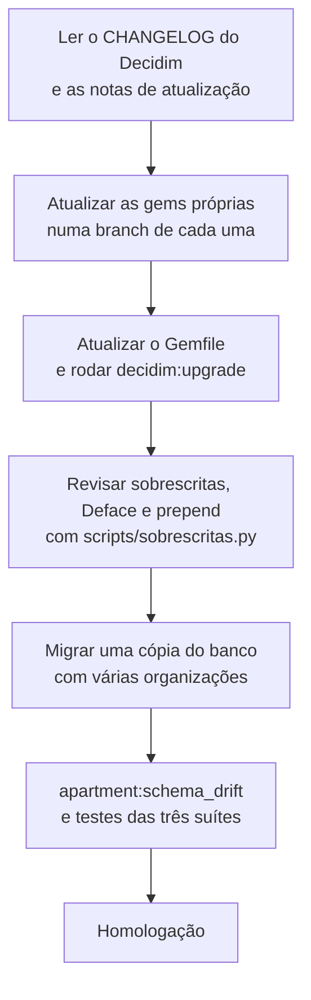

# Plano de atualização tecnológica

## Situação atual

| Item | Participa | API OP-BP |
|------|-----------|-----------|
| Linguagem | Ruby 3.4.7 | Python 3.14 (exige 3.13 ou superior) |
| Framework | Rails 8.1.4 e Decidim 0.32.1, a versão mais recente do Decidim | FastAPI 0.137 (a mais recente é 0.143) |
| Banco | PostgreSQL 17.5 | PostgreSQL 17 (o CI testa com 16) |
| Front-end | Shakapacker 9.7, Node 22.14 | Next.js 16, Vite 6, React 19 |

Dados atualizados em [Estatísticas › Qualidade](../estatisticas/participa/qualidade.md).

Ao contrário do core do Brasil Participativo (Decidim 0.27.2), o Participa já está na versão atual do Decidim. O trabalho é **manter** a atualização, não recuperar o atraso.

## O tamanho de cada atualização do Decidim

O custo vem das customizações ([Customização do Decidim](../participa/customizacao.md)):

| Item | Quantidade | O que revisar |
|------|-----------:|---------------|
| Sobrescritas de arquivo | 31 ([inventário](sobrescritas.md)) | Comparar com a versão nova de cada arquivo |
| Overrides Deface | 10 | Seletores das views alteradas |
| Módulos por `prepend` | 18 na aplicação, mais os das engines e gems | Assinatura dos métodos alterados |
| Gems do Brasil Participativo e de terceiros | 14 | Compatibilidade de cada gem; quatro dependem de repositórios externos |
| `decidim-apartment` | 1 | Mudanças no ciclo de vida de organizações e jobs do Decidim |

## Passos para uma nova versão do Decidim

1. Leia as notas de versão do Decidim, especialmente renomeações. Entre as versões do core do Brasil Participativo e o Decidim 0.32, por exemplo, `answers` virou `responses` e `endorsements` virou `likes` no banco.
2. Atualize primeiro as gems do Brasil Participativo, cada uma com sua branch e tag.
3. Rode `bin/rails decidim:upgrade` e as migrações numa cópia do banco com **várias organizações**.
4. Regenere o [inventário de sobrescritas](sobrescritas.md) apontando `DECIDIM_TAG` para a versão nova.
5. Confira `apartment:schema_drift` e rode as três suítes de teste.

## Pendências de manutenção

### Participa

- Fixar as gems instaladas por git em tags ou commits e migrar `omniauth-govbr` para um grupo institucional.
- Incluir testes e lint no CI.
- Atualizar `Chart.yaml` (`appVersion`) e a imagem do `values.yaml`.
- Alinhar o pool do banco com as threads do Puma.
- Agendar as tarefas periódicas do Decidim e incluir as filas `delete_inactive_participants` e `spam_analysis` na configuração do Sidekiq do Helm.
- Resolver as [divergências do `schema.rb`](../participa/banco-de-dados/index.md#divergencias-entre-o-schemarb-e-as-migracoes).
- Remover a tabela legada de sorteios e as categorias legadas, se não houver dados.
- Versionar os guias citados no README (`docs/`) e as especificações (`openspec/`).

### API OP-BP

- Atualizar a FastAPI e alinhar a versão do PostgreSQL do CI com a de produção.
- Remover o `api/.gitlab-ci.yml` legado e as variáveis sem uso nos `.env` de exemplo do front-end.
- Atualizar `docs/api-scenarios.md`, `api/CLAUDE.md` e os READMEs, hoje divergentes do código.
- Registrar o ator de limpeza de backups de anonimização e criar a rotina de retenção.
- Incluir os front-ends no CI e criar suas imagens.
