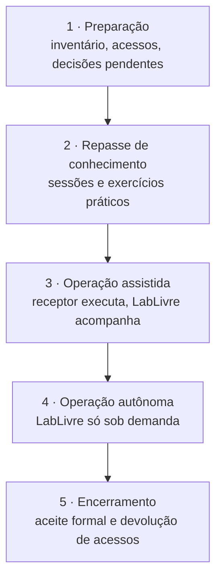

# Transferência de Tecnologia

Plano e documentação para transferir o Brasil Participativo SaaS (Participa e participação multicanal) do LabLivre/UnB, que o desenvolve no âmbito do TED, para a equipe que vai mantê-lo e operá-lo.

A transferência só está completa quando a equipe receptora consegue, **sem depender do LabLivre**:

1. subir os dois projetos em ambiente local e entender o código;
2. corrigir um defeito e publicar uma versão de cada projeto;
3. implantar, operar, monitorar e recuperar as duas plataformas;
4. criar uma organização nova no Participa e colocá-la no ar;
5. manter as integrações (gov.br, SERPRO, Decidim) e as credenciais;
6. planejar a evolução tecnológica.

## Fases

| Fase | Entregas | Responsável principal |
|------|----------|-----------------------|
| 1. Preparação | Inventário completo, acessos concedidos, [decisões pendentes](decisoes.md#decisoes-pendentes) tomadas, pendências de segurança tratadas | LabLivre e SNPS |
| 2. Repasse | Trilha de sessões com exercícios ([Plano de repasse](repasse.md)) | LabLivre, com o receptor |
| 3. Operação assistida | Ao menos um ciclo completo de versão e implantação de cada projeto feito pelo receptor | Receptor, com apoio do LabLivre |
| 4. Operação autônoma | Incidentes e versões tratados pelo receptor | Receptor |
| 5. Encerramento | Termo de aceite, revogação de acessos do LabLivre, transferência de contas | SNPS |

## Pacote de documentação

| Documento | Para quê | Situação |
|-----------|----------|----------|
| [Visão geral](../visao-geral/sobre.md) e [Arquitetura do sistema](../visao-geral/arquitetura.md) | Entender como as peças se ligam | :white_check_mark: |
| [Participa](../participa/index.md): arquitetura, multi-organização, módulos, customização | Entender o código do Participa | :white_check_mark: |
| [Participa › Desenvolvimento](../participa/desenvolvimento.md) | Começar a desenvolver | :white_check_mark: (o guia do repositório não existe) |
| [Participa › Implantação](../participa/implantacao.md) e [Configuração](../participa/configuracao.md) | Implantar e configurar | :white_check_mark: com itens **a confirmar** |
| [Participa › Banco de Dados](../participa/banco-de-dados/index.md) | Dicionário de dados e consultas | :white_check_mark: gerado do código |
| [Participação multicanal](../multicanal/index.md): arquitetura, canais, roteiros, votação, integração | Entender a API OP-BP | :white_check_mark: |
| [Participação multicanal › Implantação](../multicanal/implantacao.md) e [Configuração](../multicanal/configuracao.md) | Implantar e configurar | :white_check_mark: com itens **a confirmar** |
| [Inventário de ativos](inventario.md) | Repositórios, imagens, serviços, contas e credenciais | :white_check_mark: itens marcados **a confirmar** |
| [Operação e continuidade](operacao.md) | Rotinas, monitoramento, incidentes, backup | :white_check_mark: |
| [Segurança e LGPD](seguranca.md) | Controles, dados pessoais e pendências | :white_check_mark: pendências em canal restrito |
| [APIs](apis.md) | Contratos entre os sistemas | :white_check_mark: |
| [Versionamento e release](release.md) | Gerar e publicar versões | :white_check_mark: |
| [Testes e qualidade](testes.md) | Suítes e CI | :white_check_mark: |
| [Plano de atualização](atualizacao.md) | Manter dependências e Decidim em dia | :white_check_mark: |
| [Inventário de sobrescritas](sobrescritas.md) | Arquivos do Decidim alterados pelo Participa | :white_check_mark: gerado do código |
| [Decisões de arquitetura](decisoes.md) | Por que o sistema é como é, e o que falta decidir | :white_check_mark: |
| [Plano de repasse](repasse.md) | Sessões, exercícios e responsabilidades | :white_check_mark: |
| Documentação interna dos repositórios | Guias citados nos READMEs | :x: `docs/development.md`, `docs/deployment-kubernetes.md` e `openspec/` não existem no `participa`; `docs/api-scenarios.md` está desatualizado na participação multicanal |
| Manifestos de produção | Ingress, criação de organizações, implantação da API OP-BP e dos front-ends | :warning: fora dos repositórios analisados (**a confirmar**) |
| Credenciais e segredos | Valores | :warning: só os nomes estão aqui; os valores devem ser entregues por canal seguro |

## Critérios de aceite

A equipe receptora considera a transferência concluída quando demonstra, sem ajuda:

- [ ] Participa e API OP-BP rodando localmente a partir desta documentação;
- [ ] uma correção feita, testada, revisada e integrada em cada projeto;
- [ ] uma versão do Participa gerada, publicada como imagem e implantada com o chart Helm;
- [ ] uma organização nova criada no Participa, com endereço e certificado próprios;
- [ ] um roteiro de conversa alterado, publicado e testado no painel da API OP-BP;
- [ ] restauração de um backup do banco de cada projeto em ambiente de teste;
- [ ] rotação de um segredo de integração (por exemplo, `GOVBR_JWT_SECRET`, junto com o `EXTERNAL_AUTH_SECRET` do Brasil Participativo) sem indisponibilidade;
- [ ] acesso administrativo a todos os ativos do [Inventário](inventario.md);
- [ ] leitura das [decisões](decisoes.md) e das pendências de [Segurança e LGPD](seguranca.md).
