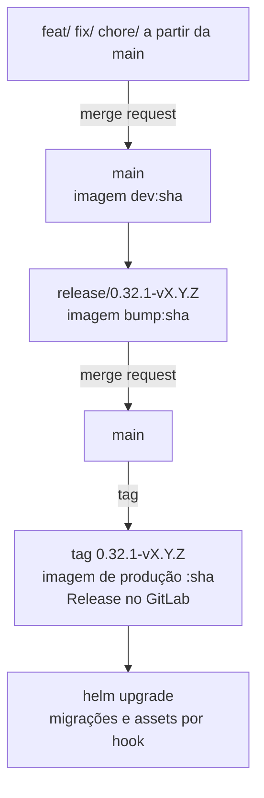

# Versionamento e release

## Participa

### Numeração

Desde a atualização para o Decidim 0.32.1, as tags juntam a versão do Decidim e a do Participa: `<versão do Decidim>-v<versão do Participa>` (**inferido** das tags e das branches `release/0.32.1-*`).

| Tag | Data | Destaques |
|-----|------|-----------|
| `0.1.0` | set. 2025 | Login efêmero |
| `0.2.0` | mai. 2026 | Base da entrega 1 |
| `0.3.0`, `0.4.0` | jun. 2026 | Módulos do Brasil Participativo como gems |
| `0.5.0` | set. 2026 | Última versão sobre o Decidim 0.30 |
| `0.32.1-v1.0.0` | set. 2026 | Atualização para Decidim 0.32.1 e Rails 8.1 |
| `0.32.1-v1.0.1` | set. 2026 | PostHog, eleições, blocos extras, participação efêmera, mapas HERE |
| (sem tag) "Release/0.32.1 v1.0.2" | out. 2026 | `sidekiq-cron`, troca automática de etapa. Integrada à `main` sem tag |

Não há `CHANGELOG`. As notas ficam na mensagem da tag e na Release do GitLab, gerada pelo CI com os commits desde a tag anterior.

### Fluxo

A `develop` está parada desde agosto de 2026; o tronco ativo é a `main`.

### Gerar e implantar uma versão

1. Crie `release/0.32.1-vX.Y.Z` a partir da `main` e valide a imagem `bump` em homologação.
2. Integre na `main` e crie a tag `0.32.1-vX.Y.Z`.
3. O CI publica a imagem de produção, etiquetada com o **SHA curto do commit**, não com o nome da tag.
4. Atualize a imagem no `values.yaml` e rode `helm upgrade`. Os hooks rodam `db:migrate` em todas as organizações e compilam os assets.
5. Confira `apartment:schema_drift` e o carregamento dos assets.

Para reverter, faça `helm rollback`: o hook `post-rollback` roda as migrações e os assets da versão anterior. Migrações destrutivas não são desfeitas; faça backup antes.

## Participação multicanal

Não há tags nem versões publicadas; a API declara `0.1.0` (`api/app/config.py`). O CI publica a imagem da API (`api:<sha>` e `api:latest`) a cada merge na branch padrão. A `/health` mostra versão, commit e data do build.

**Recomendação**: adotar versionamento semântico com tags, notas de versão e imagens etiquetadas com a versão, antes de a equipe receptora assumir.

## Recomendações comuns

- Publicar notas de versão (`CHANGELOG`) nos dois projetos.
- Etiquetar as imagens também com o nome da versão.
- Registrar no repositório os manifestos de produção que hoje estão fora dele.
