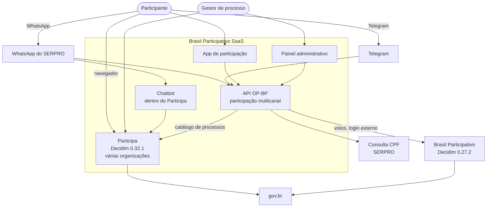

# Arquitetura do sistema

Esta página mostra como o Participa, a participação multicanal e os serviços externos se ligam. A arquitetura interna de cada projeto está em [Participa › Arquitetura](../participa/arquitetura.md) e [Participação multicanal › Arquitetura](../multicanal/arquitetura.md).

## Contexto

## Ligações entre os projetos

| De | Para | Como | Situação |
|----|------|------|----------|
| API OP-BP | Brasil Participativo | GraphQL (usuário efêmero e voto com impersonação) e login externo pelo `/external_auth/link` | Configurada para o Orçamento do Povo (catálogo do processo `orcamento-participativo` de produção) |
| API OP-BP | Participa | GraphQL `participatoryProcesses` para o concierge listar processos abertos | Aponta para a instalação de desenvolvimento do Participa do Acre |
| Chatbot | Participa | Dentro do próprio Participa | Em `main` desde outubro de 2026 |
| Participa | API OP-BP | Nenhuma | O Participa não tem o login externo nem a impersonação usados pela API OP-BP |

!!! warning "Duas soluções de WhatsApp"
    O chatbot e a API OP-BP usam o WhatsApp do SERPRO para fins parecidos, com modelos diferentes: roteiro fixo e voto direto no Participa, de um lado; roteiros editáveis, identificação progressiva e voto no Brasil Participativo, do outro. Para usar a API OP-BP com o Participa, faltariam no Participa o login externo e a impersonação. Essa decisão é central para a [transferência](../transferencia/decisoes.md).

## Onde ficam os dados

| Dado | Participa | API OP-BP |
|------|-----------|-----------|
| Banco | PostgreSQL 17, um schema por organização | PostgreSQL 17 atrás do PgBouncer |
| Cache e filas | Dois Redis (filas e cache) | Dois Valkey (cache e filas) |
| Tarefas | Sidekiq e sidekiq-cron | Dramatiq, sem agendador embutido |
| Arquivos | S3/MinIO, uma pasta por organização | Não guarda arquivos |
| Dados pessoais | Contas, CPF verificado (hash), participantes efêmeros | CPF cifrado, nome, e-mail, nascimento, telefone ou id do Telegram |

## Onde roda

| Projeto | Implantação versionada | Produção |
|---------|------------------------|----------|
| Participa | Chart Helm (`deploy/decidim-instance-chart`) e Docker Compose de desenvolvimento | Kubernetes com CloudNativePG; Ingress e criação de organizações em outro repositório (**a confirmar**) |
| API OP-BP | Docker Compose de produção e `make deploy` | Indícios de Kubernetes na Dataprev; manifestos fora do repositório (**a confirmar**) |
| Front-ends da participação multicanal | Nenhuma | **A confirmar** |
